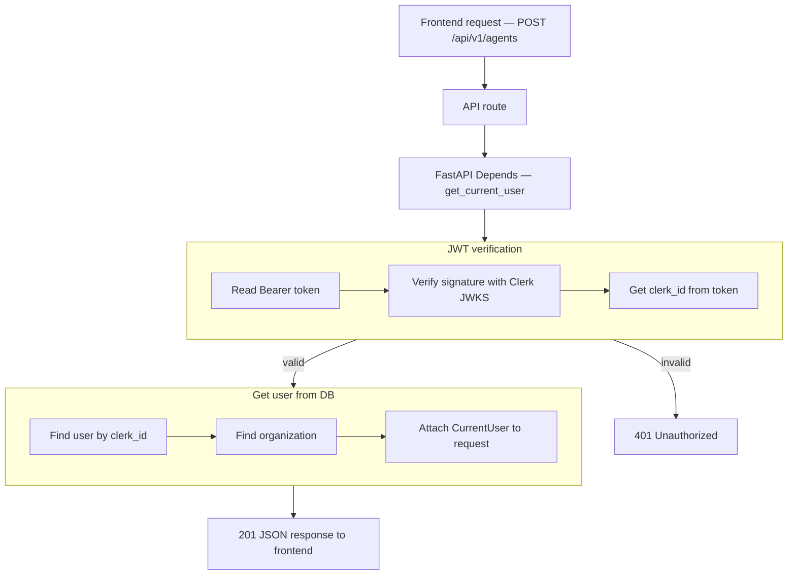
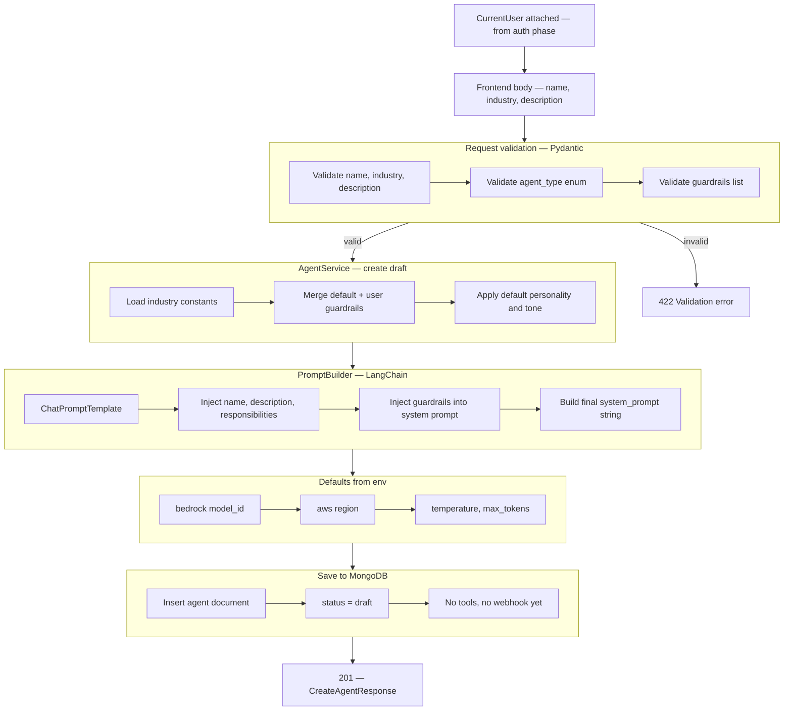

# Create Agent — `POST /api/v1/agents` (auth phase)

## Flow



## Navigate to auth files

| Flow step | What happens | Open file |
|-----------|--------------|-----------|
| API route | `POST /api/v1/agents` handler | [agents.py](../app/api/v1/agents.py) |
| Depends | Inject `CurrentUser` | [auth.py](../app/di/auth.py) |
| Read Bearer token | Parse `Authorization` header | [clerk_authenticator.py](../app/infrastructure/auth/clerk_authenticator.py) |
| Verify JWT | Clerk JWKS signature check | [clerk_jwt.py](../app/infrastructure/auth/clerk_jwt.py) |
| Get clerk_id | Read `sub` from token claims | [clerk_authenticator.py](../app/infrastructure/auth/clerk_authenticator.py) |
| 401 Unauthorized | Invalid or expired token | [main.py](../app/main.py) |
| Find user | Mongo lookup by `clerk_id` | [user_repository.py](../app/infrastructure/db/repositories/mongo/user_repository.py) |
| Find organization | Mongo lookup by `organization_id` | [organization_repository.py](../app/infrastructure/db/repositories/mongo/organization_repository.py) |
| Attach to request | Build `CurrentUser` | [current_user.py](../app/domain/models/current_user.py) |

## JSON at each step

| Step | JSON |
|------|------|
| Start | `{}` |
| After JWT verification | `clerk_id`, `token_valid` |
| After user lookup | + `user_id`, `email` |
| After organization lookup | + `organization_id`, `organization_name` |
| Final response | nested `jwt`, `user`, `organization`, `status` |

**Start**

```json
{}
```

**After JWT verification** (+2 fields)

```json
{
  "clerk_id": "user_3FZX0ugQeNkL7VO8cMOY8mhRAS5",
  "token_valid": true
}
```

**After user lookup** (+2 fields)

```json
{
  "clerk_id": "user_3FZX0ugQeNkL7VO8cMOY8mhRAS5",
  "token_valid": true,
  "user_id": "6a3b7c61d8139334274fbbfd",
  "email": "jayasingheshehan1995@gmail.com"
}
```

**After organization lookup** (+2 fields)

```json
{
  "clerk_id": "user_3FZX0ugQeNkL7VO8cMOY8mhRAS5",
  "token_valid": true,
  "user_id": "6a3b7c61d8139334274fbbfd",
  "email": "jayasingheshehan1995@gmail.com",
  "organization_id": "6a3b7c61d8139334274fbbfc",
  "organization_name": "abc bank"
}
```

**Final API response** (nested — `201 Created`)

```json
{
  "jwt": {
    "clerk_id": "user_3FZX0ugQeNkL7VO8cMOY8mhRAS5",
    "token_valid": true
  },
  "user": {
    "user_id": "6a3b7c61d8139334274fbbfd",
    "email": "jayasingheshehan1995@gmail.com",
    "first_name": "Shehan",
    "last_name": "Jayasinghe",
    "user_type": "owner",
    "is_root": true
  },
  "organization": {
    "organization_id": "6a3b7c61d8139334274fbbfc",
    "name": "abc bank",
    "industry": "financial_services"
  },
  "status": "authenticated"
}
```

---

# Create Agent — logic phase (after auth)

Runs after `CurrentUser` is attached. Frontend sends **name**, **industry**, **description**, optional **agent_type** and **guardrails**.

## Flow



## Navigate to files (not created yet)

| Flow step | What happens | Open file |
|-----------|--------------|-----------|
| API route | Receives body after auth | [agents.py](../app/api/v1/agents.py) |
| Request validation | Pydantic `CreateAgentRequest` | [agent.py](../app/schemas/agent.py) |
| Service | Orchestrates create draft | [agent_service.py](../app/services/agent_service.py) |
| DI | Inject service | [agents.py](../app/di/agents.py) |
| Industry constants | Responsibilities, default guardrails, personality, tone | [agent_defaults.py](../app/domain/constants/agent_defaults.py) |
| Prompt build | LangChain `ChatPromptTemplate` | [prompt_builder.py](../app/infrastructure/ai/prompt_builder.py) |
| Bedrock defaults | Model id + region from `.env` | [config.py](../app/config.py) |
| Save agent | Insert into `agents` collection | [agent_repository.py](../app/infrastructure/db/repositories/mongo/agent_repository.py) |

## Request body (frontend)

```json
{
  "name": "abc bank",
  "description": "Payment and collections assistant for customers",
  "industry": "financial_services",
  "agent_type": "payment_collections",
  "guardrails": [
    {
      "key": "no_secrets",
      "label": "Protect secrets",
      "instruction": "Never ask for passwords or full card numbers.",
      "enabled": true
    }
  ]
}
```

### Pydantic validation rules

| Field | Rule |
|-------|------|
| `name` | required, 1–200 chars |
| `description` | optional, max 2000 chars |
| `industry` | required enum: `financial_services`, `logistics`, `travel`, `healthcare`, `insurance`, `other` |
| `agent_type` | optional enum: `payment_collections`, `customer_onboarding`, `customer_support_triage` |
| `guardrails` | optional list; each item has `key`, `label`, `instruction`, `enabled` |

## Constants file (`agent_defaults.py`)

| Key | Purpose |
|-----|---------|
| `INDUSTRY_RESPONSIBILITIES` | Core responsibilities per industry + agent_type |
| `DEFAULT_GUARDRAILS` | Base guardrails merged with request guardrails |
| `DEFAULT_PERSONALITY` | e.g. `Professional, Empathetic, Solution-oriented` |
| `DEFAULT_TONE` | e.g. `Friendly, Reassuring, Clear` |

## Env defaults (Bedrock)

| Env / setting | Used for |
|---------------|----------|
| `AWS_REGION` → `settings.aws_region` | LLM region |
| `BEDROCK_MODEL_ID` → `settings.bedrock_model_id` | Model name stored on agent |
| defaults in code | `temperature: 0.7`, `max_output_tokens: 1024` |

## JSON at each step

| Step | Fields added |
|------|----------------|
| After auth | `organization_id`, `user_id` (from auth — not in request body) |
| After Pydantic validation | `name`, `industry`, `description`, `agent_type` |
| After constants + prompt | `system_prompt`, `personality`, `tone` |
| After env defaults | `llm_config.model_id`, `llm_config.region` |
| After DB save | `id`, `status: draft` |
| Final response | full `CreateAgentResponse` |

**After validation** (+request fields)

```json
{
  "name": "abc bank",
  "industry": "financial_services",
  "description": "Payment and collections assistant for customers",
  "agent_type": "payment_collections"
}
```

**After prompt build** (+3 fields)

```json
{
  "name": "abc bank",
  "industry": "financial_services",
  "description": "Payment and collections assistant for customers",
  "agent_type": "payment_collections",
  "system_prompt": "You are an AI-powered Payment & Collections Agent for abc bank...",
  "personality": "Professional, Empathetic, Solution-oriented",
  "tone": "Friendly, Reassuring, Clear"
}
```

**After env defaults** (+llm_config)

```json
{
  "name": "abc bank",
  "industry": "financial_services",
  "system_prompt": "You are an AI-powered Payment & Collections Agent for abc bank...",
  "personality": "Professional, Empathetic, Solution-oriented",
  "tone": "Friendly, Reassuring, Clear",
  "llm_config": {
    "model_id": "anthropic.claude-3-5-sonnet-20241022-v2:0",
    "region": "us-east-1",
    "temperature": 0.7,
    "max_output_tokens": 1024
  }
}
```

**Final API response** (`201 Created`)

```json
{
  "id": "67abc123",
  "name": "abc bank",
  "description": "Payment and collections assistant for customers",
  "industry": "financial_services",
  "agent_type": "payment_collections",
  "system_prompt": "You are an AI-powered Payment & Collections Agent for abc bank...",
  "personality": "Professional, Empathetic, Solution-oriented",
  "tone": "Friendly, Reassuring, Clear",
  "guardrails": [
    {
      "key": "no_secrets",
      "label": "Protect secrets",
      "instruction": "Never ask for passwords or full card numbers.",
      "enabled": true
    }
  ],
  "llm_config": {
    "model_id": "anthropic.claude-3-5-sonnet-20241022-v2:0",
    "region": "us-east-1",
    "temperature": 0.7,
    "max_output_tokens": 1024
  },
  "status": "draft",
  "organization_id": "6a3b7c61d8139334274fbbfc",
  "created_at": "2026-06-24T12:00:00Z"
}
```

## What is NOT in this phase

| Item | Status |
|------|--------|
| Tools / skills | empty `[]` |
| Workflows | empty `[]` |
| Webhook / publish | `status: draft` only |
| Website crawl / RAG | not started |
| Bedrock invoke at create time | prompt built locally only |
