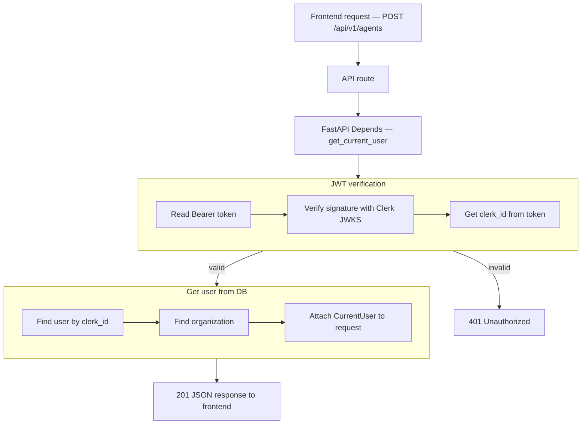

# Create Agent — `POST /api/v1/agents` (auth phase)

## Flow



## Navigate to auth files

| Flow step | What happens | Open file |
|-----------|--------------|-----------|
| API route | `POST /api/v1/agents` handler | [agents.py](../app/api/v1/agents.py) |
| Depends | Inject `CurrentUser` | [auth.py](../app/di/auth.py) |
| Read Bearer token | Parse `Authorization` header | [clerk_authenticator.py](../app/infrastructure/auth/clerk_authenticator.py) |
| Verify JWT | Clerk JWKS signature check | [clerk_jwt.py](../app/infrastructure/auth/clerk_jwt.py) |
| Get clerk_id | Read `sub` from token claims | [clerk_authenticator.py](../app/infrastructure/auth/clerk_authenticator.py) |
| 401 Unauthorized | Invalid or expired token | [main.py](../app/main.py) |
| Find user | Mongo lookup by `clerk_id` | [user_repository.py](../app/infrastructure/db/repositories/mongo/user_repository.py) |
| Find organization | Mongo lookup by `organization_id` | [organization_repository.py](../app/infrastructure/db/repositories/mongo/organization_repository.py) |
| Attach to request | Build `CurrentUser` | [current_user.py](../app/domain/models/current_user.py) |

## JSON at each step

| Step | JSON |
|------|------|
| Start | `{}` |
| After JWT verification | `clerk_id`, `token_valid` |
| After user lookup | + `user_id`, `email` |
| After organization lookup | + `organization_id`, `organization_name` |
| Final response | nested `jwt`, `user`, `organization`, `status` |

**Start**

```json
{}
```

**After JWT verification** (+2 fields)

```json
{
  "clerk_id": "user_3FZX0ugQeNkL7VO8cMOY8mhRAS5",
  "token_valid": true
}
```

**After user lookup** (+2 fields)

```json
{
  "clerk_id": "user_3FZX0ugQeNkL7VO8cMOY8mhRAS5",
  "token_valid": true,
  "user_id": "6a3b7c61d8139334274fbbfd",
  "email": "jayasingheshehan1995@gmail.com"
}
```

**After organization lookup** (+2 fields)

```json
{
  "clerk_id": "user_3FZX0ugQeNkL7VO8cMOY8mhRAS5",
  "token_valid": true,
  "user_id": "6a3b7c61d8139334274fbbfd",
  "email": "jayasingheshehan1995@gmail.com",
  "organization_id": "6a3b7c61d8139334274fbbfc",
  "organization_name": "abc bank"
}
```

**Final API response** (nested — `201 Created`)

```json
{
  "jwt": {
    "clerk_id": "user_3FZX0ugQeNkL7VO8cMOY8mhRAS5",
    "token_valid": true
  },
  "user": {
    "user_id": "6a3b7c61d8139334274fbbfd",
    "email": "jayasingheshehan1995@gmail.com",
    "first_name": "Shehan",
    "last_name": "Jayasinghe",
    "user_type": "owner",
    "is_root": true
  },
  "organization": {
    "organization_id": "6a3b7c61d8139334274fbbfc",
    "name": "abc bank",
    "industry": "financial_services"
  },
  "status": "authenticated"
}
```
