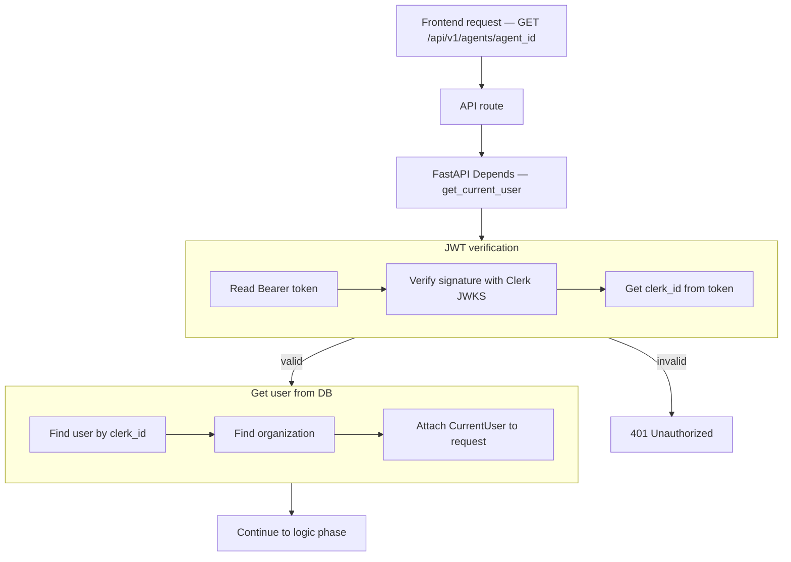
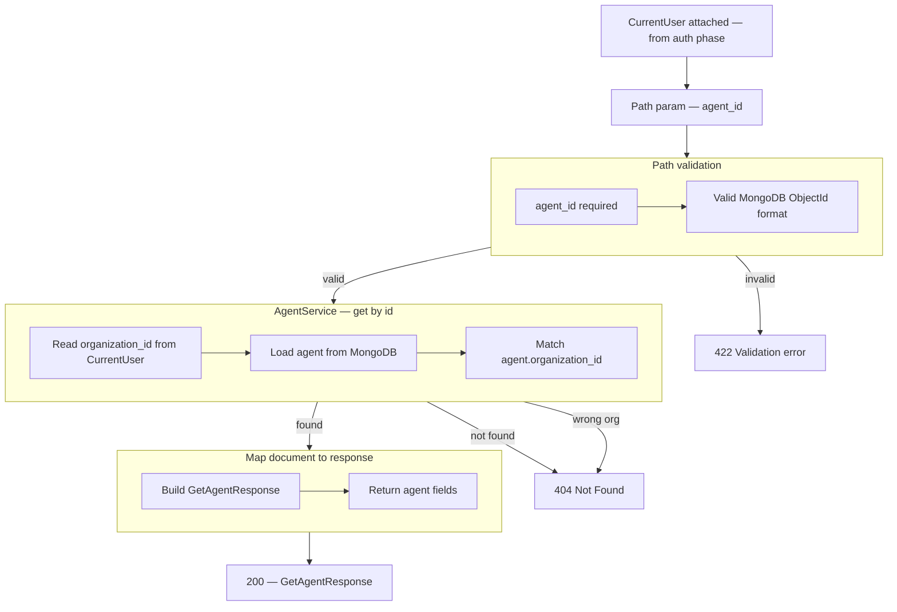

# Get Agent — `GET /api/v1/agents/{agent_id}`

Returns one agent for the authenticated user's organization. Draft and published agents are both readable.

**Agentic migration:** [../agentic/updets/api-migration-agentic.md](../agentic/updets/api-migration-agentic.md) · Phase B: [../agentic/updets/api-migration-agentic-phase-b.md](../agentic/updets/api-migration-agentic-phase-b.md) · Phase C: [../agentic/updets/api-migration-agentic-phase-c.md](../agentic/updets/api-migration-agentic-phase-c.md) (**no** REST change)

| Item | Change |
|------|--------|
| Route | **No** |
| **Optional** response field | `capability_catalog` — for builder UI to show/edit routing hints. Not required if hints are only set via attach APIs. |

# Auth phase

## Flow



## Navigate to auth files

| Flow step | What happens | Open file |
|-----------|--------------|-----------|
| API route | `GET /api/v1/agents/{agent_id}` handler | [agents.py](../../app/api/v1/agents.py) |
| Router | Mount agents routes under `/api/v1` | [router.py](../../app/api/v1/router.py) |
| Depends | Inject `CurrentUser` | [auth.py](../../app/di/auth.py) |
| Read Bearer token | Parse `Authorization` header | [clerk_authenticator.py](../../app/infrastructure/auth/clerk_authenticator.py) |
| Verify JWT | Clerk JWKS signature check | [clerk_jwt.py](../../app/infrastructure/auth/clerk_jwt.py) |
| Get clerk_id | Read `sub` from token claims | [clerk_authenticator.py](../../app/infrastructure/auth/clerk_authenticator.py) |
| 401 Unauthorized | Invalid or expired token | [main.py](../../app/main.py) |
| Find user | Mongo lookup by `clerk_id` | [user_repository.py](../../app/infrastructure/db/repositories/mongo/user_repository.py) |
| Find organization | Mongo lookup by `organization_id` | [organization_repository.py](../../app/infrastructure/db/repositories/mongo/organization_repository.py) |
| Attach to request | Build `CurrentUser` | [current_user.py](../../app/domain/models/current_user.py) |

## JSON at each step

| Step | JSON |
|------|------|
| Start | `{}` |
| After JWT verification | `clerk_id`, `token_valid` |
| After user lookup | + `user_id`, `email` |
| After organization lookup | + `organization_id`, `organization_name` |
| Next | logic phase (path param `agent_id`) |

**Start**

```json
{}
```

**After JWT verification** (+2 fields)

```json
{
  "clerk_id": "user_3FZX0ugQeNkL7VO8cMOY8mhRAS5",
  "token_valid": true
}
```

**After user lookup** (+2 fields)

```json
{
  "clerk_id": "user_3FZX0ugQeNkL7VO8cMOY8mhRAS5",
  "token_valid": true,
  "user_id": "6a3b7c61d8139334274fbbfd",
  "email": "jayasingheshehan1995@gmail.com"
}
```

**After organization lookup** (+2 fields)

```json
{
  "clerk_id": "user_3FZX0ugQeNkL7VO8cMOY8mhRAS5",
  "token_valid": true,
  "user_id": "6a3b7c61d8139334274fbbfd",
  "email": "jayasingheshehan1995@gmail.com",
  "organization_id": "6a3b7c61d8139334274fbbfc",
  "organization_name": "abc bank"
}
```

---

# Logic phase (after auth)

Runs after `CurrentUser` is attached. Frontend sends **agent_id** as a path parameter only (no request body).

## Flow



## Navigate to logic files

| Flow step | What happens | Open file |
|-----------|--------------|-----------|
| API route | `GET /api/v1/agents/{agent_id}` handler | [agents.py](../../app/api/v1/agents.py) |
| Path validation | FastAPI path param + ObjectId check | [agents.py](../../app/api/v1/agents.py) |
| 422 Validation error | Malformed `agent_id` | [agents.py](../../app/api/v1/agents.py) |
| Depends — service | Inject `AgentService` | [agents.py](../../app/di/agents.py) |
| Service | `get_by_id(current_user, agent_id)` | [agent_service.py](../../app/services/agent_service.py) |
| Organization scope | Filter by `current_user.organization_id` | [agent_service.py](../../app/services/agent_service.py) |
| Repository DI | `get_agent_repository()` | [repositories.py](../../app/di/repositories.py) |
| Load agent | `find_by_id_for_organization()` | [agent_repository.py](../../app/infrastructure/db/repositories/mongo/agent_repository.py) |
| 404 Not Found | Agent missing or other org | [agent_service.py](../../app/services/agent_service.py) |
| Response schema | `GetAgentResponse` (`200`) | [agent.py](../../app/schemas/agent.py) |
| Agent not found error | Optional dedicated exception | [agent.py](../../app/shared/exceptions/agent.py) |

## Path parameter

| Param | Location | Example |
|-------|----------|---------|
| `agent_id` | URL path | `67abc123def456789012345` |

### Validation rules

| Param | Rule |
|-------|------|
| `agent_id` | required; valid 24-character MongoDB ObjectId (hex) |

**Example request**

```http
GET /api/v1/agents/67abc123def456789012345
Authorization: Bearer <clerk_jwt>
```

## JSON at each step

| Step | Fields added |
|------|----------------|
| After auth | `organization_id` (from `CurrentUser`, not in URL) |
| After path validation | `agent_id` |
| After DB lookup | full agent document |
| After org check | confirmed agent belongs to caller's org |
| Final response | full `GetAgentResponse` |

**After path validation** (+1 field)

```json
{
  "agent_id": "67abc123def456789012345"
}
```

**After auth context applied** (+1 field)

```json
{
  "agent_id": "67abc123def456789012345",
  "organization_id": "6a3b7c61d8139334274fbbfc"
}
```

**After DB lookup — Mongo document** (internal; not returned as-is by API)

```json
{
  "_id": "67abc123def456789012345",
  "organization_id": "6a3b7c61d8139334274fbbfc",
  "name": "abc bank",
  "description": "Payment and collections assistant for customers",
  "industry": "financial_services",
  "agent_type": "payment_collections",
  "system_prompt": "You are an AI-powered Payment & Collections Agent for abc bank...",
  "personality": "Professional, Empathetic, Solution-oriented",
  "tone": "Friendly, Reassuring, Clear",
  "guardrails": [],
  "llm_config": {
    "model_id": "anthropic.claude-3-5-sonnet-20241022-v2:0",
    "region": "us-east-1",
    "temperature": 0.7,
    "max_output_tokens": 1024
  },
  "status": "draft",
  "tool_ids": [],
  "workflow_ids": [],
  "sub_agent_ids": [],
  "knowledge_base_ids": [],
  "capability_catalog": {
    "tools": {},
    "knowledge_bases": {},
    "workflows": {},
    "sub_agents": {}
  },
  "created_at": "2026-06-24T12:00:00Z"
}
```

`GetAgentResponse` does **not** expose `tool_ids`, `workflow_ids`, or `capability_catalog` today (optional after agentic migration).

**Final API response** (`200 OK`)

```json
{
  "id": "67abc123def456789012345",
  "name": "abc bank",
  "description": "Payment and collections assistant for customers",
  "industry": "financial_services",
  "agent_type": "payment_collections",
  "system_prompt": "You are an AI-powered Payment & Collections Agent for abc bank...",
  "personality": "Professional, Empathetic, Solution-oriented",
  "tone": "Friendly, Reassuring, Clear",
  "guardrails": [
    {
      "key": "no_secrets",
      "label": "Protect secrets",
      "instruction": "Never ask for passwords or full card numbers.",
      "enabled": true
    }
  ],
  "llm_config": {
    "model_id": "anthropic.claude-3-5-sonnet-20241022-v2:0",
    "region": "us-east-1",
    "temperature": 0.7,
    "max_output_tokens": 1024
  },
  "status": "draft",
  "organization_id": "6a3b7c61d8139334274fbbfc",
  "created_at": "2026-06-24T12:00:00Z"
}
```

**Optional after agentic migration** — `capability_catalog` on response (builder UI):

```json
{
  "capability_catalog": {
    "tools": {},
    "knowledge_bases": {},
    "workflows": {},
    "sub_agents": {}
  }
}
```

**404 Not Found** — agent does not exist or belongs to another organization

```json
{
  "detail": "Agent not found"
}
```

## Error responses

| Status | When |
|--------|------|
| `401` | Missing, invalid, or expired JWT |
| `422` | `agent_id` is not a valid ObjectId |
| `404` | Agent not found or not in caller's organization |

## What is NOT in this phase

| Item | Status |
|------|--------|
| List all agents | [03-list-agents-diagrams.md](./03-list-agents-diagrams.md) — `GET /api/v1/agents` |
| Update agent | separate endpoint (future) |
| Delete agent | separate endpoint (future) |
| `capability_catalog` in response | optional — agentic migration |
| Bedrock invoke | read-only; no LLM call |

## Implementation

| File | Role |
|------|------|
| [agents.py](../../app/api/v1/agents.py) | `GET /{agent_id}` route |
| [agent.py](../../app/schemas/agent.py) | `GetAgentResponse` |
| [agent_service.py](../../app/services/agent_service.py) | `get_by_id()` |
| [agent_repository.py](../../app/infrastructure/db/repositories/mongo/agent_repository.py) | `find_by_id_for_organization()` |
| [agent.py](../../app/shared/exceptions/agent.py) | `AgentNotFoundError` |
