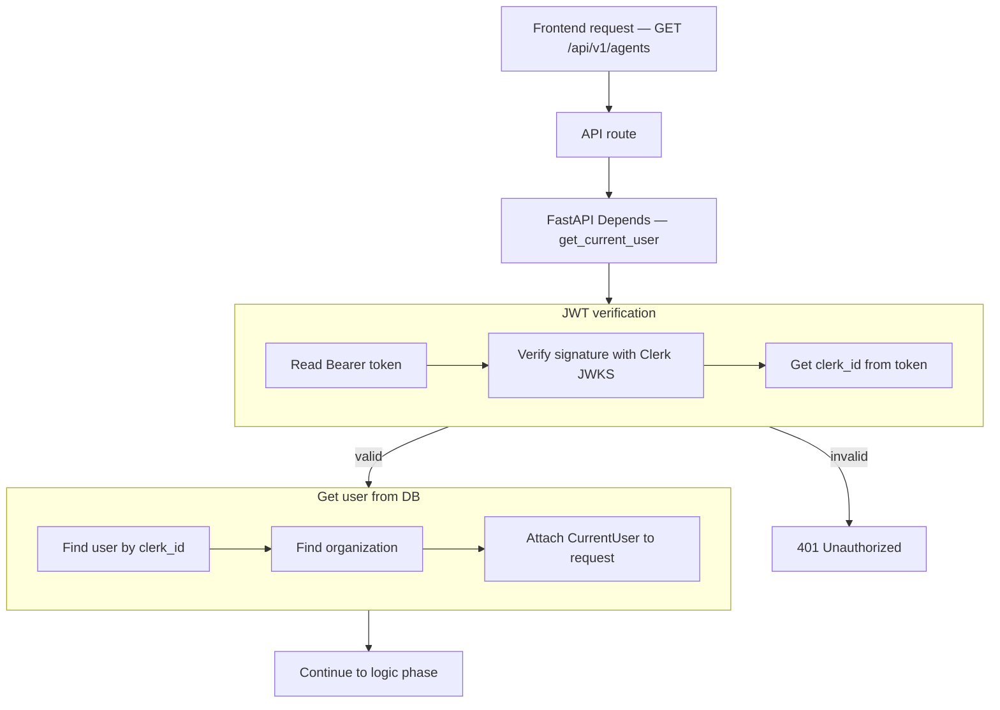
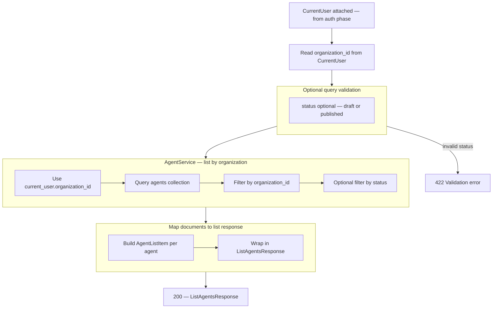

# List Agents — `GET /api/v1/agents`

**Agentic migration:** [../agentic/updets/api-migration-agentic.md](../agentic/updets/api-migration-agentic.md) — **no** route or schema change. Phase B: [../agentic/updets/api-migration-agentic-phase-b.md](../agentic/updets/api-migration-agentic-phase-b.md) — **no** REST change. Phase C: [../agentic/updets/api-migration-agentic-phase-c.md](../agentic/updets/api-migration-agentic-phase-c.md) — **no** REST change. Phase D: [../agentic/updets/api-migration-agentic-phase-d.md](../agentic/updets/api-migration-agentic-phase-d.md) — **no** REST change.

Returns all agents for the authenticated user's organization. `organization_id` comes from JWT auth (`CurrentUser`) — the client does **not** send it in the URL or query.

Draft and published agents are both included unless filtered by optional `status` query param.

# Auth phase

## Flow



## Navigate to auth files

| Flow step | What happens | Open file |
|-----------|--------------|-----------|
| API route | `GET /api/v1/agents` handler | [agents.py](../../app/api/v1/agents.py) |
| Router | Mount agents routes under `/api/v1` | [router.py](../../app/api/v1/router.py) |
| Depends | Inject `CurrentUser` | [auth.py](../../app/di/auth.py) |
| Read Bearer token | Parse `Authorization` header | [clerk_authenticator.py](../../app/infrastructure/auth/clerk_authenticator.py) |
| Verify JWT | Clerk JWKS signature check | [clerk_jwt.py](../../app/infrastructure/auth/clerk_jwt.py) |
| Get clerk_id | Read `sub` from token claims | [clerk_authenticator.py](../../app/infrastructure/auth/clerk_authenticator.py) |
| 401 Unauthorized | Invalid or expired token | [main.py](../../app/main.py) |
| Find user | Mongo lookup by `clerk_id` | [user_repository.py](../../app/infrastructure/db/repositories/mongo/user_repository.py) |
| Find organization | Mongo lookup by `organization_id` | [organization_repository.py](../../app/infrastructure/db/repositories/mongo/organization_repository.py) |
| Attach to request | Build `CurrentUser` | [current_user.py](../../app/domain/models/current_user.py) |

## JSON at each step

| Step | JSON |
|------|------|
| Start | `{}` |
| After JWT verification | `clerk_id`, `token_valid` |
| After user lookup | + `user_id`, `email` |
| After organization lookup | + `organization_id`, `organization_name` |
| Next | logic phase (list by `organization_id`) |

**Start**

```json
{}
```

**After JWT verification** (+2 fields)

```json
{
  "clerk_id": "user_3FZX0ugQeNkL7VO8cMOY8mhRAS5",
  "token_valid": true
}
```

**After user lookup** (+2 fields)

```json
{
  "clerk_id": "user_3FZX0ugQeNkL7VO8cMOY8mhRAS5",
  "token_valid": true,
  "user_id": "6a3b7c61d8139334274fbbfd",
  "email": "jayasingheshehan1995@gmail.com"
}
```

**After organization lookup** (+2 fields)

```json
{
  "clerk_id": "user_3FZX0ugQeNkL7VO8cMOY8mhRAS5",
  "token_valid": true,
  "user_id": "6a3b7c61d8139334274fbbfd",
  "email": "jayasingheshehan1995@gmail.com",
  "organization_id": "6a3b7c61d8139334274fbbfc",
  "organization_name": "abc bank"
}
```

---

# Logic phase (after auth)

Runs after `CurrentUser` is attached. No request body. Optional `status` query filter only.

## Flow



## Navigate to logic files

| Flow step | What happens | Open file |
|-----------|--------------|-----------|
| API route | `GET /api/v1/agents` list handler | [agents.py](../../app/api/v1/agents.py) |
| Query validation | Optional `status` enum filter | [agent.py](../../app/schemas/agent.py) |
| 422 Validation error | Invalid `status` value | [agent.py](../../app/schemas/agent.py) |
| Depends — service | Inject `AgentService` | [agents.py](../../app/di/agents.py) |
| Service | `list_by_organization(current_user, status?)` | [agent_service.py](../../app/services/agent_service.py) |
| Organization scope | Always filter by `current_user.organization_id` | [agent_service.py](../../app/services/agent_service.py) |
| Repository DI | `get_agent_repository()` | [repositories.py](../../app/di/repositories.py) |
| Load agents | `find_all_by_organization()` | [agent_repository.py](../../app/infrastructure/db/repositories/mongo/agent_repository.py) |
| List item schema | `AgentListItem` (summary fields) | [agent.py](../../app/schemas/agent.py) |
| Response schema | `ListAgentsResponse` (`200`) | [agent.py](../../app/schemas/agent.py) |

## Query parameters (optional)

| Param | Location | Required | Example |
|-------|----------|----------|---------|
| `status` | query string | no | `draft` |

### Validation rules

| Param | Rule |
|-------|------|
| `status` | optional enum: `draft`, `published` |

**Example request — all agents for caller's org**

```http
GET /api/v1/agents
Authorization: Bearer <clerk_jwt>
```

**Example request — draft agents only**

```http
GET /api/v1/agents?status=draft
Authorization: Bearer <clerk_jwt>
```

## Response shape

List returns **summary items** (no `system_prompt`, `guardrails`, or `llm_config`) to keep the payload small. Use `GET /api/v1/agents/{agent_id}` for full detail.

| Field | In list response |
|-------|------------------|
| `id` | yes |
| `name` | yes |
| `description` | yes |
| `industry` | yes |
| `agent_type` | yes |
| `status` | yes |
| `organization_id` | yes |
| `created_at` | yes |
| `system_prompt` | no |
| `guardrails` | no |
| `llm_config` | no |

## JSON at each step

| Step | Fields added |
|------|----------------|
| After auth | `organization_id` (from `CurrentUser`, not from client) |
| After optional query | `status` filter if provided |
| After DB query | array of matching agent documents |
| Final response | `items`, `total` |

**After auth context** (+1 field)

```json
{
  "organization_id": "6a3b7c61d8139334274fbbfc"
}
```

**After optional status filter** (+1 field)

```json
{
  "organization_id": "6a3b7c61d8139334274fbbfc",
  "status": "draft"
}
```

**After DB query** (+items)

```json
{
  "organization_id": "6a3b7c61d8139334274fbbfc",
  "items": [
    {
      "id": "67abc123def456789012345",
      "name": "abc bank",
      "description": "Payment and collections assistant for customers",
      "industry": "financial_services",
      "agent_type": "payment_collections",
      "status": "draft",
      "organization_id": "6a3b7c61d8139334274fbbfc",
      "created_at": "2026-06-24T12:00:00Z"
    }
  ]
}
```

**Final API response** (`200 OK`)

```json
{
  "items": [
    {
      "id": "67abc123def456789012345",
      "name": "abc bank",
      "description": "Payment and collections assistant for customers",
      "industry": "financial_services",
      "agent_type": "payment_collections",
      "status": "draft",
      "organization_id": "6a3b7c61d8139334274fbbfc",
      "created_at": "2026-06-24T12:00:00Z"
    },
    {
      "id": "67def456abc789012345678",
      "name": "support bot",
      "description": "Customer support triage assistant",
      "industry": "financial_services",
      "agent_type": "customer_support_triage",
      "status": "published",
      "organization_id": "6a3b7c61d8139334274fbbfc",
      "created_at": "2026-06-25T09:30:00Z"
    }
  ],
  "total": 2
}
```

**Empty list** (`200 OK`)

```json
{
  "items": [],
  "total": 0
}
```

## Error responses

| Status | When |
|--------|------|
| `401` | Missing, invalid, or expired JWT |
| `422` | Invalid `status` query value |

## What is NOT in this phase

| Item | Status |
|------|--------|
| Client-supplied `organization_id` | not allowed — always from auth |
| Cross-organization listing | not allowed |
| Pagination (`page`, `limit`) | future enhancement |
| Full agent detail in list | use `GET /api/v1/agents/{agent_id}` |
| Search / sort | future enhancement |

## Planned implementation (not coded yet)

| File | Change |
|------|--------|
| [agents.py](../../app/api/v1/agents.py) | Add `GET /` list route (same path as create, different method) |
| [agent.py](../../app/schemas/agent.py) | Add `AgentListItem`, `ListAgentsResponse` |
| [agent_service.py](../../app/services/agent_service.py) | Add `list_by_organization()` |
| [agent_repository.py](../../app/infrastructure/db/repositories/mongo/agent_repository.py) | Add `find_all_by_organization()` |
