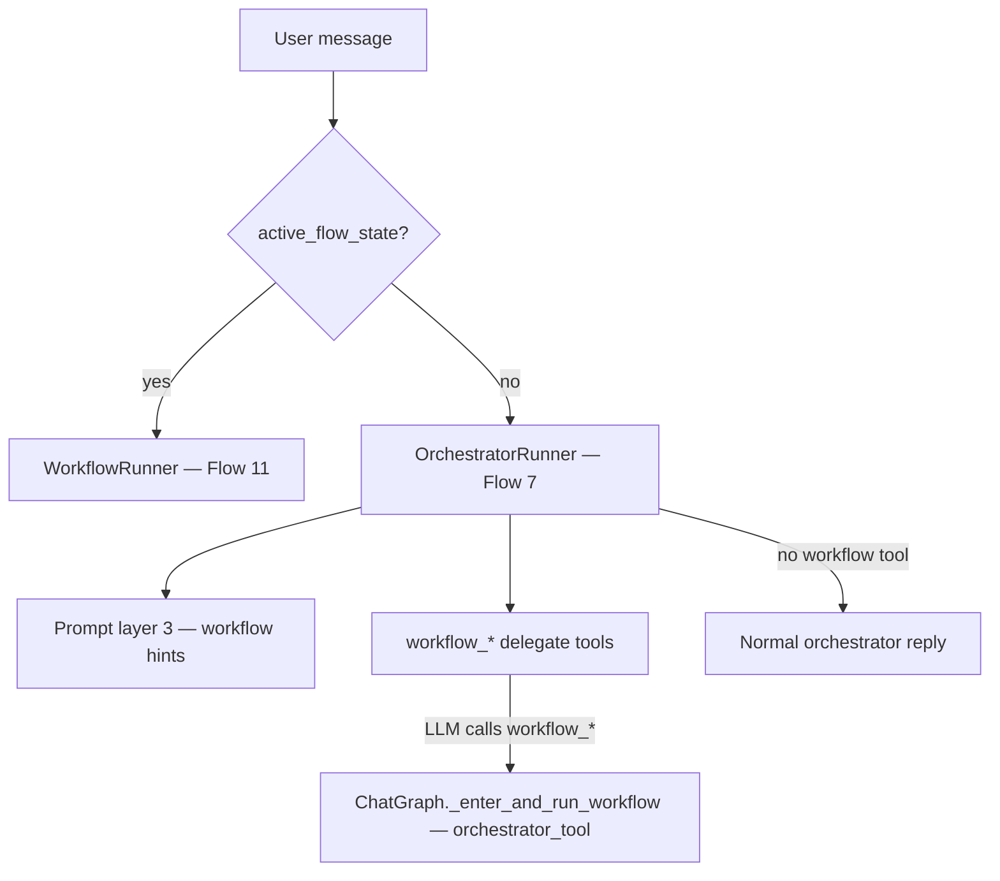

# Runtime migration — Phase B (agentic workflow routing)

**No new HTTP endpoints.** API matrix: [api-migration-agentic-phase-b.md](./api-migration-agentic-phase-b.md)

**Prerequisite:** Phase A **Done** — [runtime-migration-agentic.md](./runtime-migration-agentic.md)

---

## Implementation status

**Phase B — Done** (implemented in code).

---

## Problem

Today `ChatGraph` bypasses the orchestrator on the **first user message** when the agent has any published workflow:

```text
user message #1 + workflows[] → auto-enter workflows[0] (default_first_message)
```

That ignores capability catalog `routing_hint` and prevents the LLM from choosing the right workflow (or no workflow).

---

## Target behavior



| Enter reason | When | After Phase B |
|--------------|------|---------------|
| `active_state` | Resume in-progress workflow | **Keep** |
| `orchestrator_tool` | LLM called `workflow_<name>` | **Keep** — primary entry |
| `default_first_message` | First message auto-start | **Remove** |

---

## Code changes

### 1. `app/domain/graph/chat_graph.py` — required

| Action | Detail |
|--------|--------|
| **Delete** | `_should_auto_start_workflow()` function |
| **Delete** | Block that calls it (lines ~59–67) — `enter_reason="default_first_message"` |
| **Keep** | `active_flow_state` branch |
| **Keep** | `turn_result.workflow_enter` → `_enter_and_run_workflow(..., enter_reason="orchestrator_tool")` |

### 2. `app/services/chat_completion_service.py` — required

| Action | Detail |
|--------|--------|
| **Delete** | `will_auto_start_workflow` computation |
| **Change** | `skip_rag = in_workflow` only (not `or will_auto_start_workflow`) |

Today:

```python
will_auto_start_workflow = (
    not in_workflow
    and bool(bundle.orchestrator.workflows)
    and sum(1 for event in tracker.get_history() if event.get("role") == "user") == 1
)
skip_rag = in_workflow or will_auto_start_workflow
```

After Phase B:

```python
skip_rag = in_workflow
```

### 3. `app/domain/workflow/workflow_delegate.py` — optional (recommended)

Enrich LangGraph tool `description` with `routing_hint` from `bundle.capability_catalog` so the model sees hints in the tool list as well as layer [3].

| Today | Target |
|-------|--------|
| `description = workflow.description or f"Start workflow {workflow.name}"` | Append `routing_hint` when present, e.g. `"Greet new users — Start workflow hello"` |

Requires passing `capability_catalog` (or pre-built hint map) into `build_workflow_delegate_tools`.

### 4. `app/domain/graph/orchestrator.py` — optional

If workflow delegate descriptions are enriched, pass catalog from `bundle` into `build_workflow_delegate_tools`.

### 5. No change

| File | Why |
|------|-----|
| `workflow_runner.py` | Node execution unchanged |
| `workflow_service.py` | REST/catalog already Phase A |
| `runtime_bundle_loader.py` | Already loads workflows + catalog |
| `capability_catalog_builder.py` | Layer [3] already lists workflows + hints |
| `FinalPromptBuilder` | Unchanged |
| `tracker.py` | Unchanged |

---

## Prompt / routing flow (orchestrator turn)

Unchanged from Phase A except workflow **entry**:

```text
[1] system_prompt + personality/tone
[2] guardrail_instructions
[3] capability_catalog  ← workflow routing_hint here
[4] rag_context         ← always-on until Phase C
```

LLM tools on orchestrator turn:

```text
executor tools (mongo_*, http_*, …)
delegate_* (sub-agents)
workflow_* (workflows)   ← only way to start a workflow after Phase B
```

Workflow tool naming: `workflow_<normalized_name>` — see [workflow_delegate.py](../../app/domain/workflow/workflow_delegate.py).

---

## Trace events

| Event | Phase B change |
|-------|----------------|
| `workflow_enter` | `reason` never `default_first_message` |
| `workflow_enter` | `reason: orchestrator_tool` when LLM starts workflow |
| `rag_skipped` | Only when `in_workflow`, not first message + workflows |
| `routing_decision` | `mode: workflow` unchanged |

---

## Tests

| File | Covers | Status |
|------|--------|--------|
| `tests/test_workflow_runtime_at_chat.py` | Remove auto-start tests; add LLM-routed enter | **Done** |
| `tests/test_chat_completion_service.py` | RAG runs on first message when workflows attached | **Done** |

### Tests to remove or rewrite

- `test_should_auto_start_workflow_on_first_message`
- `test_chat_graph_auto_starts_hello_workflow`

### Tests to add

- First message with workflows → orchestrator invoked, `active_flow_state` null
- Mock LLM workflow tool call → `workflow_enter` with `orchestrator_tool`
- `chat_completion_service` — RAG `retrieve` called on first message (when KBs exist)

---

## Breaking change notice

Agents that depended on **silent auto-start** of the first attached workflow will **no longer** enter a workflow until the LLM calls `workflow_<name>` (or the user is already in `active_flow_state`).

**Mitigation for builders:**

- Set clear `routing_hint` on workflows (Phase A REST)
- Use workflow description that matches user intent
- Test preview chat — first message may be orchestrator-only reply until LLM routes

---

## After Phase B

| Phase | Next |
|-------|------|
| **C** | Agentic RAG — `search_knowledge` tool | [runtime-migration-agentic-phase-c.md](./runtime-migration-agentic-phase-c.md) |
| **D** | Sticky sub-agent handover |

Master index: [../00-overview.md](../00-overview.md)
