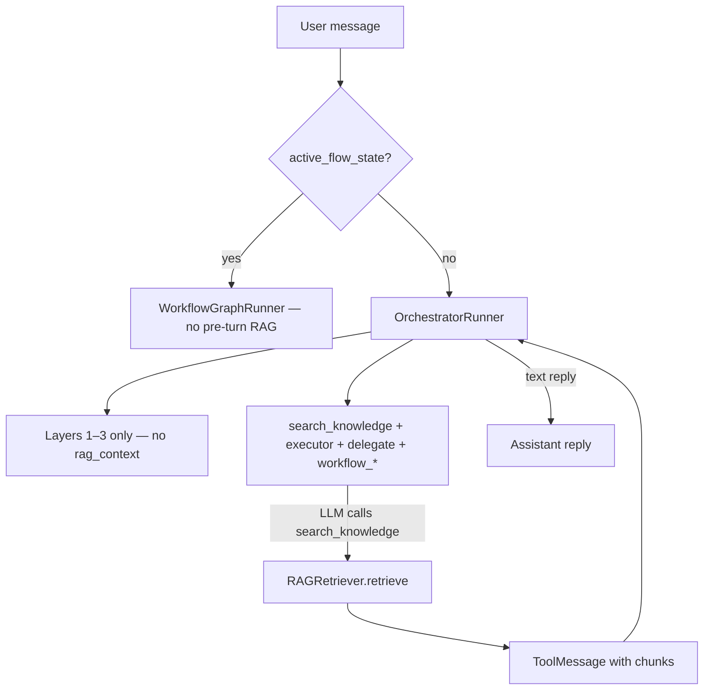

# Runtime migration — Phase C (agentic RAG)

**No new HTTP endpoints.** API matrix: [api-migration-agentic-phase-c.md](./api-migration-agentic-phase-c.md)

**Prerequisite:** Phase A **Done** · Phase B **Done** — [runtime-migration-agentic.md](./runtime-migration-agentic.md)

---

## Implementation status

**Phase C — Done** (implemented in code).

**Runtime stack note:** RAG runs inside LangChain `create_agent()` via `search_knowledge` tool + routing middleware (`OrchestratorRunner` / `SubAgentRunner` → `run_tool_agent_turn`). **LangChain proper (Done):** [migration-langchain-proper.md](./migration-langchain-proper.md).

---

## Problem (before Phase C — fixed)

Before Phase C, `ChatCompletionService` **always** retrieved knowledge before the orchestrator ran:

```text
user message + orchestrator KBs[] → RAGRetriever.retrieve() → layer [4] rag_context in system prompt
```

That ignores capability catalog `routing_hint` and spends retrieval cost on every turn even when the LLM does not need KB context.

**Exception (before Phase C):** RAG was skipped when `tracker.active_flow_state` was set (Phase B).

**Sub-agent path (before Phase C):** `OrchestratorRunner.run_turn` auto-called `rag.retrieve()` when delegating to a sub-agent with KBs — same always-on pattern. **Removed in Phase C.**

---

## Current behavior (Phase C — Done)



| RAG trigger | When | Current (Done) |
|-------------|------|---------------|
| Pre-turn always-on | Every orchestrator turn with KBs | **Removed** |
| `search_knowledge` tool | LLM chooses to search | **Primary** |
| In-workflow skip | `active_flow_state` set | **Keep** — no pre-turn RAG |
| Sub-agent auto prefetch | On delegate enter | **Removed** — `search_knowledge` on `SubAgentRunner` turn |

---

## Code changes (implemented)

### 1. `app/domain/graph/search_knowledge_delegate.py`

Mirror [workflow_delegate.py](../../app/domain/workflow/workflow_delegate.py) for **tool registration only** — use a **stub coroutine** (like `workflow_*`). Real retrieval runs in `OrchestratorRunner.execute_tool_turn`, **not** in the stub (same pattern as executor tools, unlike `workflow_*` which early-returns).

| Item | Detail |
|------|--------|
| Tool name | `search_knowledge` (fixed; not per-KB) |
| Args | `query: str` (required); optional `knowledge_base_names: list[str]` to narrow scope |
| Stub | Returns placeholder string — runtime handles real retrieval in `execute_tool_turn` |
| Description | Include catalog KB hints — append `routing_hint` per KB from `bundle.capability_catalog` |
| Tool result | Formatted context string (`RagRetrieveResult.context`) returned as `ToolMessage` content |

```python
def build_search_knowledge_tool(
    knowledge_bases: list[RuntimeKnowledgeBase],
    *,
    capability_catalog: CapabilityCatalog | None,
) -> StructuredTool | None:
    async def _search_stub(**_kwargs: Any) -> str:
        return "Knowledge search is handled by the chat runtime."
    ...
```

Return `None` when `knowledge_bases` is empty (no tool registered).

In `execute_tool_turn`, when `tool_name == "search_knowledge"`: call `RAGRetriever.retrieve(...)`, append `ToolMessage`, **continue** the tool loop (do not early-return like `workflow_*`).

### 2. `app/services/chat_completion_service.py` — required

| Action | Detail |
|--------|--------|
| **Delete** | Block that calls `self._rag.retrieve(...)` before `ChatGraph.run_turn` for orchestrator KBs |
| **Change** | Always pass `rag_context=""` to `FinalPromptBuilder` |
| **Simplify** | `skip_rag = in_workflow` — **trace-only** after Phase C (emit `rag_skipped` when in workflow or no KBs; no retrieval either way) |
| **Keep** | Pass `rag=self._rag` into `chat_graph.run_turn` for tool execution inside orchestrator |

Before Phase C (removed):

```python
if skip_rag or not kb_list:
    rag_context = ""
else:
    rag_result = await self._rag.retrieve(...)
    rag_context = rag_result.context
```

Current (implemented):

```python
rag_context = ""  # layer [4] empty; chunks only via search_knowledge ToolMessage
# emit rag_skipped trace when in_workflow or not kb_list (trace-only; no retrieval)
```

### 3. `app/domain/graph/orchestrator.py` — required

| Action | Detail |
|--------|--------|
| **Add** | Build `search_knowledge` tool when `orchestrator.knowledge_bases` non-empty |
| **Add** | In `execute_tool_turn`, branch `tool_name == "search_knowledge"` — invoke `RAGRetriever`, append `ToolMessage`, continue loop |
| **Delete** | Auto `rag.retrieve()` prefetch in delegation branch (lines ~84–91) |
| **Pass** | `rag`, `bundle`, and scoped KB list into search handler |

Tool list order (suggested):

```text
executor tools (mongo_*, http_*, …)
search_knowledge          ← Phase C
delegate_* (sub-agents)
workflow_* (workflows)
```

Reserve `search_knowledge` in `reserved_names` when building delegate/workflow tools.

### 4. `SubAgentRunner` + `sub_agent_delegate.py` — required

| Action | Detail |
|--------|--------|
| **Update** | `SubAgentRunner.run_turn` — add `search_knowledge` to tool list when `sub_agent.knowledge_bases` non-empty (scoped to sub-agent KBs) |
| **Delete** | Pre-fetched `rag_context` passed into `build_sub_agent_system_prompt` |
| **Reuse** | Same `execute_tool_turn` search branch as orchestrator (scoped KB list from sub-agent) |

`build_sub_agent_system_prompt` no longer receives pre-fetched `rag_context`; chunks arrive via `ToolMessage` when the sub-agent LLM calls `search_knowledge`.

### 5. `app/domain/pipeline/prompt/final_prompt_builder.py` — no structural change

Layer [4] remains supported for explicit `rag_context` but chat passes empty string at turn start.

### 6. No change

| File | Why |
|------|-----|
| `retriever.py` | Reused by tool handler |
| `vector_search.py` / `keyword_search.py` | Unchanged |
| `capability_catalog_builder.py` | Layer [3] already lists KBs + hints |
| `knowledgebase_service.py` | REST/catalog already Phase A |
| `workflow_graph_runner.py` | Workflows unchanged |
| `chat_graph.py` | Still passes `rag` through to orchestrator |

---

## Prompt layers (orchestrator turn — current)

```text
[1] system_prompt + personality/tone
[2] guardrail_instructions
[3] capability_catalog     ← KB routing_hint here
[4] rag_context            ← empty at turn start; chunks via ToolMessage after search_knowledge
```

---

## Trace events

| Event | Phase C change |
|-------|----------------|
| `rag_complete` | **Remove** per-turn auto emit from `chat_completion_service` — do **not** duplicate alongside `tool_complete` |
| `tool_start` / `tool_complete` | Emit for `search_knowledge`; put RAG stats (`kb_ids`, `chunk_count`, `context_length`) in `tool_complete` payload |
| `rag_skipped` | When `in_workflow` or no KBs on agent (trace-only; no retrieval) |
| `routing_decision` | Unchanged |

---

## Tests

| File | Covers | Status |
|------|--------|--------|
| `tests/test_chat_completion_service.py` | No auto `retrieve` when KBs attached | **Done** |
| `tests/test_search_knowledge_delegate.py` | Tool schema + routing_hint in description | **Done** |
| `tests/test_sub_agent_delegation_at_chat.py` | Sub-agent — no prefetch; `search_knowledge` registered | **Done** |
| `tests/test_orchestrator_search_knowledge.py` | Handler + LLM tool loop + name collision | **Done** |
| `tests/test_rag_retriever.py` | Retriever behavior | **Done** (keep) |

### Tests removed or rewritten (Phase C)

- ~~`test_chat_completion_runs_rag_on_first_message_with_workflows`~~ — replaced by `test_chat_completion_does_not_auto_retrieve_rag_with_kbs` in `test_orchestrator_search_knowledge.py`

Covered by `test_orchestrator_search_knowledge.py` and `test_sub_agent_delegation_at_chat.py`: no auto `retrieve` until tool handler; sub-agent `search_knowledge` registration; LLM tool loop; `routing_hint` in tool description.

---

## Breaking change notice

Agents that depended on **silent always-on RAG** will answer without KB context until the LLM calls `search_knowledge`.

**Mitigation for builders:**

- Set clear `routing_hint` on knowledge bases (Phase A REST)
- Use KB description that matches user questions
- Test preview chat — verify model calls `search_knowledge` for FAQ-style agents

---

## Next phases

| Phase | Status | Doc |
|-------|--------|-----|
| **D** | **Done** — sticky sub-agent | [runtime-migration-agentic-phase-d.md](./runtime-migration-agentic-phase-d.md) |
| **LangChain proper** | **Done** — `create_agent()`, compiled workflows, PIIMiddleware | [migration-langchain-proper.md](./migration-langchain-proper.md) |

Master index: [../00-overview.md](../00-overview.md)
