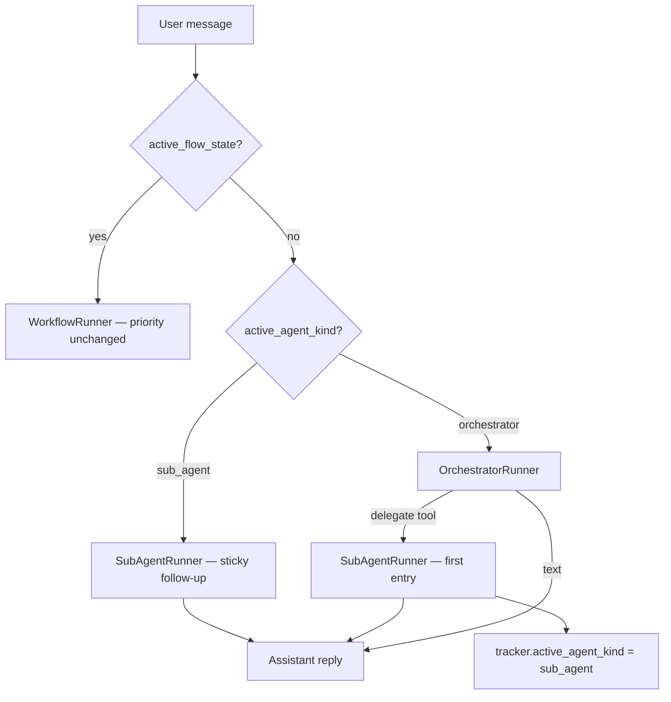

# Runtime migration — Phase D (sticky sub-agent)

**No new HTTP endpoints.** API matrix: [api-migration-agentic-phase-d.md](./api-migration-agentic-phase-d.md)

**Prerequisite:** Phase A **Done** · Phase B **Done** · Phase C **Done** — [runtime-migration-agentic.md](./runtime-migration-agentic.md)

---

## Implementation status

**Phase D — Planned** (not implemented in code yet).

---

## Problem

Today every chat turn **resets** sub-agent routing before the orchestrator runs:

```text
turn N:   orchestrator delegates → active_agent_kind = sub_agent → SubAgentRunner reply
turn N+1: chat_completion_service calls reset_to_orchestrator() → orchestrator runs again
```

User follow-up messages must re-trigger delegation through the orchestrator LLM, even when the conversation is clearly still scoped to the same sub-agent.

**Location today:** `chat_completion_service.py` (~lines 120–121):

```python
if tracker.active_agent_kind == "sub_agent" and tracker.active_flow_state is None:
    tracker.reset_to_orchestrator()
```

---

## Target behavior



| Routing | When | After Phase D |
|---------|------|---------------|
| Reset sub-agent every turn | Start of `chat_completion_service._complete_turn` | **Remove** |
| Sticky sub-agent follow-up | `active_agent_kind == "sub_agent"` and no workflow | **Primary** for turn N+1… |
| Orchestrator | Default or after exit | **Unchanged** |
| Workflow | `active_flow_state` set | **Unchanged** — takes priority over sticky |

---

## Exit conditions (sticky → orchestrator)

| Exit | Mechanism |
|------|-----------|
| Workflow enter | `tracker.enter_workflow()` — workflow path in `ChatGraph` (Phase B) |
| Workflow exit | `tracker.clear_flow_state()` — returns to orchestrator (existing) |
| Explicit return | **Recommended:** `return_to_orchestrator` LLM tool on sub-agent turns (stub + runtime handler, mirror `workflow_*`) |
| Session / new topic | Builder may clear session; or orchestrator re-delegates on next explicit delegate tool call after exit |

**MVP:** workflow priority + explicit `return_to_orchestrator` tool. Do not require keyword heuristics.

---

## Code changes

### 1. `app/services/chat_completion_service.py` — required

| Action | Detail |
|--------|--------|
| **Delete** | Block that calls `tracker.reset_to_orchestrator()` when `active_agent_kind == "sub_agent"` |

Orchestrator `FinalPromptBuilder` still runs on every turn today; sticky path in `ChatGraph` will bypass orchestrator execution (prompt build cost is acceptable for MVP — optimize later if needed).

### 2. `app/domain/graph/chat_graph.py` — required

| Action | Detail |
|--------|--------|
| **Add** | After workflow check, before orchestrator: if `active_agent_kind == "sub_agent"` → resolve sub-agent via `find_sub_agent_by_id(active_agent_id)` → `SubAgentRunner.run_turn` |
| **Pass** | `delegate_args` from `tracker.last_routing_decision.get("args", {})` on sticky turns |
| **Return** | `ChatGraphResult` with `routing.mode == "delegate"` and same `sub_agent_id` — reuse existing `set_routing_decision` mapping |

```python
# Suggested order in run_turn:
# 1. active_flow_state → workflow (existing)
# 2. active_agent_kind == "sub_agent" → SubAgentRunner (Phase D)
# 3. orchestrator (existing)
```

### 3. `app/domain/graph/sub_agent_delegate.py` — recommended

| Action | Detail |
|--------|--------|
| **Add** | `return_to_orchestrator` stub tool on sub-agent tool list |
| **Handle** | In `execute_tool_turn` or sub-agent loop — early-return to orchestrator (mirror workflow delegate pattern) |

Tool name: `return_to_orchestrator` (fixed; reserve in sub-agent executor tool names).

### 4. `app/domain/models/runtime_bundle.py` — required

| Action | Detail |
|--------|--------|
| **Add** | `RuntimeOrchestrator.find_sub_agent_by_id(sub_agent_id: str)` — sticky path resolves by `active_agent_id` (today only `find_sub_agent_by_name` exists) |

### 5. `app/domain/models/tracker.py` — optional helpers

| Action | Detail |
|--------|--------|
| **Add** | `get_sticky_sub_agent_id()` / `get_delegate_args()` reading `last_routing_decision` |
| **Keep** | `set_routing_decision` on first delegate — already sets `active_agent_id` + `active_agent_kind` |

Persistence in Mongo via `tracker_repository` already includes `active_agent_id`, `active_agent_kind`, `last_routing_decision` — **no schema migration**.

### 6. No change

| File | Why |
|------|-----|
| `orchestrator.py` | Delegate entry unchanged — first delegate still via orchestrator tool |
| `runtime_bundle_loader.py` | Unchanged |
| `final_prompt_builder.py` | Orchestrator prompt unchanged; sub-agent uses `build_sub_agent_system_prompt` |
| REST routes / schemas | Unchanged |

---

## Prompt / routing on sticky turns

| Turn | System prompt | Tools |
|------|---------------|-------|
| First delegate | `build_sub_agent_system_prompt` + delegate args | sub-agent tools + `search_knowledge` (Phase C) |
| Sticky follow-up | Same sub-agent instructions; delegate args from `last_routing_decision` (or empty) | Same scoped tools |
| Orchestrator | `FinalPromptBuilder` layers [1]–[4] | executor + `search_knowledge` + delegate + `workflow_*` |

Layer [3] catalog on orchestrator turns still lists sub-agents + `routing_hint` for **entry** only.

---

## Trace events

| Event | Phase D change |
|-------|----------------|
| `sub_agent_start` | Emit on **first** delegate from orchestrator (existing — `chat_completion_service.py`) |
| `sub_agent_continue` | **Add** — sticky follow-up turn; emit from `ChatGraph` sticky branch when `routing.mode == "delegate"` on a non-first delegate turn |
| `sub_agent_complete` | Emit after sub-agent reply (existing — `chat_completion_service.py`) |
| `routing_decision` | `mode: delegate` with same `sub_agent_id` on sticky turns |

---

## Tests

| File | Covers | Status |
|------|--------|--------|
| `tests/test_sub_agent_delegation_at_chat.py` | Follow-up does **not** reset; sticky routing | **Planned** |
| `tests/test_chat_completion_service.py` | Orchestrator skipped on sticky turn | **Planned** |
| `tests/test_workflow_runtime_at_chat.py` | Workflow overrides sticky sub-agent | **Planned** |
| Return tool test | `return_to_orchestrator` clears sticky state | **Planned** |

### Tests to rewrite

- `test_chat_completion_resets_sub_agent_before_next_turn` — today asserts reset; after Phase D assert **sticky** (orchestrator not called, sub-agent path used)

---

## Breaking change notice

Agents that relied on **automatic return to orchestrator** every message will keep users on the sub-agent until explicit exit.

**Mitigation:**

- Document `return_to_orchestrator` for builders
- Preview UI graph highlight will stay on sub-agent node (expected)
- QA multi-turn delegate flows without re-stating the task

---

## After Phase D

Agentic migration phases A–D complete for the current roadmap. Future work (out of scope): executor tool trace events, optional catalog PATCH API.

Master index: [../00-overview.md](../00-overview.md)
