# Chat Completion — `POST /api/v1/chat/webhook/{webhook_id}`

Main inference endpoint for the **web widget** and channels. End user sends a message; platform returns assistant reply/replies.

**Not org JWT auth (MVP).** `webhook_id` identifies the channel. Service token — phase 2.

Capabilities (no separate Skills layer): **orchestrator agent**, **sub-agents**, **tools**, **knowledge bases**, **workflows**.

**Agentic migration (capability catalog):** [../agentic/updets/api-migration-agentic.md](../agentic/updets/api-migration-agentic.md) — this endpoint has **no REST/schema change**; runtime builds final prompt from `system_prompt` + guardrails + catalog; RAG via `search_knowledge` tool (Phase C **Done**).

Related config docs:

- Agent: [../agent/01-create-agent-diagrams.md](../agent/01-create-agent-diagrams.md) · [../agent/03-list-agents-diagrams.md](../agent/03-list-agents-diagrams.md)
- Tools: [../tools/00-executor-catalog.md](../tools/00-executor-catalog.md) · runtime: [../tools/03-execute-tool-at-chat-diagrams.md](../tools/03-execute-tool-at-chat-diagrams.md)
- Knowledge bases: [../knowledgebase/01-create-knowledgebase-diagrams.md](../knowledgebase/01-create-knowledgebase-diagrams.md)
- Workflows: [../workflows/01-create-workflow-diagrams.md](../workflows/01-create-workflow-diagrams.md)
- Sub-agents: [../sub-agents/01-create-sub-agent-diagrams.md](../sub-agents/01-create-sub-agent-diagrams.md)

**Next-pass specs:**

- Agentic catalog + prompt layers — [../agentic/updets/api-migration-agentic.md](../agentic/updets/api-migration-agentic.md)
- Phase 2 — [02-sub-agent-delegation-at-chat-diagrams.md](./02-sub-agent-delegation-at-chat-diagrams.md)
- Phase 3 — [03-rag-at-chat-diagrams.md](./03-rag-at-chat-diagrams.md) (agentic `search_knowledge` — Phase C **Done**)
- Phase 4 — [04-workflow-runtime-at-chat-diagrams.md](./04-workflow-runtime-at-chat-diagrams.md)
- Phase B — [../agentic/updets/runtime-migration-agentic-phase-b.md](../agentic/updets/runtime-migration-agentic-phase-b.md) (agentic workflow routing — **Done**)
- Phase C — [../agentic/updets/runtime-migration-agentic-phase-c.md](../agentic/updets/runtime-migration-agentic-phase-c.md) (agentic RAG — **Done**)
- Phase D — [../agentic/updets/runtime-migration-agentic-phase-d.md](../agentic/updets/runtime-migration-agentic-phase-d.md) (sticky sub-agent — **Done**)
- LangChain proper — [../agentic/updets/migration-langchain-proper.md](../agentic/updets/migration-langchain-proper.md) (**Done** — `create_agent()` orchestrator/sub-agent, compiled workflow graph, `PIIMiddleware`, LangSmith parent run; **no REST change**)

**Runtime stack:** LangGraph session router (`ChatGraph`) + LangChain `create_agent()` (orchestrator/sub-agent) + LangGraph `WorkflowGraphRunner` for workflows. See [migration-langchain-proper.md](../agentic/updets/migration-langchain-proper.md) and [migration-chat-router-langgraph.md](../agentic/updets/migration-chat-router-langgraph.md).

**Preview UI (admin builder — implemented):**

- [05-agent-runtime-graph-diagrams.md](./05-agent-runtime-graph-diagrams.md) — `GET .../runtime-graph`
- [06-preview-chat-diagrams.md](./06-preview-chat-diagrams.md) — `POST .../preview/chat`
- [07-preview-session-trace-diagrams.md](./07-preview-session-trace-diagrams.md) — `GET .../preview/sessions/{sender_id}/trace`

---

# Implementation status

| Phase | Flows | Status | What runs today |
|-------|--------|--------|-----------------|
| **0** | 1–5, 12 | **Done** | Request validation, channel/agent resolve (friendly 200 fallback), tracker, RuntimeBundle batch hydrate, guardrails, orchestrator LLM (PII via agent middleware), persist + response |
| **1** | 6–7, 10 | **Done** | Orchestrator/sub-agent Bedrock turn via LangChain `create_agent()` in [orchestrator_agent.py](../../app/domain/graph/langchain/orchestrator_agent.py); tools via agent `ToolNode` + [langgraph_tools.py](../../app/domain/executors/langgraph_tools.py) |
| **2** | 8 | **Done** | Sub-agent delegation at runtime — see [02-sub-agent-delegation-at-chat-diagrams.md](./02-sub-agent-delegation-at-chat-diagrams.md) |
| **3** | 9 | **Done** — agentic `search_knowledge` tool (Phase C) | Qdrant / keyword RAG — see [03-rag-at-chat-diagrams.md](./03-rag-at-chat-diagrams.md) · [../agentic/updets/runtime-migration-agentic-phase-c.md](../agentic/updets/runtime-migration-agentic-phase-c.md) |
| **4** | 11 | **Done** | Workflow runtime — [04-workflow-runtime-at-chat-diagrams.md](./04-workflow-runtime-at-chat-diagrams.md) · Phase B (LLM routing): [../agentic/updets/runtime-migration-agentic-phase-b.md](../agentic/updets/runtime-migration-agentic-phase-b.md) |
| **A** | — | **Done** | [../agentic/updets/runtime-migration-agentic.md](../agentic/updets/runtime-migration-agentic.md) |
| **B** | 6, 11 | **Done** | [../agentic/updets/runtime-migration-agentic-phase-b.md](../agentic/updets/runtime-migration-agentic-phase-b.md) |
| **C** | 9 | **Done** | [../agentic/updets/runtime-migration-agentic-phase-c.md](../agentic/updets/runtime-migration-agentic-phase-c.md) |
| **D** | 8 | **Done** | Sticky sub-agent — [../agentic/updets/runtime-migration-agentic-phase-d.md](../agentic/updets/runtime-migration-agentic-phase-d.md) |
| **LangChain** | 6–7, 8, 10, 11 | **Done** | [migration-langchain-proper.md](../agentic/updets/migration-langchain-proper.md) — `create_agent()` orchestrator/sub-agent; compiled workflow graph |

**Current runtime path:** `chat.py` → `ChatCompletionService` → guardrails (intent) → `RuntimeBundleLoader` → `ChatGraph` (LangGraph router) → `OrchestratorRunner` / `WorkflowGraphRunner` / `SubAgentRunner` → NeMo output gate (optional) → `TrackerService.persist`.

---

# High-level flow

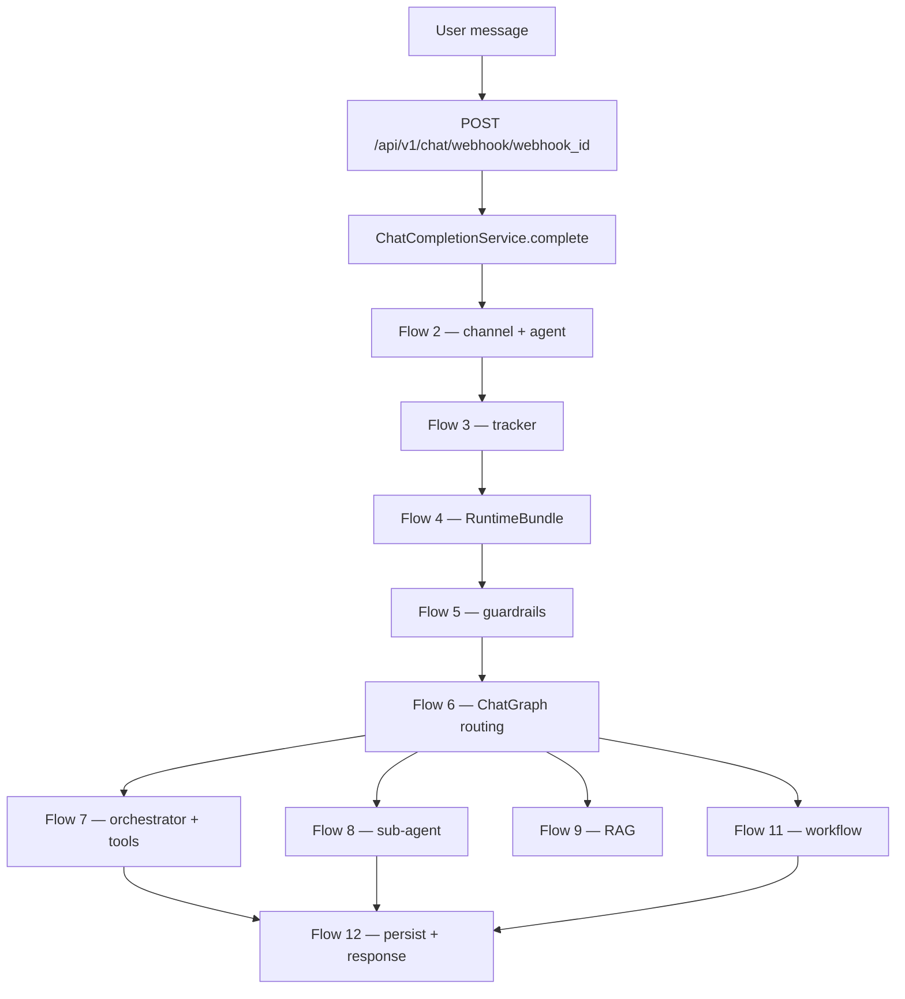

**Note:** Flow 9 (RAG) runs **inside** Flow 7 / Flow 8 tool loops via `search_knowledge` (Phase C **Done**) — not as a separate `ChatGraph` branch.

---

# Flow 1 — Validate request

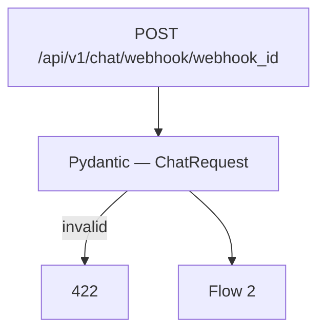

### Request body

```json
{
  "sender_id": "user-abc-123",
  "message": "What is my loyalty balance?",
  "metadata": {
    "page_url": "https://example.com/help"
  }
}
```

| Field | Rule |
|-------|------|
| `sender_id` | required — stable per end user in channel |
| `message` | required, min length 1 |
| `metadata` | optional object |

---

# Flow 2 — Resolve channel + orchestrator agent

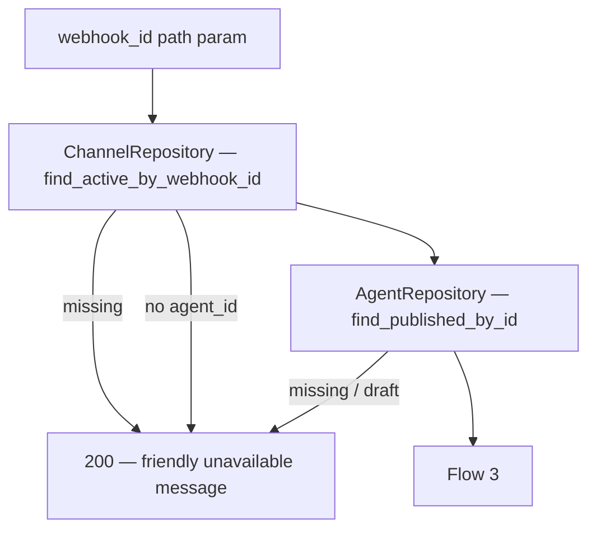

Orchestrator = **published** parent agent linked to channel.

### Friendly fallback `200` (not 500)

```json
{
  "messages": [
    {
      "recipient_id": "user-abc-123",
      "text": "This assistant is temporarily unavailable. Please contact support.",
      "buttons": null
    }
  ]
}
```

---

# Flow 3 — Load session (tracker)

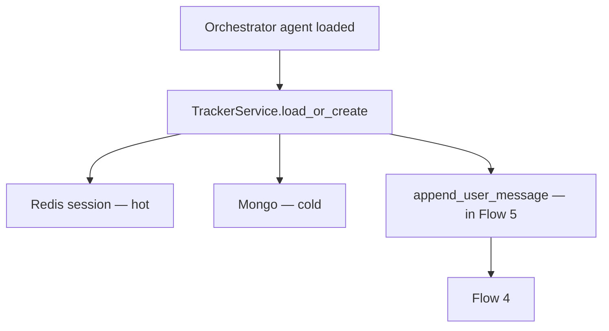

### Tracker fields (existing + planned)

```json
{
  "sender_id": "user-abc-123",
  "assistant_id": "67agent001",
  "events": [
    { "role": "user", "content": "...", "timestamp": "..." },
    { "role": "assistant", "content": "...", "timestamp": "..." }
  ],
  "active_agent_id": "67agent001",
  "active_agent_kind": "orchestrator",
  "active_flow_state": null,
  "last_routing_decision": null
}
```

| Field | Purpose |
|-------|---------|
| `events` | LLM history (cap last N turns) |
| `active_flow_state` | Workflow position + slots — Flow 11 |
| `active_agent_kind` | `orchestrator` \| `sub_agent` \| `workflow` |

---

# Flow 4 — RuntimeBundle loader (batch hydrate)

Mongo stores **IDs only** on agent / sub-agent. Chat hydrates once per turn (or Redis cache).

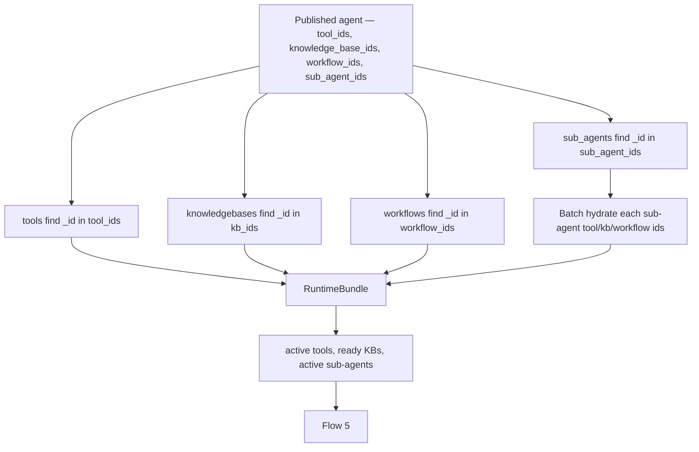

**~6–9 batch queries** — not one call per ID. See [../tools/03-execute-tool-at-chat-diagrams.md](../tools/03-execute-tool-at-chat-diagrams.md).

### RuntimeBundle shape (in-memory)

```json
{
  "orchestrator": {
    "id": "67agent001",
    "name": "Support Bot",
    "system_prompt": "...",
    "tools": [{ "id": "...", "name": "customer_lookup", "description": "...", "executor": "mongo_find_one", "config": {} }],
    "knowledge_bases": [{ "id": "...", "name": "Policy docs", "storage_type": "vector", "status": "ready" }],
    "workflows": [{ "id": "...", "name": "Onboarding", "nodes": [], "edges": [] }],
    "sub_agents": [{
      "id": "...",
      "name": "research_agent",
      "description": "...",
      "instructions": "...",
      "parameters": [],
      "tools": [],
      "knowledge_bases": [],
      "workflows": []
    }]
  },
  "organization_id": "6a3b7c61d8139334274fbbfc"
}
```

---

# Flow 5 — Guardrails

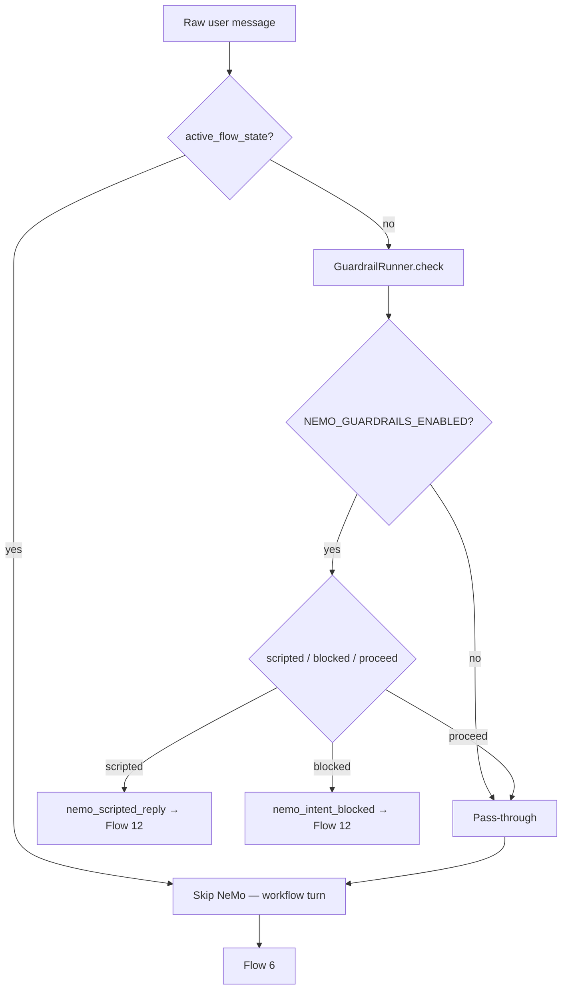

- **Prompt policy:** `GuardrailRunner.build_instructions()` → `FinalPromptBuilder` layer [2] (includes `no_secrets` and other Mongo guardrails as instructions).
- **PII / secrets in message:** LangChain `PIIMiddleware` on orchestrator/sub-agent `create_agent()` (email redact, credit_card mask, ip/url redact; block api_key/password/otp) — not at Flow 5. See [migration-nemo-guardrails.md](../agentic/updets/migration-nemo-guardrails.md#phase-2--langchain-pii-expand-done).
- **NeMo intent gate (optional):** when `NEMO_GUARDRAILS_ENABLED=true`, `evaluate_nemo_intent()` runs before the graph — `scripted_intents.yml` for greeting/help/bye (no orchestrator LLM), NeMo `self check input` for jailbreak/off-topic, skipped during active workflow. See [migration-nemo-guardrails.md](../agentic/updets/migration-nemo-guardrails.md).
- **Default (flag off):** `check()` pass-through; policy in prompt layer [2] only.
- Slot extractor **not** used here — only Flow 11 (workflow `input` nodes).

---

# Flow 6 — ChatGraph routing (LangGraph session router)

**Status: done.** [chat_graph.py](../../app/domain/graph/chat_graph.py) invokes [chat_router_compiler.py](../../app/domain/graph/chat_router_compiler.py) — LangGraph conditional edges on tracker session state (workflow → sticky sub-agent → orchestrator).

Inner LLM/workflows use LangChain/LangGraph per [migration-langchain-proper.md](../agentic/updets/migration-langchain-proper.md). Router migration: [migration-chat-router-langgraph.md](../agentic/updets/migration-chat-router-langgraph.md).

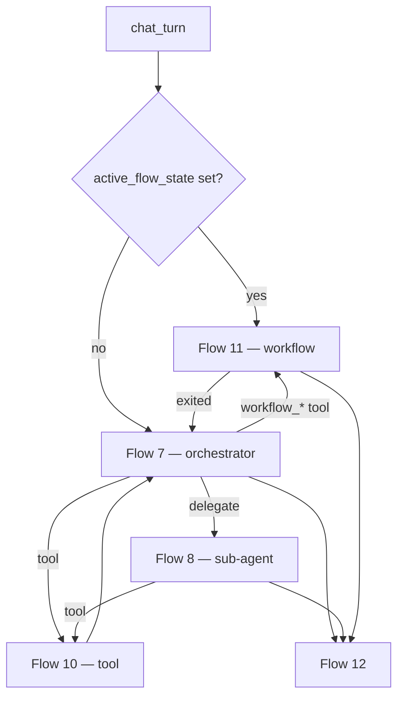

RAG (Flow 9) runs **inside** orchestrator/sub-agent `create_agent()` turns when the model calls `search_knowledge` — not in `ChatCompletionService` before `ChatGraph`.

---

# Flow 7 — Orchestrator node

**Status: done.** [orchestrator.py](../../app/domain/graph/orchestrator.py) delegates to [orchestrator_agent.py](../../app/domain/graph/langchain/orchestrator_agent.py) — LangChain `create_agent()` with routing middleware, `PIIMiddleware`, and agent `ToolNode` for executor/delegate/workflow tools.

```mermaid
flowchart TB
    BUNDLE[RuntimeBundle.orchestrator]
    BUNDLE --> PROMPT[system_prompt + personality + tone + catalog — layer 4 empty]
    BUNDLE --> TOOLS[LLM tool defs — executors + workflow_* + delegates]
    BUNDLE --> SUBS[Delegate functions from bundle.sub_agents]
    PROMPT --> LLM[Bedrock converse + tool use]
    TOOLS --> LLM
    SUBS --> LLM
    LLM --> HIST[tracker history + user_message]
    LLM --> OUT{text | tool_use | delegate}
```

Sub-agent function example:

```json
{
  "name": "research_agent",
  "description": "Deep research tasks",
  "parameters": { "type": "object", "properties": { "query": { "type": "string" } }, "required": ["query"] }
}
```

---

# Flow 8 — Sub-agent delegation

**Status:** Implemented — delegate tools + sticky follow-up (Phase D **Done**). Spec: [02-sub-agent-delegation-at-chat-diagrams.md](./02-sub-agent-delegation-at-chat-diagrams.md) · [../agentic/updets/runtime-migration-agentic-phase-d.md](../agentic/updets/runtime-migration-agentic-phase-d.md).

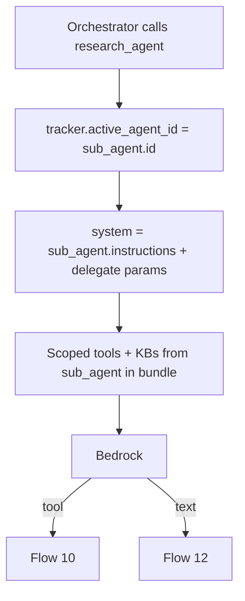

MVP: follow-up messages stay on sub-agent until workflow enter, `return_to_orchestrator` tool, or detached sub-agent fallback.

---

# Flow 9 — RAG retrieval (knowledge bases)

**Status: done** — LLM calls `search_knowledge` tool; `RAGRetriever` runs inside `execute_tool_turn`. Spec: [03-rag-at-chat-diagrams.md](./03-rag-at-chat-diagrams.md) · [../agentic/updets/runtime-migration-agentic-phase-c.md](../agentic/updets/runtime-migration-agentic-phase-c.md).

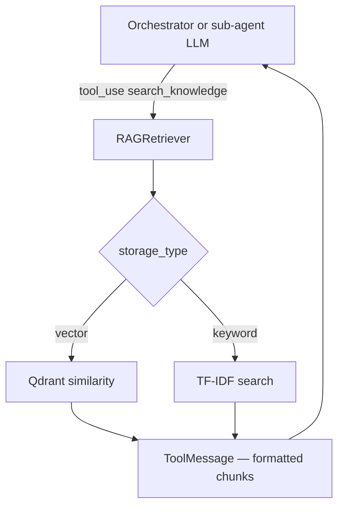

Ingest: [LlamaIndexPipeline](../../app/infrastructure/ai/indexers/llama_index_pipeline.py). Query: [RAGRetriever](../../app/domain/pipeline/rag/retriever.py). Tool: [search_knowledge_delegate.py](../../app/domain/graph/search_knowledge_delegate.py).

Layer `[4] rag_context` in `FinalPromptBuilder` is empty at turn start. Scope: orchestrator KBs or sub-agent KBs on the active turn.

---

# Flow 10 — Tool execution

**Status: done** when orchestrator has active tools in the bundle.

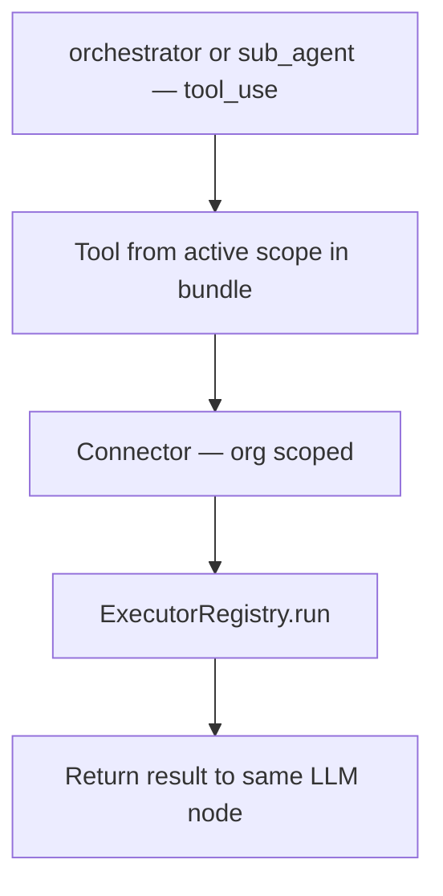

Full detail: [../tools/03-execute-tool-at-chat-diagrams.md](../tools/03-execute-tool-at-chat-diagrams.md).

---

# Flow 11 — Workflow runtime + slot capture

**Status: done** — `WorkflowGraphRunner` + LangGraph `ChatGraph` routing. Spec: [04-workflow-runtime-at-chat-diagrams.md](./04-workflow-runtime-at-chat-diagrams.md).

**Agentic Phase B (runtime, Done):** removed `default_first_message` auto-start — LLM picks workflow via `workflow_*` tool + catalog hints. Spec: [../agentic/updets/runtime-migration-agentic-phase-b.md](../agentic/updets/runtime-migration-agentic-phase-b.md).

Runs when `tracker.active_flow_state` is set **or** when the orchestrator LLM calls a `workflow_<name>` tool in the same turn (`enter_reason: orchestrator_tool`).

```mermaid
flowchart TB
    WF[workflow_node — current_node_id]
    WF --> TYPE{node type?}
    TYPE -->|start| NEXT[Follow edge]
    TYPE -->|message| OUT[Emit data.text — {{slot}} substitute]
    TYPE -->|input| SLOT[Capture user message into slots]
    TYPE -->|output| REPLY[User reply]
    TYPE -->|end| CLEAR[Clear flow state]

    SLOT --> VAL{valid?}
    VAL -->|no| RETRY[Ask again]
    VAL -->|yes| NEXT
```

### `input` node slot capture (workflow-only — not global SlotExtractor)

```json
{
  "active_flow_state": {
    "workflow_id": "6a3f9012d8139334274fbc00",
    "current_node_id": "input-1",
    "slots": { "customer_id": "123456" },
    "awaiting_slot": null
  }
}
```

Normal orchestrator / sub-agent / tool chat does **not** use slot extractor.

---

# Flow 12 — Persist + response

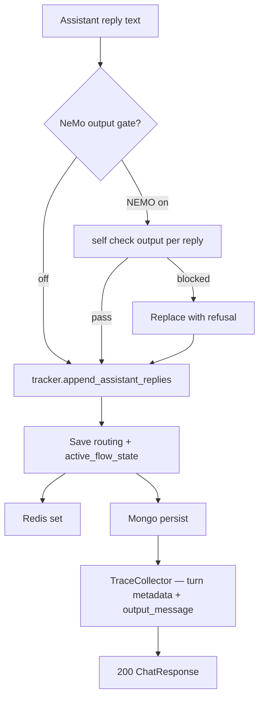

- **NeMo output gate (optional):** when `NEMO_GUARDRAILS_ENABLED=true`, `apply_nemo_output_gate()` runs after `ChatGraph.run_turn()` — skipped on scripted/input-blocked early returns. See [migration-nemo-guardrails.md](../agentic/updets/migration-nemo-guardrails.md#phase-3--output-rails-done).

### Response `200`

```json
{
  "messages": [
    {
      "recipient_id": "user-abc-123",
      "text": "Your loyalty balance is 1,250 points.",
      "buttons": null
    }
  ]
}
```

---

# Trace events (per turn)

| Event | When |
|-------|------|
| `input_message` | Turn start |
| `guardrail_complete` | Flow 5 — check passed; `gate: proceed` when NeMo on; policy also in prompt layer [2] |
| `nemo_scripted_reply` | Flow 5 — NeMo on; `scripted_intents.yml` match (`intent`, `matched_phrase` in trace) |
| `nemo_intent_blocked` | Flow 5 — NeMo on; input rail blocked (`intent`, `rail` in trace) |
| `nemo_output_complete` | Flow 12 — NeMo on; output self-check passed |
| `nemo_output_blocked` | Flow 12 — NeMo on; output rail blocked (`rail` in trace) |
| `bundle_loaded` | Flow 4 |
| `rag_skipped` | Flow 9 — in workflow or no KBs |
| `tool_start` / `tool_complete` | Flow 9 (`search_knowledge`) · Flow 10 (executors via agent `ToolNode`) |
| `sub_agent_start` / `sub_agent_continue` / `sub_agent_complete` | Flow 8 |
| `workflow_enter` / `workflow_step` / `slot_captured` / `workflow_exit` | Flow 11 |
| `output_message` | Flow 12 |

**Turn metadata** (not `TraceCollector.record()` events): `routing_decision` and `turn_evidence` on each finished turn — graph highlight + RAG eval input ([../evaluation/01-turn-evidence-runtime.md](../evaluation/01-turn-evidence-runtime.md)).

---

# Error responses

| Status | When |
|--------|------|
| `422` | Invalid body |
| `200` | Channel/agent missing — fallback text |
| `429` | Rate limit — phase 2 |
| `500` | Unexpected — generic user message |

---

# Example request

```http
POST /api/v1/chat/webhook/wh_abc123xyz
Content-Type: application/json

{
  "sender_id": "sess-9f2a",
  "message": "I need help with my account",
  "metadata": {}
}
```

---

# Legacy migration

| Removed | Replaced with |
|---------|----------------|
| `skill_ids` on agent (write path) | `tool_ids` — legacy `skill_ids` read at load time when `tool_ids` is empty |

---

# Agentic migration — API impact on this endpoint

| Item | Change |
|------|--------|
| `POST /api/v1/chat/webhook/{webhook_id}` route | **No** |
| `ChatRequest` / `ChatResponse` schemas | **No** |
| Runtime | **Yes** — `FinalPromptBuilder` assembles `[1] system_prompt` + personality/tone + `[2] guardrails` + `[3] capability_catalog` + `[4] rag_context` (empty at turn start; KB chunks via `search_knowledge` ToolMessage — Phase C **Done**) |

Full API matrix: [../agentic/updets/api-migration-agentic.md](../agentic/updets/api-migration-agentic.md)

---

# Implementation phases

| Phase | Flows | Status | Doc |
|-------|--------|--------|-----|
| 0 | 1–5, 12 | Done | this file |
| 1 | 6–7, 10 | Done | this file · [tools/03-execute-tool-at-chat-diagrams.md](../tools/03-execute-tool-at-chat-diagrams.md) |
| 2 | 8 | Done | [02-sub-agent-delegation-at-chat-diagrams.md](./02-sub-agent-delegation-at-chat-diagrams.md) |
| 3 | 9 | Done | [03-rag-at-chat-diagrams.md](./03-rag-at-chat-diagrams.md) |
| 4 | 11 | Done | [04-workflow-runtime-at-chat-diagrams.md](./04-workflow-runtime-at-chat-diagrams.md) |
| A | catalog | Done | [../agentic/updets/runtime-migration-agentic.md](../agentic/updets/runtime-migration-agentic.md) |
| B | workflow routing | Done | [../agentic/updets/runtime-migration-agentic-phase-b.md](../agentic/updets/runtime-migration-agentic-phase-b.md) |
| C | agentic RAG | Done | [../agentic/updets/runtime-migration-agentic-phase-c.md](../agentic/updets/runtime-migration-agentic-phase-c.md) |
| D | sticky sub-agent | Done | [../agentic/updets/runtime-migration-agentic-phase-d.md](../agentic/updets/runtime-migration-agentic-phase-d.md) |
| LangChain | orchestrator / workflows | Done | [../agentic/updets/migration-langchain-proper.md](../agentic/updets/migration-langchain-proper.md) |

---

# Navigate to implementation files

| What | Open file | Status |
|------|-----------|--------|
| API route | [chat.py](../../app/api/v1/chat.py) | Done |
| Entry service | [chat_completion_service.py](../../app/services/chat_completion_service.py) | Done |
| Schemas | [schemas/chat.py](../../app/schemas/chat.py) | Done |
| Graph routing | [chat_graph.py](../../app/domain/graph/chat_graph.py) · [chat_router_compiler.py](../../app/domain/graph/chat_router_compiler.py) | Done |
| Runtime bundle | [runtime_bundle.py](../../app/domain/models/runtime_bundle.py) · [runtime_bundle_loader.py](../../app/services/runtime_bundle_loader.py) | Done |
| Orchestrator (`create_agent`) | [orchestrator.py](../../app/domain/graph/orchestrator.py) · [orchestrator_agent.py](../../app/domain/graph/langchain/orchestrator_agent.py) · [agent_factory.py](../../app/domain/graph/langchain/agent_factory.py) | Done |
| Sub-agent delegate | [sub_agent_delegate.py](../../app/domain/graph/sub_agent_delegate.py) | Done |
| Workflow runtime (LangGraph) | [workflow_graph_runner.py](../../app/domain/workflow/workflow_graph_runner.py) · [workflow_graph_compiler.py](../../app/domain/workflow/workflow_graph_compiler.py) | Done |
| Assistant resolve | [assistant_loader.py](../../app/services/assistant_loader.py) | Done |
| Tracker | [tracker.py](../../app/domain/models/tracker.py) · [tracker_service.py](../../app/services/tracker_service.py) | Done |
| LLM | [llm.py](../../app/infrastructure/ai/llm.py) | Done |
| PII (agent) | [pii_middleware.py](../../app/domain/graph/langchain/pii_middleware.py) · [agent_factory.py](../../app/domain/graph/langchain/agent_factory.py) · [orchestrator_agent.py](../../app/domain/graph/langchain/orchestrator_agent.py) (block handling) | Done |
| Guardrails | [runner.py](../../app/domain/pipeline/guardrails/runner.py) · [nemo_intent_gate.py](../../app/domain/pipeline/guardrails/nemo_intent_gate.py) · [nemo_output_gate.py](../../app/domain/pipeline/guardrails/nemo_output_gate.py) · [scripted_intents.py](../../app/domain/pipeline/guardrails/scripted_intents.py) | Done |
| Final prompt | [final_prompt_builder.py](../../app/domain/pipeline/prompt/final_prompt_builder.py) · [capability_catalog_builder.py](../../app/domain/pipeline/prompt/capability_catalog_builder.py) | Done |
| Agent create prompt | [prompt_builder.py](../../app/infrastructure/ai/prompt_builder.py) — base layer only | Done |
| Tool execution | [langgraph_tools.py](../../app/domain/executors/langgraph_tools.py) (LangChain `StructuredTool`) · [registry.py](../../app/domain/executors/registry.py) | Done — via agent `ToolNode` in `create_agent()` |
| LangSmith tracing | [langsmith_tracing.py](../../app/infrastructure/ai/langsmith_tracing.py) | Done — parent run per chat turn |
| RAG query | [retriever.py](../../app/domain/pipeline/rag/retriever.py) | Done |
| Search knowledge tool | [search_knowledge_delegate.py](../../app/domain/graph/search_knowledge_delegate.py) | Done |
| Trace | [trace.py](../../app/domain/pipeline/observability/trace.py) | Done |
| DI | [di/chat.py](../../app/di/chat.py) | Done |
