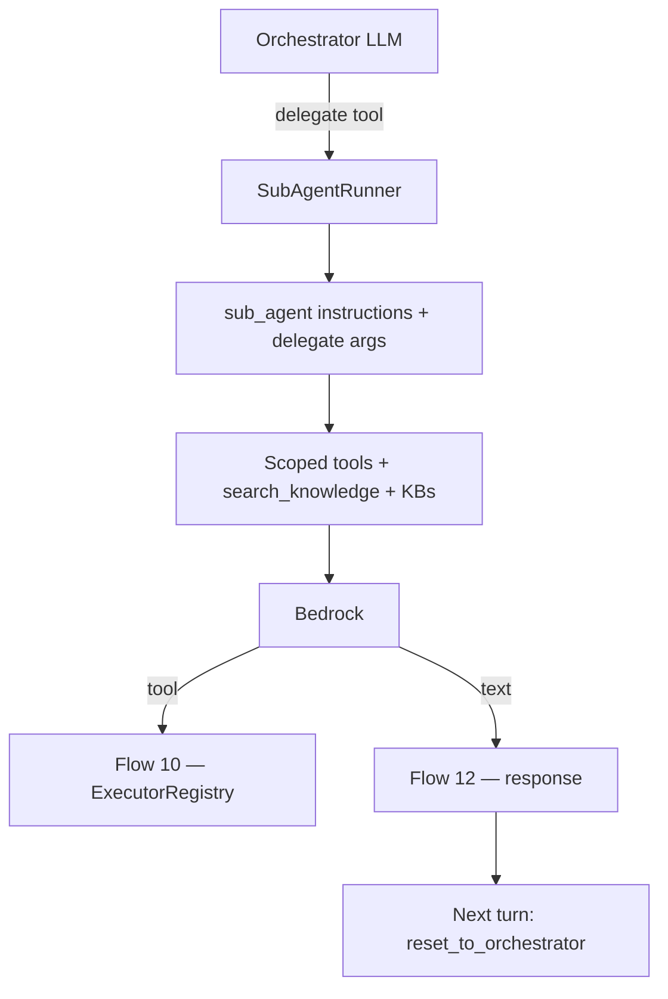
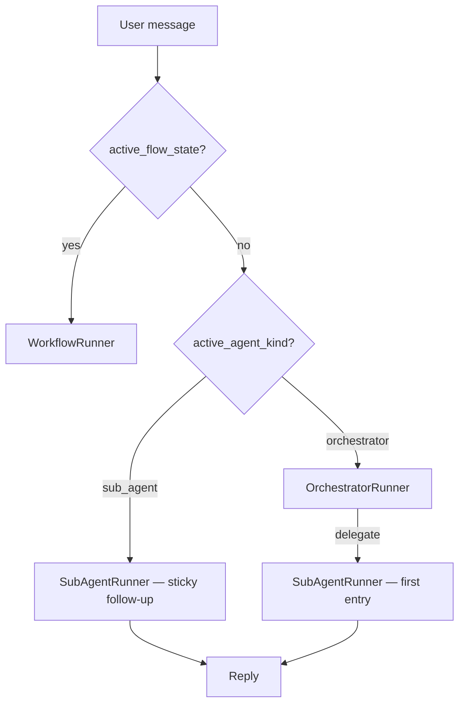

# Sub-agent delegation at chat — Flow 8

**Not a REST endpoint.** Runs inside `POST /api/v1/chat/webhook/{webhook_id}` and preview chat when the orchestrator LLM calls a delegate tool.

Parent: [01-chat-completion-diagrams.md](./01-chat-completion-diagrams.md) · Flow 8

Sub-agent REST (attach + `routing_hint`): [../sub-agents/01-create-sub-agent-diagrams.md](../sub-agents/01-create-sub-agent-diagrams.md)

**Agentic migration (chat API):** Phase A **Done**. Phase B **no change** (workflows only). Phase C **Done** — `search_knowledge` on `SubAgentRunner` turn. Phase D **planned** — sticky sub-agent handover. See [../agentic/updets/api-migration-agentic-phase-d.md](../agentic/updets/api-migration-agentic-phase-d.md).

**Status:** Implemented — `sub_agent_delegate.py` + orchestrator delegate tools. Sticky follow-up (**Phase D**) not yet in code.

---

## Runtime flow (today)

## Runtime flow (Phase D — planned)

## Implementation files

| What | File |
|------|------|
| Delegate tools | [sub_agent_delegate.py](../../app/domain/graph/sub_agent_delegate.py) |
| Orchestrator wiring | [orchestrator.py](../../app/domain/graph/orchestrator.py) |
| Sticky routing (Phase D) | [chat_graph.py](../../app/domain/graph/chat_graph.py) |
| Reset today (remove in D) | [chat_completion_service.py](../../app/services/chat_completion_service.py) |
| Session state | [tracker.py](../../app/domain/models/tracker.py) |
| Trace | `sub_agent_start` / `sub_agent_complete` in [chat_completion_service.py](../../app/services/chat_completion_service.py) |

## Agentic migration — Phase D (planned)

| Item | Change |
|------|--------|
| Sticky handover | Keep `active_agent_id` / `active_agent_kind` across turns until explicit exit |
| Remove reset | Delete `reset_to_orchestrator()` at turn start when `active_agent_kind == "sub_agent"` |
| Follow-up routing | `ChatGraph` runs `SubAgentRunner` directly when sticky |
| Exit | Workflow enter/exit; optional `return_to_orchestrator` tool |
| Delegate args | Reuse `last_routing_decision.args` on sticky turns |
| Sub-agent lookup | Add `find_sub_agent_by_id()` on `RuntimeOrchestrator` (resolve `active_agent_id`) |

Runtime spec: [../agentic/updets/runtime-migration-agentic-phase-d.md](../agentic/updets/runtime-migration-agentic-phase-d.md) · API: [../agentic/updets/api-migration-agentic-phase-d.md](../agentic/updets/api-migration-agentic-phase-d.md)
