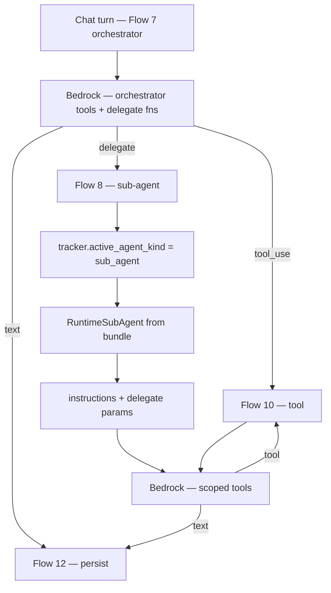
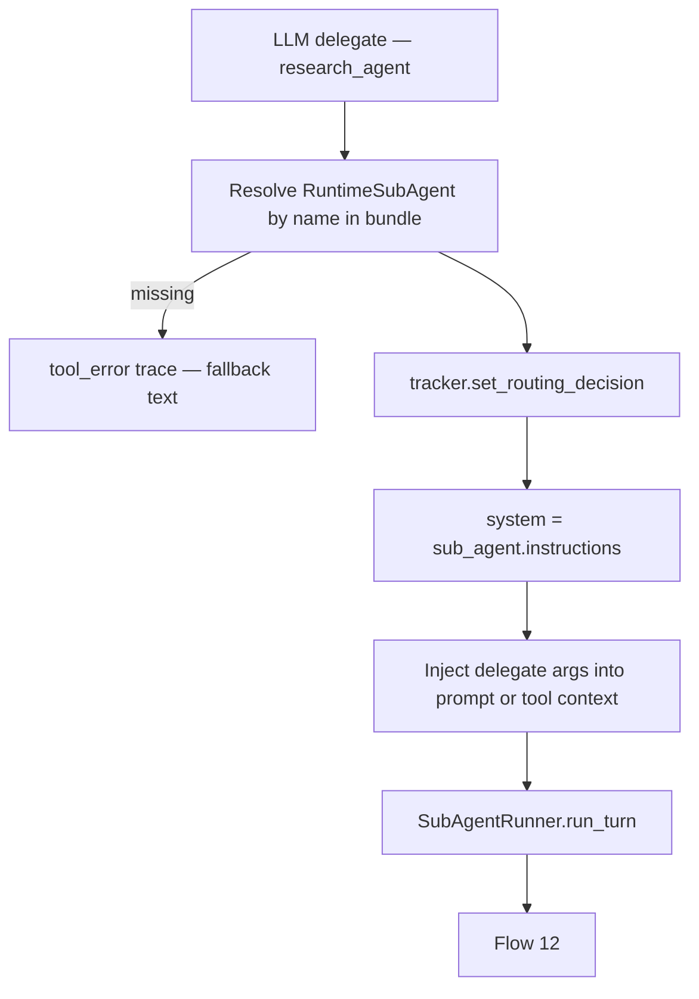
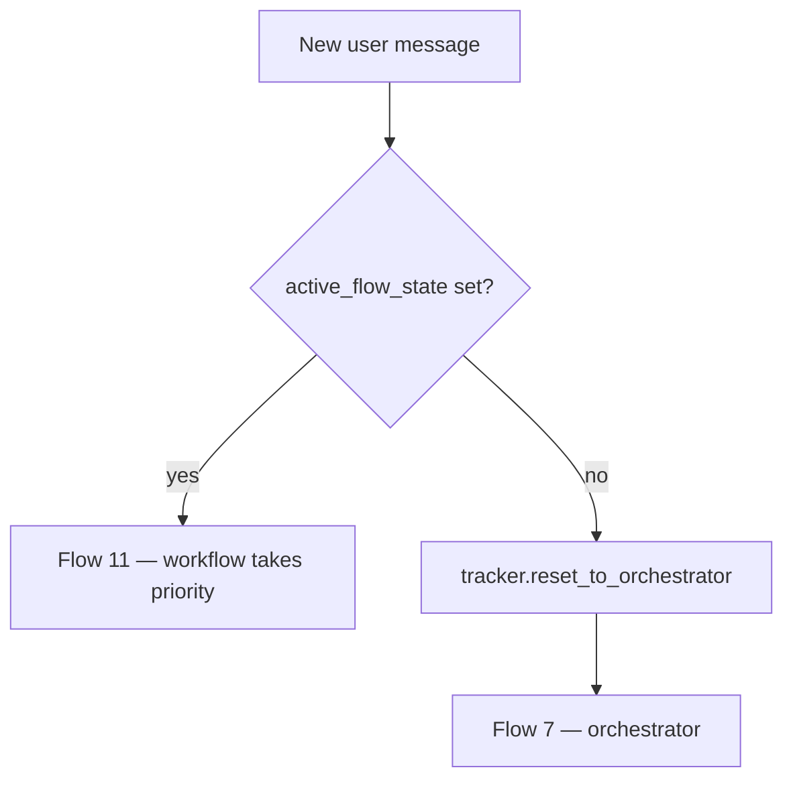

# Sub-Agent Delegation at Chat — Phase 2 (next pass)

**Not a new REST endpoint.** Runs inside `POST /api/v1/chat/webhook/{webhook_id}` when the orchestrator delegates to a sub-agent.

Parent doc: [01-chat-completion-diagrams.md](./01-chat-completion-diagrams.md) · Flow 8

Sub-agent config: [../sub-agents/00-sub-agent-model.md](../sub-agents/00-sub-agent-model.md)

**Prerequisite:** Phase 0 + 1 done (`RuntimeBundle`, `OrchestratorRunner`, tool execution).

**Status:** Next pass — bundle loads sub-agents today; runtime delegation is **not** wired.

---

# Goal

When the orchestrator LLM calls a **delegate function** (one per attached sub-agent), the chat runtime:

1. Switches scope to that sub-agent's `instructions`, `tools`, and `knowledge_bases`
2. Updates `tracker.active_agent_id` and `tracker.active_agent_kind`
3. Runs a scoped LLM turn (with tool calling — same as Flow 10)
4. Returns the sub-agent reply to the user
5. Resets to orchestrator on the **next** user message (unless `active_flow_state` is set — Flow 11)

---

# High-level flow



---

# Flow 1 — Expose sub-agents as LLM functions

Orchestrator receives **delegate tools** built from `RuntimeBundle.orchestrator.sub_agents[]`.

### Function schema (per sub-agent)

```json
{
  "name": "research_agent",
  "description": "Deep research tasks",
  "parameters": {
    "type": "object",
    "properties": {
      "query": {
        "type": "string",
        "description": "Research question"
      }
    },
    "required": ["query"]
  }
}
```

| Source field | Maps to |
|--------------|---------|
| `sub_agent.name` | function `name` (snake_case) |
| `sub_agent.description` | function `description` |
| `sub_agent.parameters[]` | JSON Schema `properties` / `required` |

**Rule:** Delegate function names must not collide with attached **tool** names. Validate at agent publish time (future).

---

# Flow 2 — Handle delegate call



### Tracker update

```json
{
  "active_agent_id": "6a3f9012d8139334274fbc04",
  "active_agent_kind": "sub_agent",
  "last_routing_decision": {
    "type": "delegate",
    "sub_agent_id": "6a3f9012d8139334274fbc04",
    "sub_agent_name": "research_agent",
    "args": { "query": "loyalty program rules" }
  }
}
```

---

# Flow 3 — Scoped sub-agent turn

```mermaid
flowchart TB
    SA[RuntimeSubAgent]
    SA --> TOOLS[sub_agent.tools — not orchestrator tools]
    SA --> KB[sub_agent.knowledge_bases]
    SA --> PROMPT[instructions + personality from parent optional]

    KB -->|Phase 3| RAG[RAGRetriever — scoped KB ids]
    RAG --> LLM[Bedrock + bind_tools]
    TOOLS --> LLM
    PROMPT --> LLM
    LLM --> OUT{text | tool_use}
```

| Scope | Orchestrator turn | Sub-agent turn |
|-------|-------------------|----------------|
| System prompt | `orchestrator.system_prompt` | `sub_agent.instructions` |
| Tools | `orchestrator.tools` | `sub_agent.tools` |
| KBs (Phase 3) | `orchestrator.knowledge_bases` | `sub_agent.knowledge_bases` |
| Delegate fns | yes | no |

Reuse `OrchestratorRunner` with a **scoped context** object, or add `SubAgentRunner` with the same tool loop.

---

# Flow 4 — Reset on next user message



Already stubbed in `ChatCompletionService` — extend when delegation is live.

---

# Trace events

| Event | When |
|-------|------|
| `routing_decision` | Delegate chosen — `type: delegate` |
| `sub_agent_start` | Sub-agent LLM turn begins |
| `sub_agent_complete` | Sub-agent returns text |
| `tool_start` / `tool_complete` | Scoped tool execution (Flow 10) |

---

# Files to add / update (implementation checklist)

| Action | File |
|--------|------|
| Add | `app/domain/graph/sub_agent_delegate.py` — build delegate tools + `SubAgentRunner` |
| Update | `app/domain/graph/orchestrator.py` — bind delegate fns alongside executor tools |
| Update | `app/services/chat_completion_service.py` — route delegate results; respect reset |
| Update | `app/domain/models/runtime_bundle.py` — helper to resolve sub-agent by name |
| Tests | `tests/test_sub_agent_delegation_at_chat.py` |

**No API schema change** — same `ChatRequest` / `ChatResponse`.

---

# Test plan

- [ ] Orchestrator with one sub-agent — delegate call runs scoped turn
- [ ] Sub-agent tool call uses **sub-agent** tool list only
- [ ] Next user message resets `active_agent_kind` to `orchestrator`
- [ ] Unknown delegate name — safe fallback, no 500
- [ ] `routing_decision` persisted on tracker
