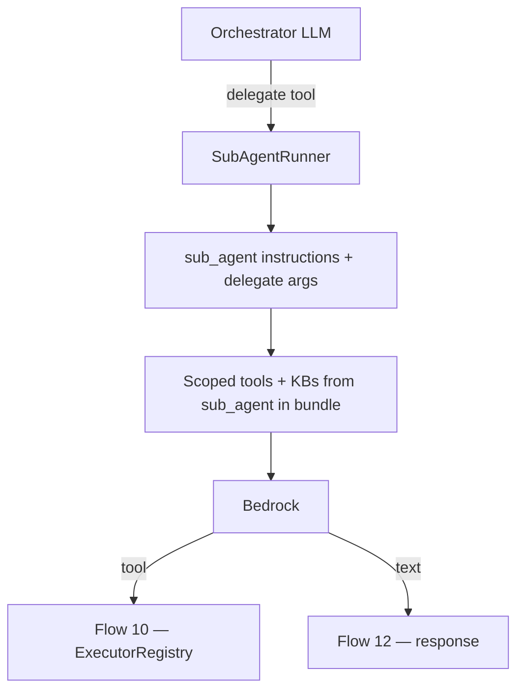

# Sub-agent delegation at chat — Flow 8

**Not a REST endpoint.** Runs inside `POST /api/v1/chat/webhook/{webhook_id}` and preview chat when the orchestrator LLM calls a delegate tool.

Parent: [01-chat-completion-diagrams.md](./01-chat-completion-diagrams.md) · Flow 8

Sub-agent REST (attach + `routing_hint`): [../sub-agents/01-create-sub-agent-diagrams.md](../sub-agents/01-create-sub-agent-diagrams.md)

**Agentic migration (chat API):** Phase A **Done**. Phase B **no change** (workflows only). Phase D — sticky sub-agent. See [../agentic/updets/api-migration-agentic.md](../agentic/updets/api-migration-agentic.md).

**Status:** Implemented — `sub_agent_delegate.py` + orchestrator delegate tools.

---

## Runtime flow

## Implementation files

| What | File |
|------|------|
| Delegate tools | [sub_agent_delegate.py](../../app/domain/graph/sub_agent_delegate.py) |
| Orchestrator wiring | [orchestrator.py](../../app/domain/graph/orchestrator.py) |
| Trace | `sub_agent_start` in [chat_completion_service.py](../../app/services/chat_completion_service.py) |

## Agentic migration (runtime — next)

| Item | Change |
|------|--------|
| Sticky handover | Keep `active_agent_id` across turns until explicit exit (today: resets to orchestrator each message) |
| Catalog layer [3] | Sub-agent `routing_hint` in `capability_catalog` helps LLM pick delegate |

Runtime spec: [../agentic/updets/runtime-migration-agentic.md](../agentic/updets/runtime-migration-agentic.md)
