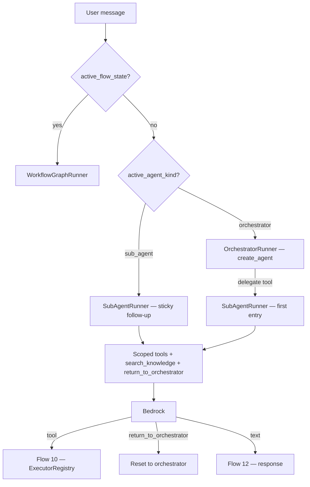

# Sub-agent delegation at chat — Flow 8

**Not a REST endpoint.** Runs inside `POST /api/v1/chat/webhook/{webhook_id}` and preview chat when the orchestrator LLM calls a delegate tool.

Parent: [01-chat-completion-diagrams.md](./01-chat-completion-diagrams.md) · Flow 8

Sub-agent REST (attach + `routing_hint`): [../sub-agents/01-create-sub-agent-diagrams.md](../sub-agents/01-create-sub-agent-diagrams.md)

**Agentic migration (chat API):** Phase A **Done**. Phase B **no change** (workflows only). Phase C **Done** — `search_knowledge` on `SubAgentRunner` turn. Phase D **Done** — sticky sub-agent handover. **LangChain proper (Done):** [../agentic/updets/migration-langchain-proper.md](../agentic/updets/migration-langchain-proper.md).

**Status:** Implemented — `sub_agent_delegate.py` + orchestrator delegate tools + sticky follow-up in `chat_graph.py` (LangGraph session router). Sub-agent LLM uses LangChain `create_agent()` via shared [orchestrator_agent.py](../../app/domain/graph/langchain/orchestrator_agent.py).

---

## Runtime flow

**First entry:** orchestrator LLM calls a delegate tool → `SubAgentRunner` with delegate args.

**Sticky follow-up (Phase D):** when `active_agent_kind == "sub_agent"`, `ChatGraph` runs `SubAgentRunner` directly — reuses `last_routing_decision.args`.

**Exit:** workflow enter/exit, `return_to_orchestrator` tool, or detached sub-agent → orchestrator fallback.

---

## Implementation files

| What | File |
|------|------|
| Delegate tools + `return_to_orchestrator` | [sub_agent_delegate.py](../../app/domain/graph/sub_agent_delegate.py) |
| Orchestrator / sub-agent agent | [orchestrator.py](../../app/domain/graph/orchestrator.py) · [orchestrator_agent.py](../../app/domain/graph/langchain/orchestrator_agent.py) | Done |
| Sticky routing | [chat_graph.py](../../app/domain/graph/chat_graph.py) |
| Sub-agent lookup | `find_sub_agent_by_id()` in [runtime_bundle.py](../../app/domain/models/runtime_bundle.py) |
| Session state | [tracker.py](../../app/domain/models/tracker.py) |
| Trace | `sub_agent_start` / `sub_agent_continue` / `sub_agent_complete` in [chat_completion_service.py](../../app/services/chat_completion_service.py) |

## Agentic migration — Phase D (Done)

| Item | Status |
|------|--------|
| Sticky handover | Keep `active_agent_id` / `active_agent_kind` across turns until explicit exit |
| No per-turn reset | Removed `reset_to_orchestrator()` at turn start in `chat_completion_service` |
| Follow-up routing | `ChatGraph` runs `SubAgentRunner` directly when sticky |
| Exit | Workflow priority; `return_to_orchestrator` tool; detached sub-agent fallback |
| Delegate args | Reuse `last_routing_decision.args` on sticky turns |
| Sub-agent lookup | `find_sub_agent_by_id()` on `RuntimeOrchestrator` |

Runtime spec: [../agentic/updets/runtime-migration-agentic-phase-d.md](../agentic/updets/runtime-migration-agentic-phase-d.md) · API: [../agentic/updets/api-migration-agentic-phase-d.md](../agentic/updets/api-migration-agentic-phase-d.md)
