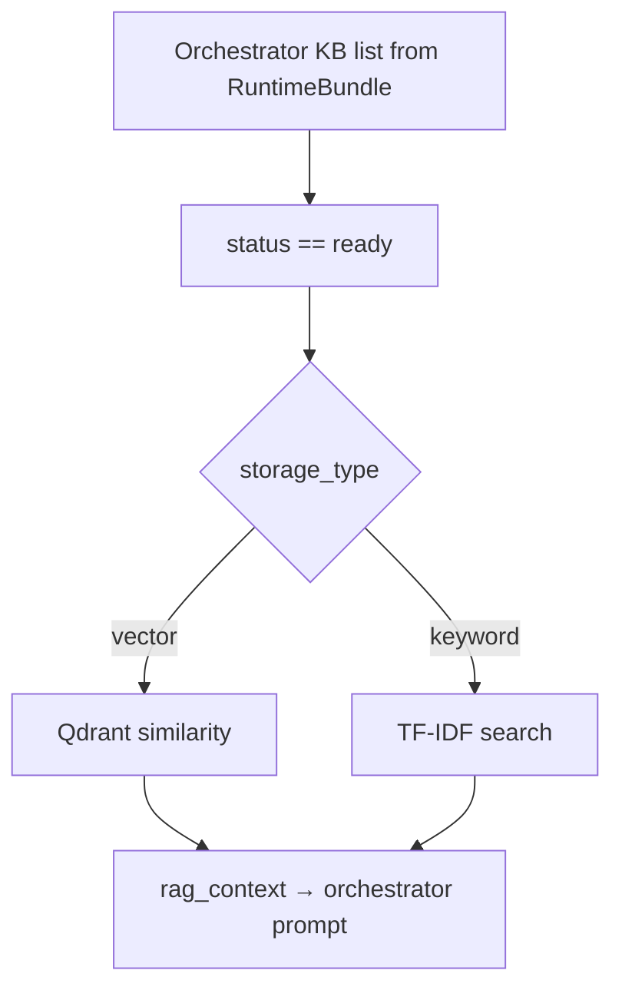

# RAG at chat — Flow 9

**Not a REST endpoint.** Retrieval runs inside chat completion before orchestrator (today) or via LLM tool (Phase C agentic).

Parent: [01-chat-completion-diagrams.md](./01-chat-completion-diagrams.md) · Flow 9

KB REST (attach + `routing_hint`): [../knowledgebase/01-create-knowledgebase-diagrams.md](../knowledgebase/01-create-knowledgebase-diagrams.md)

**Agentic migration (chat API):** **No** route or schema change. Phase A **Done**. Phase B **Done** (workflows). Phase C **planned** — agentic RAG at chat. See [../agentic/updets/api-migration-agentic-phase-c.md](../agentic/updets/api-migration-agentic-phase-c.md).

**Status:** Implemented — always-on RAG via `RAGRetriever` before orchestrator (skipped during active workflow). **Phase C** replaces with `search_knowledge` LLM tool.

**Phase B side effect (Done):** RAG **runs on first message** when agent has workflows but no `active_flow_state`. See [../agentic/updets/runtime-migration-agentic-phase-b.md](../agentic/updets/runtime-migration-agentic-phase-b.md).

---

## Current flow (always-on)

| Component | File |
|-----------|------|
| Retriever | [retriever.py](../../app/domain/pipeline/rag/retriever.py) |
| Wired from | [chat_completion_service.py](../../app/services/chat_completion_service.py) |
| Ingest | [llama_index_pipeline.py](../../app/infrastructure/ai/indexers/llama_index_pipeline.py) |

Scope: orchestrator KBs; sub-agent path can run scoped RAG on delegate.

---

## Agentic migration — Phase C (planned)

| Today | Target |
|-------|--------|
| Auto `RAGRetriever.retrieve()` every orchestrator turn | LLM calls `search_knowledge` tool when catalog hint matches |
| Layer [4] injected before LLM | Layer [4] empty at turn start; chunks via `search_knowledge` `ToolMessage` (not re-injected into system prompt) |

`search_knowledge` is an **LLM tool**, not a new REST API.

**Spec:** [../agentic/updets/api-migration-agentic-phase-c.md](../agentic/updets/api-migration-agentic-phase-c.md) · [../agentic/updets/runtime-migration-agentic-phase-c.md](../agentic/updets/runtime-migration-agentic-phase-c.md)
