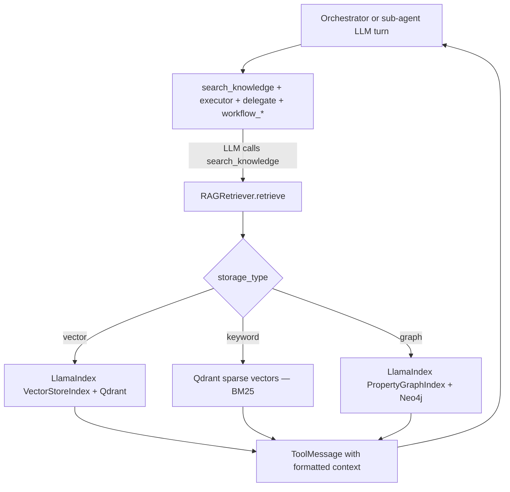

# RAG at chat — Flow 9

**Not a REST endpoint.** Knowledge retrieval runs when the LLM calls the `search_knowledge` tool inside orchestrator or sub-agent turns (Phase C **Done**).

Parent: [01-chat-completion-diagrams.md](./01-chat-completion-diagrams.md) · Flow 9

KB REST (attach + `routing_hint`): [../knowledgebase/01-create-knowledgebase-diagrams.md](../knowledgebase/01-create-knowledgebase-diagrams.md)

**Agentic migration (chat API):** **No** route or schema change. Phase A **Done**. Phase B **Done** (workflows). Phase C **Done** — agentic RAG at chat. See [../agentic/updets/api-migration-agentic-phase-c.md](../agentic/updets/api-migration-agentic-phase-c.md).

**LangChain proper (Done):** `search_knowledge` wired via `create_agent()` — [../agentic/updets/migration-langchain-proper.md](../agentic/updets/migration-langchain-proper.md) Step 3. REST unchanged.

**Status:** Implemented — LLM-driven RAG via `search_knowledge` tool in LangChain `create_agent()` (orchestrator/sub-agent). Layer `[4] rag_context` is empty at turn start; chunks arrive as `ToolMessage` content after the model calls the tool.

**LlamaIndex RAG (Done):** Vector, keyword (BM25), and graph ingest/query via `infrastructure/ai/llamaindex/` — **no** chat API or tool contract change. See [../agentic/updets/migration-llamaindex-rag.md](../agentic/updets/migration-llamaindex-rag.md).

---

## Current flow (tool-driven)

| Component | File |
|-----------|------|
| Tool registration | [search_knowledge_delegate.py](../../app/domain/graph/search_knowledge_delegate.py) |
| Tool handler | LangChain routing middleware — [tool_router.py](../../app/domain/graph/langchain/tool_router.py) |
| Retriever facade | [retriever.py](../../app/domain/pipeline/rag/retriever.py) → `RetrieverFactory.search()` |
| LlamaIndex query | [retriever_factory.py](../../app/infrastructure/ai/llamaindex/retriever_factory.py) — vector / keyword (Qdrant sparse) / graph |
| Chat wiring | [chat_completion_service.py](../../app/services/chat_completion_service.py) — passes `rag` into graph; no pre-turn retrieve |
| Sub-agent scope | [sub_agent_delegate.py](../../app/domain/graph/sub_agent_delegate.py) — `search_knowledge` when sub-agent has KBs |
| Ingest router | [llama_index_pipeline.py](../../app/infrastructure/ai/indexers/llama_index_pipeline.py) → [index_factory.py](../../app/infrastructure/ai/llamaindex/index_factory.py) |
| LlamaIndex adapters | `infrastructure/ai/llamaindex/` — Bedrock embed/LLM, Qdrant (dense + sparse), Neo4j graph store |

**Scope:** orchestrator KBs on orchestrator turns; sub-agent KBs on delegated sub-agent turns. Optional `knowledge_base_names` arg narrows which KBs to search.

**Skipped:** when `tracker.active_flow_state` is set (workflow active) — no RAG tools in workflow path; `rag_skipped` trace emitted from chat service when in workflow or agent has no KBs.

---

## Prompt layers

| Layer | At turn start | After `search_knowledge` |
|-------|---------------|--------------------------|
| `[4] rag_context` | Empty (`""`) | Still empty — chunks only in `ToolMessage`, not re-injected into system prompt |

Catalog layer `[3]` lists KBs + `routing_hint` so the LLM knows when to call `search_knowledge`.

---

## Trace

| Event | When |
|-------|------|
| `rag_skipped` | In active workflow or agent has no KBs (trace-only; no retrieval) |
| `tool_start` / `tool_complete` | LLM calls `search_knowledge` — RAG stats + ranked `chunks` in `tool_complete` (`query`, `kb_ids`, `chunk_count`, `context_length`) |

Per-turn `rag_complete` is **not** emitted (removed in Phase C).

**Turn evidence:** `turn_evidence` on each finished trace turn (preview/webhook) — see [../evaluation/01-turn-evidence-runtime.md](../evaluation/01-turn-evidence-runtime.md).

**Spec:** [../agentic/updets/api-migration-agentic-phase-c.md](../agentic/updets/api-migration-agentic-phase-c.md) · [../agentic/updets/runtime-migration-agentic-phase-c.md](../agentic/updets/runtime-migration-agentic-phase-c.md)
