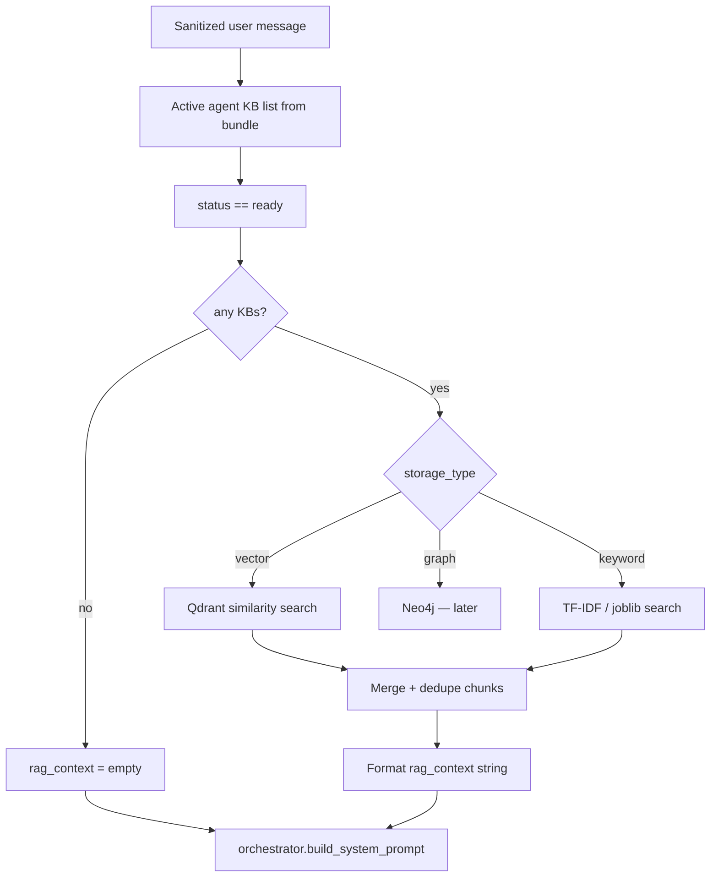
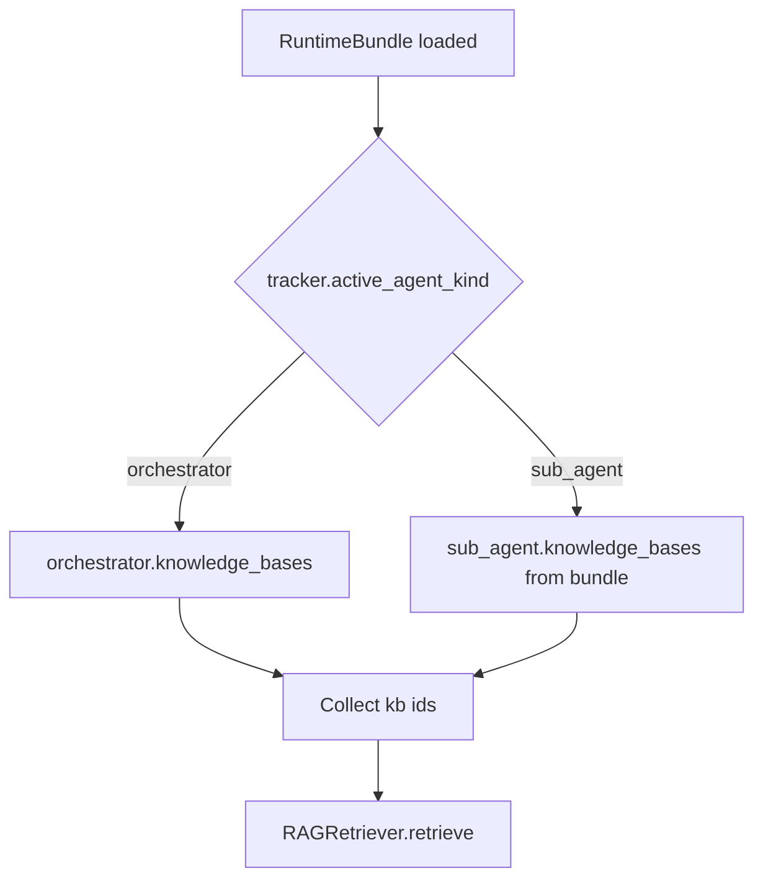
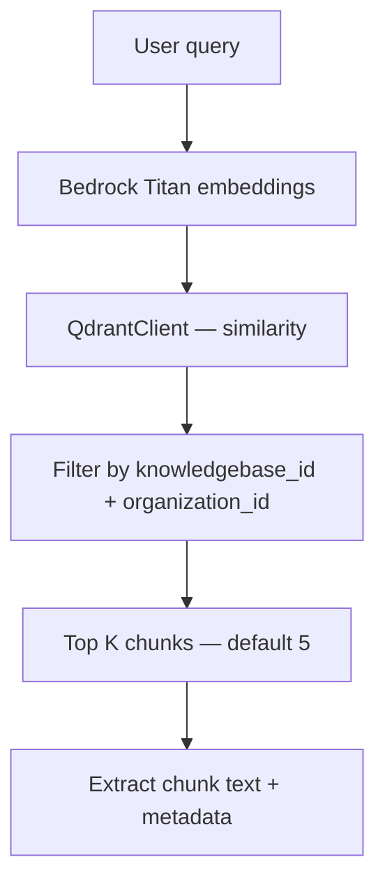
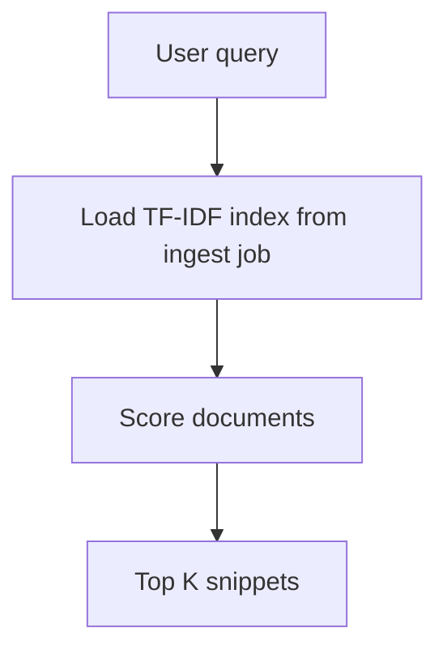

# RAG at Chat — Phase 3 (next pass)

**Not a new REST endpoint.** Runs inside `POST /api/v1/chat/webhook/{webhook_id}` before the orchestrator (or sub-agent) LLM call.

Parent doc: [01-chat-completion-diagrams.md](./01-chat-completion-diagrams.md) · Flow 9

KB ingest: [../knowledgebase/01-create-knowledgebase-diagrams.md](../knowledgebase/01-create-knowledgebase-diagrams.md)

**Prerequisite:** Phase 0 + 1 done. KB documents ingested via `LlamaIndexPipeline` with `status: ready`.

**Status:** Next pass — `RAGRetriever.retrieve()` returns `""` today. Bundle already passes ready KB ids.

---

# Goal

For each chat turn, retrieve relevant chunks from attached **ready** knowledge bases and inject them into the system prompt as `rag_context`.

Scope depends on active agent:

| `active_agent_kind` | KB list source |
|---------------------|----------------|
| `orchestrator` | `bundle.orchestrator.knowledge_bases` |
| `sub_agent` | active `RuntimeSubAgent.knowledge_bases` (Phase 2) |

---

# High-level flow



---

# Flow 1 — Resolve KB scope



### Input to retriever

```python
await rag.retrieve(
    query=sanitized_message,
    knowledge_base_ids=["6a3f9012d8139334274fbc02", ...],
    organization_id=bundle.organization_id,
)
```

Extend signature in [retriever.py](../../app/domain/pipeline/rag/retriever.py) — add `organization_id` for collection scoping.

---

# Flow 2 — Vector search (storage_type = vector)



| Setting | Default |
|---------|---------|
| `top_k` | 5 |
| `min_score` | 0.7 (tune per org) |
| Collection naming | From ingest pipeline — per KB or shared org collection |

Use existing [qdrant_client.py](../../app/infrastructure/vectorstores/qdrant_client.py) and [bedrock_embeddings.py](../../app/infrastructure/ai/bedrock_embeddings.py).

---

# Flow 3 — Keyword search (storage_type = keyword)



Ingest stores keyword index via `joblib` (see knowledge base ingest docs).

---

# Flow 4 — Format context for prompt

```markdown
## Retrieved context

### Policy docs
- Chunk 1 text...
- Chunk 2 text...

### FAQ
- Chunk 1 text...
```

Inject via `RuntimeOrchestrator.build_system_prompt(rag_context=...)` — already supported.

**Rule:** Redacted user message is the query — never send raw PII to the embedder if redaction removed it.

---

# Trace events

| Event | Payload |
|-------|---------|
| `rag_complete` | `context_length`, `kb_ids`, `chunk_count`, `storage_types` |
| `rag_skipped` | no ready KBs attached |
| `rag_error` | Qdrant / embed failure — log; proceed with empty context |

On `rag_error`, **do not 500** — orchestrator runs without RAG (degraded mode).

---

# Files to add / update (implementation checklist)

| Action | File |
|--------|------|
| Update | [retriever.py](../../app/domain/pipeline/rag/retriever.py) — vector + keyword paths |
| Add | `app/domain/pipeline/rag/vector_search.py` |
| Add | `app/domain/pipeline/rag/keyword_search.py` |
| Reuse | [qdrant_client.py](../../app/infrastructure/vectorstores/qdrant_client.py) |
| Reuse | [bedrock_embeddings.py](../../app/infrastructure/ai/bedrock_embeddings.py) |
| Update | [chat_completion_service.py](../../app/services/chat_completion_service.py) — pass `organization_id` |
| Tests | `tests/test_rag_retriever.py` |

**No API schema change** — same `ChatRequest` / `ChatResponse`.

---

# Test plan

- [ ] No KBs attached — `rag_context` empty, turn succeeds
- [ ] Vector KB `ready` — returns top chunks above `min_score`
- [ ] Keyword KB `ready` — TF-IDF path returns snippets
- [ ] KB `pending` / `failed` — excluded from search
- [ ] Qdrant down — empty context, 200 reply, `rag_error` trace
- [ ] Sub-agent scope (Phase 2) — only sub-agent KB ids queried
