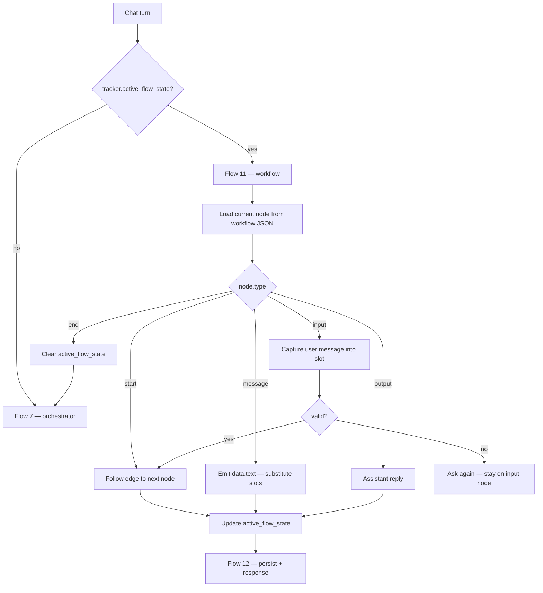
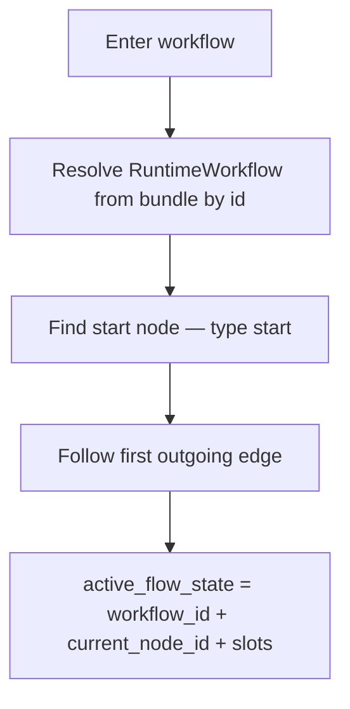
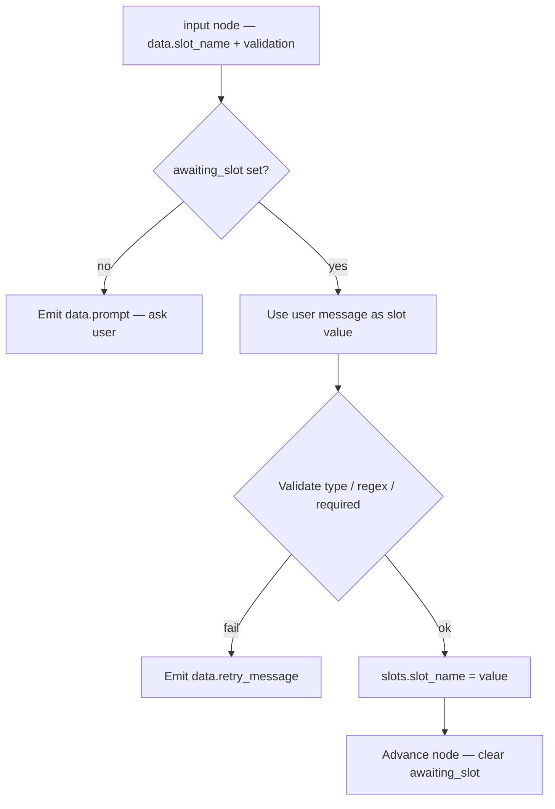
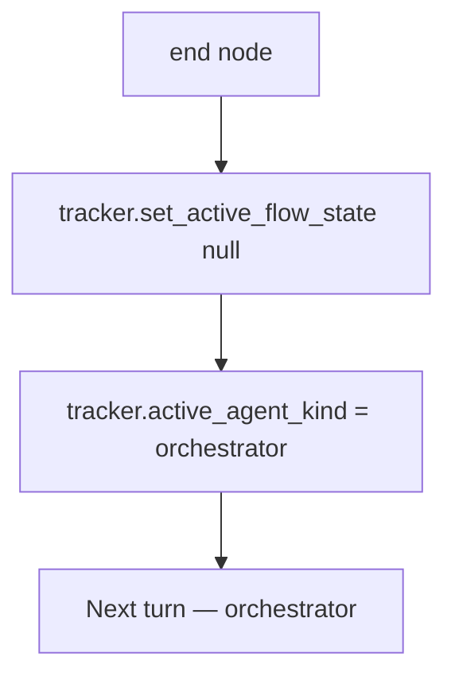
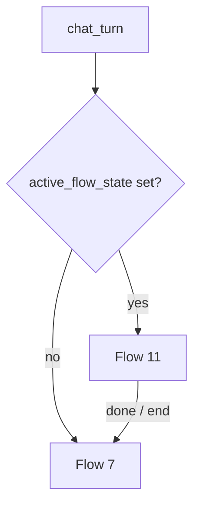

# Workflow Runtime at Chat — Phase 4 (next pass)

**Not a new REST endpoint.** Runs inside `POST /api/v1/chat/webhook/{webhook_id}` when `tracker.active_flow_state` is set.

Parent doc: [01-chat-completion-diagrams.md](./01-chat-completion-diagrams.md) · Flow 11

Workflow model: [../workflows/00-workflow-model.md](../workflows/00-workflow-model.md)

**Prerequisite:** Phase 0 + 1 done. Workflows attached to agent with `status: published`.

**Status:** Next pass — `active_flow_state` exists on tracker; no workflow runner yet.

---

# Goal

Execute the workflow graph **step by step** inside chat:

- **`message` nodes** — emit text (with `{{slot}}` substitution)
- **`input` nodes** — capture the user's message into named slots (workflow-only — **not** global `SlotExtractor`)
- **`output` nodes** — treat as user-facing reply
- **`end` nodes** — clear `active_flow_state`, return to orchestrator (Flow 7)

Workflow takes **priority** over orchestrator when `active_flow_state` is non-null.

---

# High-level flow



---

# Flow 1 — Enter workflow

Workflow starts when:

1. Orchestrator LLM selects a **workflow tool** (future — same pattern as sub-agent delegate), or
2. Channel / agent config triggers a default workflow on first message (optional MVP+)



### Initial `active_flow_state`

```json
{
  "workflow_id": "6a3f9012d8139334274fbc00",
  "current_node_id": "message-1",
  "slots": {},
  "awaiting_slot": null
}
```

---

# Flow 2 — `message` node

```mermaid
flowchart TB
    NODE[message node — data.text]
    NODE --> SUB[Substitute {{slot_name}} from slots map]
    SUB --> OUT[Append to assistant replies]
    OUT --> NEXT[Advance to next node via edge]
```

Example node:

```json
{
  "id": "message-1",
  "type": "message",
  "data": { "text": "Hello {{customer_name}}, how can I help?" }
}
```

---

# Flow 3 — `input` node (slot capture)

**Only place slot capture runs in chat** — not in Flow 5 sanitize.



### `input` node example

```json
{
  "id": "input-1",
  "type": "input",
  "data": {
    "slot_name": "customer_id",
    "prompt": "Please enter your customer ID.",
    "retry_message": "That doesn't look valid. Try again.",
    "validation": { "type": "string", "pattern": "^[0-9]{6,12}$" }
  }
}
```

### State while waiting

```json
{
  "workflow_id": "6a3f9012d8139334274fbc00",
  "current_node_id": "input-1",
  "slots": {},
  "awaiting_slot": "customer_id"
}
```

After valid capture:

```json
{
  "workflow_id": "6a3f9012d8139334274fbc00",
  "current_node_id": "message-2",
  "slots": { "customer_id": "123456" },
  "awaiting_slot": null
}
```

---

# Flow 4 — `output` and `end` nodes

| Node type | Behavior |
|-----------|----------|
| `output` | Emit `data.text` as assistant reply; may chain to next node in same turn or wait for next message |
| `end` | Set `active_flow_state = null`; optionally emit farewell `data.text` |



---

# Flow 5 — Integration with LangGraph routing (Flow 6)

When Phase 4 lands, update the routing graph:



Replace direct `OrchestratorRunner` call in `ChatCompletionService` with `ChatGraph.run()` or a `WorkflowRunner` branch.

---

# Trace events

| Event | When |
|-------|------|
| `workflow_step` | Node processed — `node_id`, `type` |
| `slot_captured` | Valid input stored — `slot_name` (not raw PII in logs) |
| `workflow_enter` | Workflow started |
| `workflow_exit` | `end` node — state cleared |
| `routing_decision` | `type: workflow` |

---

# Files to add / update (implementation checklist)

| Action | File |
|--------|------|
| Add | `app/domain/workflow/workflow_runner.py` — node dispatch + slot validation |
| Add | `app/domain/workflow/slot_validator.py` — regex / type checks for `input` nodes |
| Add | `app/domain/graph/chat_graph.py` — Flow 6 router (workflow vs orchestrator) |
| Update | [chat_completion_service.py](../../app/services/chat_completion_service.py) — branch on `active_flow_state` |
| Update | [tracker.py](../../app/domain/models/tracker.py) — helpers for flow state transitions |
| Deprecate | [slot_extractor.py](../../app/domain/engine/slot_extractor.py) — do not use globally |
| Tests | `tests/test_workflow_runtime_at_chat.py` |

**No API schema change** — same `ChatRequest` / `ChatResponse`. Optional future: `metadata.workflow_payload` for button clicks.

---

# Test plan

- [ ] `message` node — slot substitution in emitted text
- [ ] `input` node — prompt on first visit; capture on second message
- [ ] Invalid slot — retry message, stay on same node
- [ ] `end` node — clears state; next turn hits orchestrator
- [ ] Active workflow blocks orchestrator for that turn
- [ ] Published workflow in bundle; draft workflows excluded
