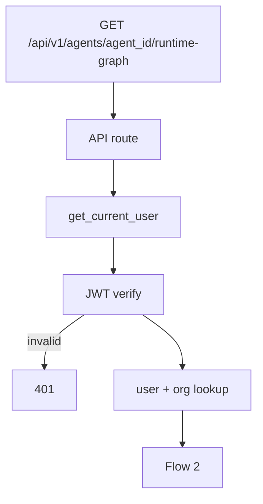
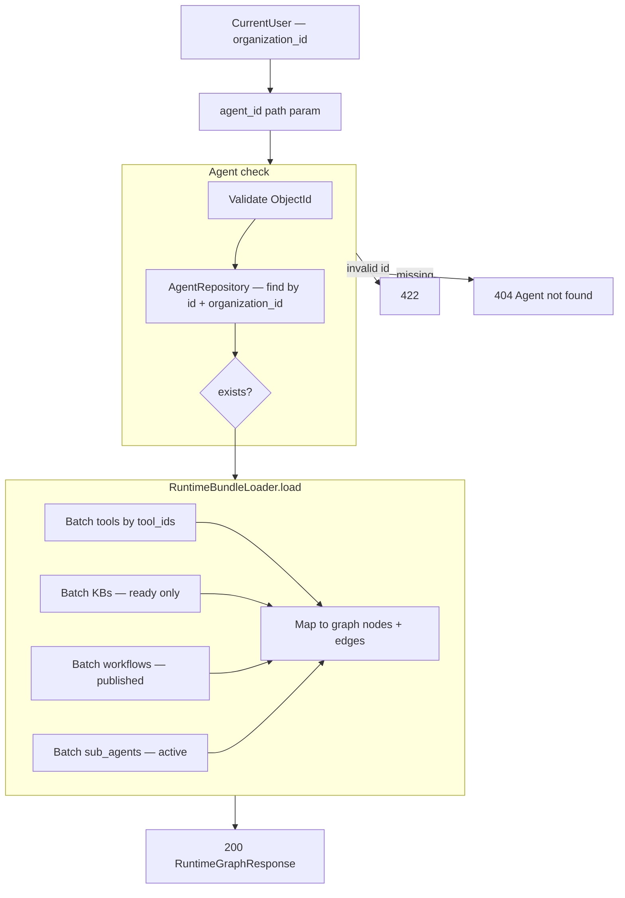

# Agent Runtime Graph — `GET /api/v1/agents/{agent_id}/runtime-graph`

Returns the **Agent View** graph payload for the builder **Preview** screen (left panel).

One batch load: orchestrator + attached tools, knowledge bases, workflows, and sub-agents — same hydrate as chat `RuntimeBundle`, shaped for React Flow.

**JWT auth only** — not used by the public webhook.

**Agentic migration:** Phase A **Done** — no route/schema change. Phase B **Done** — runtime graph unchanged. Phase C **Done** — chat RAG via `search_knowledge` tool. Phase D **Done** — sticky sub-agent graph highlight. See [../agentic/updets/api-migration-agentic-phase-d.md](../agentic/updets/api-migration-agentic-phase-d.md).

Related:

- Chat runtime: [01-chat-completion-diagrams.md](./01-chat-completion-diagrams.md) Flow 4
- Preview chat: [06-preview-chat-diagrams.md](./06-preview-chat-diagrams.md)
- Preview trace: [07-preview-session-trace-diagrams.md](./07-preview-session-trace-diagrams.md)

**Status:** Implemented.

---

# Flow 1 — Auth

Same as [../agent/01-create-agent-diagrams.md](../agent/01-create-agent-diagrams.md) Flow 1.



---

# Flow 2 — Validate agent + load graph



Use **draft or published** agent for preview (config flag: prefer `published`, fallback `draft` for builder testing).

---

# Example request

```http
GET /api/v1/agents/67agent001/runtime-graph
Authorization: Bearer <clerk_jwt>
```

---

# Response `200`

```json
{
  "agent_id": "67agent001",
  "organization_id": "6a3b7c61d8139334274fbbfc",
  "orchestrator": {
    "id": "67agent001",
    "name": "Support Bot",
    "kind": "orchestrator"
  },
  "nodes": [
    {
      "id": "67agent001",
      "type": "orchestrator",
      "label": "Agent",
      "description": null
    },
    {
      "id": "6a3f9012d8139334274fbc01",
      "type": "tool",
      "label": "transactions_analysis",
      "description": "Lookup customer transactions"
    },
    {
      "id": "6a3f9012d8139334274fbc02",
      "type": "workflow",
      "label": "dispute_process",
      "description": "Dispute handling flow"
    },
    {
      "id": "6a3f9012d8139334274fbc03",
      "type": "sub_agent",
      "label": "research_agent",
      "description": "Research specialist"
    },
    {
      "id": "6a3f9012d8139334274fbc04",
      "type": "knowledge_base",
      "label": "Policy docs",
      "description": "Company policies"
    }
  ],
  "edges": [
    { "id": "e-tool-1", "source": "67agent001", "target": "6a3f9012d8139334274fbc01", "kind": "tool" },
    { "id": "e-wf-1", "source": "67agent001", "target": "6a3f9012d8139334274fbc02", "kind": "workflow" },
    { "id": "e-sa-1", "source": "67agent001", "target": "6a3f9012d8139334274fbc03", "kind": "sub_agent" },
    { "id": "e-kb-1", "source": "67agent001", "target": "6a3f9012d8139334274fbc04", "kind": "knowledge_base" }
  ]
}
```

| Field | Rule |
|-------|------|
| `nodes` | Flat list — orchestrator + attached resources only |
| `edges` | Always `source` = orchestrator id, `target` = resource id |
| `type` | `orchestrator` \| `tool` \| `workflow` \| `sub_agent` \| `knowledge_base` |
| Sub-agent nested tools/KBs | **Not** expanded in v1 — only sub-agent node on orchestrator graph |

Sub-agent internal graph is a later enhancement.

---

# Error responses

| Status | When |
|--------|------|
| `401` | Invalid JWT |
| `404` | Agent not found for org |
| `422` | Invalid `agent_id` format |

---

# UI mapping — Agent View (left panel)

| UI | API |
|----|-----|
| Center **Agent** node | `orchestrator` |
| Connected boxes (tools, workflows, …) | `nodes` where `type != orchestrator` |
| Lines | `edges` |
| Highlight active node after chat | Match `last_routing_decision` from [07-preview-session-trace-diagrams.md](./07-preview-session-trace-diagrams.md) to `nodes[].id` or `label` |

Load once when Preview page opens. Refresh only when agent attachments change (publish / attach tool).

---

# Navigate to implementation files

| What | Open file |
|------|-----------|
| Route | [agents.py](../../app/api/v1/agents.py) |
| Schema | [preview.py](../../app/schemas/preview.py) |
| Service | [runtime_graph_service.py](../../app/services/runtime_graph_service.py) |
| DI | [preview.py](../../app/di/preview.py) |
| Reuse loader | [runtime_bundle_loader.py](../../app/services/runtime_bundle_loader.py) |
