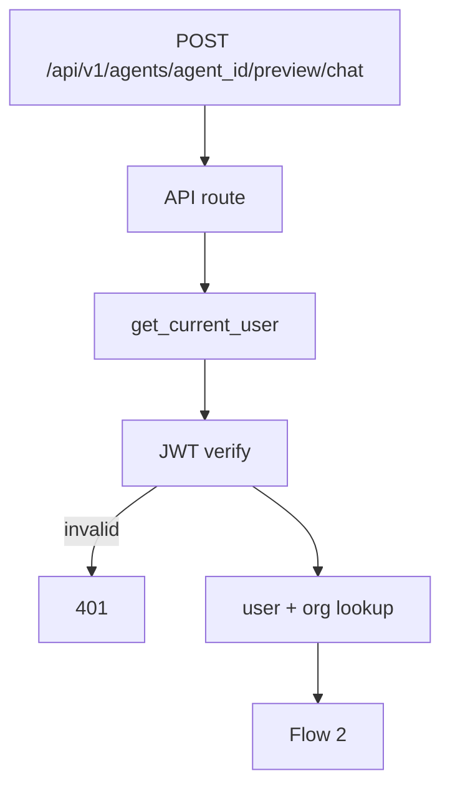
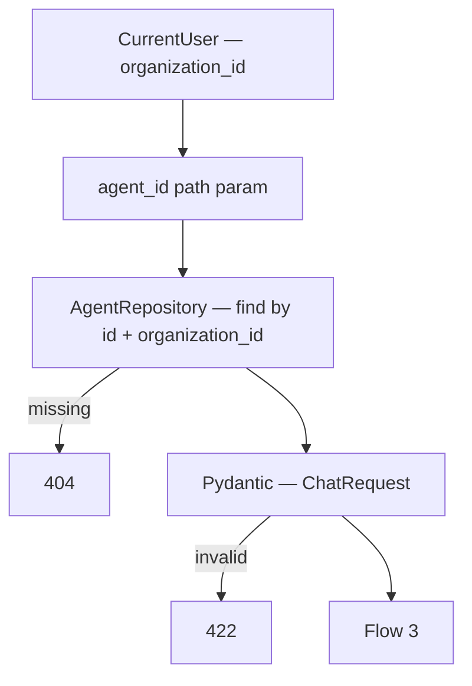
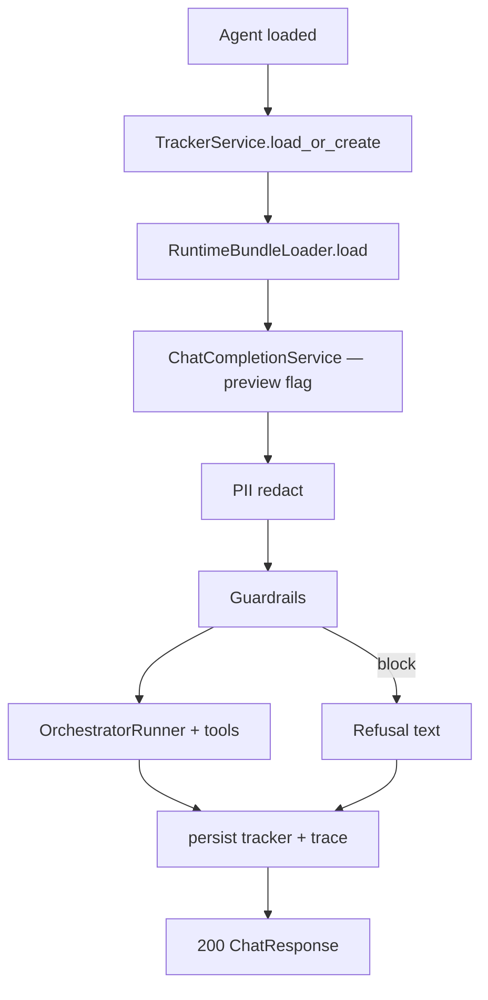

# Preview Chat — `POST /api/v1/agents/{agent_id}/preview/chat`

Admin **Preview** chat (right panel). Same inference as [01-chat-completion-diagrams.md](./01-chat-completion-diagrams.md) but:

- **JWT auth** — org user in builder
- **`agent_id` in path** — no webhook / channel
- **`source: preview`** — always persist trace (see [07-preview-session-trace-diagrams.md](./07-preview-session-trace-diagrams.md))
- Response is **text only** — trace is **not** inline; fetch via GET trace

Public widget continues to use `POST /api/v1/chat/webhook/{webhook_id}`.

**Agentic migration:** Phase A **Done** — no route/schema change. Phase B **planned** — same URLs; runtime stops auto-starting workflows on first message. See [../agentic/updets/api-migration-agentic-phase-b.md](../agentic/updets/api-migration-agentic-phase-b.md).

**Status:** Implemented.

---

# Flow 1 — Auth

Same as [../agent/01-create-agent-diagrams.md](../agent/01-create-agent-diagrams.md) Flow 1.



---

# Flow 2 — Validate agent + request



Same body as webhook chat:

| Field | Rule |
|-------|------|
| `sender_id` | required — stable per preview session (e.g. `preview-{uuid}`) |
| `message` | required, min length 1 |
| `metadata` | optional object |

---

# Flow 3 — Run chat completion (preview mode)



| Step | Same as webhook? |
|------|------------------|
| RuntimeBundle | yes |
| Sanitize + guardrails | yes |
| Orchestrator + tools | yes |
| RAG | yes when Phase 3 done |
| Channel / webhook resolve | **no** — agent from path |
| Friendly 200 on missing agent | **no** — return `404` for admin |

Every turn appends trace events to the session document (not returned in this response).

---

# Example request

```http
POST /api/v1/agents/67agent001/preview/chat
Authorization: Bearer <clerk_jwt>
Content-Type: application/json

{
  "sender_id": "preview-session-9f2a",
  "message": "I want to know what are my top three spendings in Feb?",
  "metadata": {}
}
```

---

# Response `200`

Same schema as webhook — [schemas/chat.py](../../app/schemas/chat.py):

```json
{
  "messages": [
    {
      "recipient_id": "preview-session-9f2a",
      "text": "Your top 3 spendings in February were:\n1. TECH GADGETS CITY MBR — 32,000...",
      "buttons": null
    }
  ]
}
```

**No trace in response.** UI calls `GET .../preview/sessions/{sender_id}/trace` after each POST.

---

# Error responses

| Status | When |
|--------|------|
| `401` | Invalid JWT |
| `404` | Agent not found for org |
| `422` | Invalid body or `agent_id` |
| `500` | Unexpected — generic message in `ChatResponse` (same as webhook) |

---

# UI mapping — Preview (right panel)

| UI action | API |
|-----------|-----|
| Open Preview | Generate stable `sender_id` (localStorage) |
| User sends message | `POST .../preview/chat` |
| Show bot reply | `response.messages[0].text` |
| Update Trace panel | `GET .../trace` (next doc) |
| Highlight graph node | `routing_decision` from trace |
| Clear button | `DELETE .../preview/sessions/{sender_id}` *(optional v1.1)* |

---

# Navigate to implementation files

| What | Open file |
|------|-----------|
| Route | [agents.py](../../app/api/v1/agents.py) |
| Service | [chat_completion_service.py](../../app/services/chat_completion_service.py) |
| Schemas | [schemas/chat.py](../../app/schemas/chat.py) |
| Trace persist | [trace.py](../../app/domain/pipeline/observability/trace.py) |
| DI | [chat.py](../../app/di/chat.py) |
