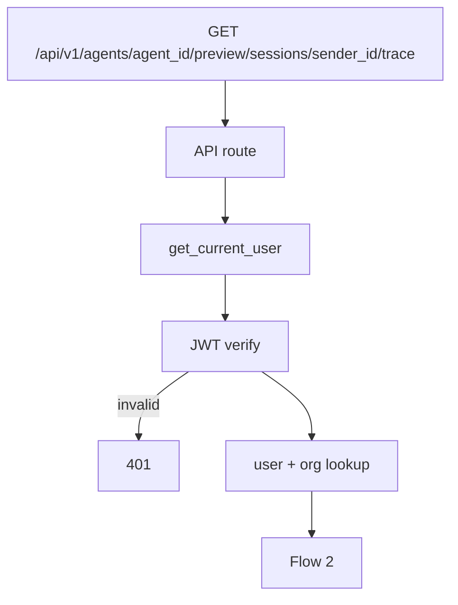
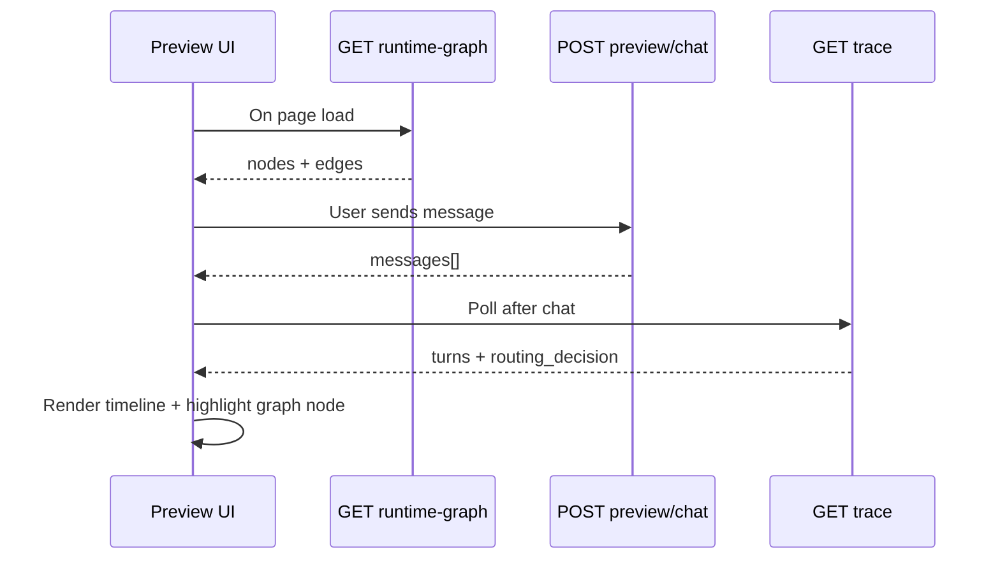

# Preview Session Trace — `GET /api/v1/agents/{agent_id}/preview/sessions/{sender_id}/trace`

Returns the **Trace View** timeline (middle panel) for one preview session.

Trace is **saved on every chat turn** (preview and webhook). This GET is for **admin UI only** — end users never see it.

Related:

- Preview chat: [06-preview-chat-diagrams.md](./06-preview-chat-diagrams.md)
- Agent graph: [05-agent-runtime-graph-diagrams.md](./05-agent-runtime-graph-diagrams.md)
- Chat events: [01-chat-completion-diagrams.md](./01-chat-completion-diagrams.md) — Trace events table

**Agentic migration:** **No** route or schema change. Optional later: `capability_catalog_built` trace event. See [../agentic/updets/api-migration-agentic.md](../agentic/updets/api-migration-agentic.md).

**Status:** Implemented.

---

# Flow 1 — Auth

Same as [../agent/01-create-agent-diagrams.md](../agent/01-create-agent-diagrams.md) Flow 1.



---

# Flow 2 — Load session trace

```mermaid
flowchart TB
    AUTH[CurrentUser — organization_id]
    AUTH --> PATH[agent_id + sender_id]

    PATH --> AGENT[AgentRepository — find by id + organization_id]
    AGENT -->|missing| E404A[404 Agent not found]

    AGENT --> TRK[TrackerRepository — find_by_session]
    TRK -->|missing| EMPTY[200 — empty turns]

    TRK --> DOC[Read trace[] + events from document]
    DOC --> RES[200 PreviewTraceResponse]
```

Session key: `(assistant_id = agent_id, sender_id)`.

---

# Example request

```http
GET /api/v1/agents/67agent001/preview/sessions/preview-session-9f2a/trace
Authorization: Bearer <clerk_jwt>
```

---

# Response `200`

```json
{
  "agent_id": "67agent001",
  "sender_id": "preview-session-9f2a",
  "source": "preview",
  "turns": [
    {
      "turn_id": "6a3f9012d8139334274ff01",
      "started_at": "2026-06-20T21:33:35.100Z",
      "events": [
        {
          "type": "input_message",
          "at": "2026-06-20T21:33:35.100Z",
          "data": { "message": "Hi" }
        },
        {
          "type": "guardrail_complete",
          "at": "2026-06-20T21:33:36.200Z",
          "data": {}
        },
        {
          "type": "rag_complete",
          "at": "2026-06-20T21:33:36.200Z",
          "data": { "context_length": 0 }
        },
        {
          "type": "output_message",
          "at": "2026-06-20T21:33:37.000Z",
          "data": { "text": "Hello! How can I help you today?" }
        }
      ],
      "routing_decision": { "mode": "orchestrator" }
    },
    {
      "turn_id": "6a3f9012d8139334274ff02",
      "started_at": "2026-06-20T21:34:15.800Z",
      "events": [
        {
          "type": "input_message",
          "at": "2026-06-20T21:34:15.800Z",
          "data": { "message": "I want to know what are my top three spendings in Feb?" }
        },
        {
          "type": "guardrail_complete",
          "at": "2026-06-20T21:34:17.000Z",
          "data": {}
        },
        {
          "type": "tool_start",
          "at": "2026-06-20T21:34:17.500Z",
          "data": { "tool": "transactions_analysis" }
        },
        {
          "type": "tool_complete",
          "at": "2026-06-20T21:34:19.800Z",
          "data": { "tool": "transactions_analysis", "ok": true }
        },
        {
          "type": "output_message",
          "at": "2026-06-20T21:34:20.200Z",
          "data": { "text": "Your top 3 spendings in February were:..." }
        }
      ],
      "routing_decision": {
        "type": "tool",
        "name": "transactions_analysis",
        "tool_id": "6a3f9012d8139334274fbc01"
      }
    }
  ]
}
```

---

# Trace event types

| `type` | When | Trace UI label |
|--------|------|----------------|
| `input_message` | User message received | **Input Message** |
| `guardrail_complete` | Policy check passed | **LLM Request** → `guardrail_complete` |
| `guardrail_blocked` | Policy refusal | **LLM Request** → blocked |
| `bundle_loaded` | RuntimeBundle ready | *(optional — dev detail)* |
| `rag_complete` | KB retrieval done | **LLM Request** → `rag_complete` |
| `tool_start` | Tool invoked | **Tool Start** → tool name |
| `tool_complete` | Tool finished | *(nested under tool)* |
| `tool_error` | Tool failed | **Tool Start** → error state |
| `routing_decision` | Agent/workflow switch | *(feeds graph highlight)* |
| `output_message` | Assistant reply | **Output Message** |

Nested **LLM Request** rows in the UI = group `guardrail_complete` + `rag_complete` under one turn step (same timestamp bucket).

---

# `routing_decision` → graph highlight

| `routing_decision` | Highlight node |
|--------------------|----------------|
| `{ "mode": "orchestrator" }` | Center Agent node only |
| `{ "type": "tool", "name": "...", "tool_id": "..." }` | Tool node matching `tool_id` |
| `{ "type": "sub_agent", "sub_agent_id": "..." }` | Sub-agent node |
| `{ "type": "workflow", "workflow_id": "..." }` | Workflow node |

From [05-agent-runtime-graph-diagrams.md](./05-agent-runtime-graph-diagrams.md) `nodes[]`.

---

# Storage model (Mongo tracker document)

Trace stored **with** session — not a separate public API for webhook users:

```json
{
  "sender_id": "preview-session-9f2a",
  "assistant_id": "67agent001",
  "organization_id": "6a3b7c61d8139334274fbbfc",
  "source": "preview",
  "events": [],
  "turns": [
    {
      "turn_id": "...",
      "started_at": "...",
      "events": [],
      "routing_decision": {}
    }
  ],
  "active_agent_id": "67agent001",
  "active_agent_kind": "orchestrator",
  "last_routing_decision": {}
}
```

Webhook sessions use the same shape with `"source": "webhook"`. Admin GET trace is scoped to org + agent.

---

# Error responses

| Status | When |
|--------|------|
| `401` | Invalid JWT |
| `404` | Agent not found for org |
| `422` | Invalid `agent_id` format |
| `200` empty | No session yet — `{ "turns": [] }` |

---

# UI flow (all three panels)



---

# Navigate to implementation files

| What | Open file |
|------|-----------|
| Route | [agents.py](../../app/api/v1/agents.py) |
| Schema | [preview.py](../../app/schemas/preview.py) |
| Service | [preview_trace_service.py](../../app/services/preview_trace_service.py) |
| DI | [preview.py](../../app/di/preview.py) |
| Record events | [trace.py](../../app/domain/pipeline/observability/trace.py) |
| Session store | [tracker.py](../../app/domain/models/tracker.py) · [tracker_service.py](../../app/services/tracker_service.py) |
