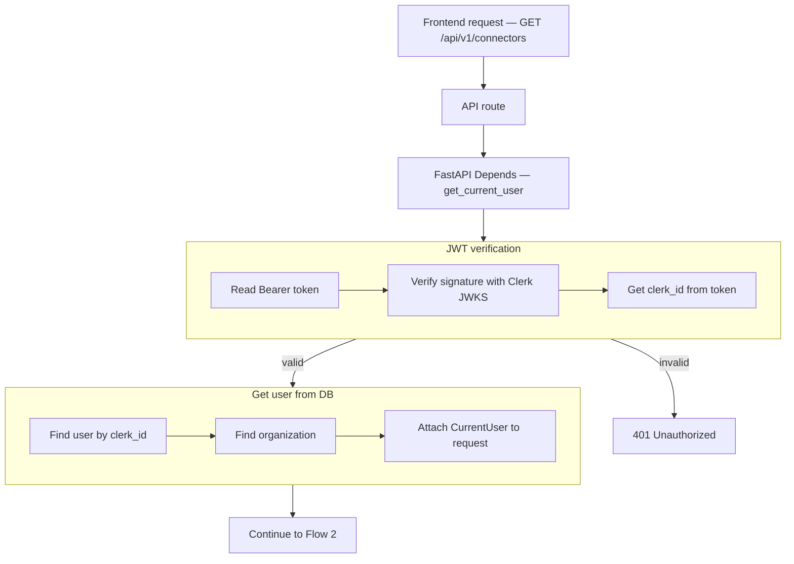

# List Connectors — `GET /api/v1/connectors`

Returns all organization-scoped connectors for the authenticated user. `organization_id` comes from JWT auth (`CurrentUser`), not from query params.

Used by the **Connections** settings UI and the **Add Tool** modal (connector dropdown).

---

# Flow 1 — Auth

## Flow



## Navigate to auth files

| Flow step | What happens | Open file |
|-----------|--------------|-----------|
| API route | `GET /api/v1/connectors` handler | [connectors.py](../../app/api/v1/connectors.py) *(planned)* |
| Router | Mount under `/api/v1` | [router.py](../../app/api/v1/router.py) |
| Depends | Inject `CurrentUser` | [auth.py](../../app/di/auth.py) |
| Read Bearer token | Parse `Authorization` header | [clerk_authenticator.py](../../app/infrastructure/auth/clerk_authenticator.py) |
| Verify JWT | Clerk JWKS signature check | [clerk_jwt.py](../../app/infrastructure/auth/clerk_jwt.py) |
| Get clerk_id | Read `sub` from token claims | [clerk_authenticator.py](../../app/infrastructure/auth/clerk_authenticator.py) |
| 401 Unauthorized | Invalid or expired token | [main.py](../../app/main.py) |
| Find user | Mongo lookup by `clerk_id` | [user_repository.py](../../app/infrastructure/db/repositories/mongo/user_repository.py) |
| Find organization | Mongo lookup by `organization_id` | [organization_repository.py](../../app/infrastructure/db/repositories/mongo/organization_repository.py) |
| Attach to request | Build `CurrentUser` | [current_user.py](../../app/domain/models/current_user.py) |

## JSON at each step

| Step | JSON |
|------|------|
| Start | `{}` |
| After JWT verification | `clerk_id`, `token_valid` |
| After user lookup | + `user_id`, `email` |
| After organization lookup | + `organization_id`, `organization_name` |
| Next | Flow 2 — query Mongo |

**After organization lookup**

```json
{
  "clerk_id": "user_3FZX0ugQeNkL7VO8cMOY8mhRAS5",
  "token_valid": true,
  "user_id": "6a3b7c61d8139334274fbbfd",
  "email": "jayasingheshehan1995@gmail.com",
  "organization_id": "6a3b7c61d8139334274fbbfc",
  "organization_name": "abc bank"
}
```

---

# Flow 2 — Query + filter + response

Runs after auth. Loads connectors for the caller's organization. Optional filters for UI (type dropdown, tool create).

## Flow

```mermaid
flowchart TB
    AUTH[CurrentUser — organization_id from auth]

    AUTH --> QUERY[Optional query params — type, status]

    subgraph VALIDATE["Query validation"]
        Q1[type optional — connector type enum]
        Q2[status optional — active | disabled]
        Q1 --> Q2
    end

    QUERY --> VALIDATE
    VALIDATE -->|invalid| E422[422 Validation error]

    subgraph SERVICE["ConnectorService — list"]
        S1[Use current_user.organization_id]
        S2[ConnectorRepository — find by organization_id]
        S3[Optional filter by type + status]
        S4[Sort by created_at descending]
        S1 --> S2 --> S3 --> S4
    end

    VALIDATE --> SERVICE

    subgraph MASK["Mask secrets in response"]
        M1[Redact uri passwords, tokens, api keys]
        M2[Build ConnectorListItem per doc]
        M3[Wrap in ListConnectorsResponse]
        M1 --> M2 --> M3
    end

    SERVICE --> MASK
    MASK --> RES[200 — ListConnectorsResponse]
```

## Navigate to Flow 2 files

| Flow step | What happens | Open file |
|-----------|--------------|-----------|
| API route | `GET /api/v1/connectors` | [connectors.py](../../app/api/v1/connectors.py) *(planned)* |
| 422 Validation error | Invalid `type` or `status` | [connector.py](../../app/schemas/connector.py) *(planned)* |
| Depends — service | Inject `ConnectorService` | [connectors.py](../../app/di/connectors.py) *(planned)* |
| Service | `list(current_user, type?, status?)` | [connector_service.py](../../app/services/connector_service.py) *(planned)* |
| Organization scope | Always filter `organization_id` from `CurrentUser` | [connector_service.py](../../app/services/connector_service.py) *(planned)* |
| Repository DI | `get_connector_repository()` | [repositories.py](../../app/di/repositories.py) |
| Load connectors | `find_all_by_organization()` | [connector_repository.py](../../app/infrastructure/db/repositories/mongo/connector_repository.py) *(planned)* |
| Mask secrets | `mask_connector_config()` helper | [connector_service.py](../../app/services/connector_service.py) *(planned)* |
| List item schema | `ConnectorListItem` | [connector.py](../../app/schemas/connector.py) *(planned)* |
| Response schema | `ListConnectorsResponse` (`200`) | [connector.py](../../app/schemas/connector.py) *(planned)* |

## Query parameters (optional)

| Param | Location | Required | Example |
|-------|----------|----------|---------|
| `type` | query string | no | `mongo` |
| `status` | query string | no | `active` |

### Query validation rules

| Param | Rule |
|-------|--------|
| `type` | optional enum: `mongo`, `http`, `sql`, `graphql`, `grpc`, `redis`, `vector` |
| `status` | optional enum: `active`, `disabled` |

### What the client does NOT send

| Field | Source |
|-------|--------|
| `organization_id` | `CurrentUser.organization_id` from auth |

## Example requests

**All connectors for the org**

```http
GET /api/v1/connectors
Authorization: Bearer <clerk_jwt>
```

**Mongo connectors only** (for tool create — executor `mongo_find_one`)

```http
GET /api/v1/connectors?type=mongo
Authorization: Bearer <clerk_jwt>
```

**Active HTTP connectors**

```http
GET /api/v1/connectors?type=http&status=active
Authorization: Bearer <clerk_jwt>
```

## MongoDB query (repository)

Collection: `connectors`

```json
{
  "organization_id": "6a3b7c61d8139334274fbbfc"
}
```

With optional filters:

```json
{
  "organization_id": "6a3b7c61d8139334274fbbfc",
  "type": "mongo",
  "status": "active"
}
```

Sort: `created_at` descending (newest first).

## Response shape

List returns **summary items** with **masked** secrets. Use `GET /api/v1/connectors/{connector_id}` for single-item detail (also masked).

| Field | In list response |
|-------|------------------|
| `id` | yes |
| `name` | yes |
| `description` | yes |
| `type` | yes |
| `config` | yes — secrets masked |
| `status` | yes |
| `organization_id` | yes |
| `created_at` | yes |
| `updated_at` | yes |

## JSON at each step

| Step | Fields added |
|------|----------------|
| After auth | `organization_id` |
| After optional query | `type`, `status` filters if provided |
| After DB query | array of connector documents |
| After masking | secrets redacted in each `config` |
| Final response | `items`, `total` |

**Final response (`200`)**

```json
{
  "items": [
    {
      "id": "6a3f8c12d8139334274fbbfe",
      "name": "Customer MongoDB",
      "description": "Production customer database",
      "type": "mongo",
      "config": {
        "uri": "mongodb+srv://***@cluster.example.net",
        "database": "customers"
      },
      "status": "active",
      "organization_id": "6a3b7c61d8139334274fbbfc",
      "created_at": "2026-06-25T10:00:00Z",
      "updated_at": "2026-06-25T10:00:00Z"
    },
    {
      "id": "6a3f8c12d8139334274fbbff",
      "name": "Payments API",
      "description": "Internal billing REST service",
      "type": "http",
      "config": {
        "base_url": "https://api.example.com",
        "auth_type": "bearer",
        "auth_token": "***"
      },
      "status": "active",
      "organization_id": "6a3b7c61d8139334274fbbfc",
      "created_at": "2026-06-25T09:30:00Z",
      "updated_at": "2026-06-25T09:30:00Z"
    }
  ],
  "total": 2
}
```

## Error responses

| Status | When |
|--------|------|
| `401` | Invalid or missing JWT |
| `422` | Invalid `type` or `status` query param |

---

# Related endpoints (planned)

| Method | Path | Doc |
|--------|------|-----|
| `POST` | `/api/v1/connectors` | [01-create-connector-diagrams.md](./01-create-connector-diagrams.md) |
| `GET` | `/api/v1/connectors/{connector_id}` | *(same list item shape, single doc)* |
| `PATCH` | `/api/v1/connectors/{connector_id}` | *(update name, config, status)* |
| `DELETE` | `/api/v1/connectors/{connector_id}` | *(soft-delete or hard-delete; block if tools reference)* |
| `GET` | `/api/v1/connector-types` | [00-connector-types-catalog.md](./00-connector-types-catalog.md) |
