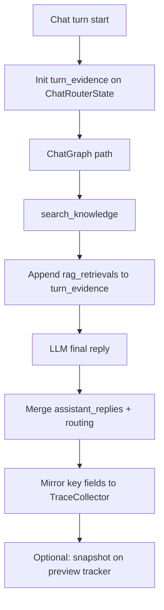

# Turn evidence — LangGraph runtime (Phase 1)

Single structured blob per chat turn for RAGAS input. Replaces scattering RAG data across `ToolRouterContext` and trace aggregates.

**Status:** Planned.

Parent: [00-overview.md](./00-overview.md)

---

## Current LangGraph state (today)

| Graph | State keys |
|-------|------------|
| **Chat router** (`ChatRouterState`) | `finished`, `needs_workflow_enter`, `result` |
| **Workflow** (`WorkflowGraphState`) | `current_node_id`, `slots`, `awaiting_slot`, `user_message`, `replies`, `steps`, `exited`, `should_continue` |
| **Orchestrator agent** (`create_agent`) | `messages` only |

**Not in state today:** RAG chunks, tool metadata, delegation signals (those use `ToolRouterContext` sidecar).

---

## Target: `turn_evidence` on `ChatRouterState`

```python
class ChatRouterState(TypedDict, total=False):
    finished: bool
    needs_workflow_enter: bool
    result: Any
    turn_evidence: TurnEvidence  # NEW
```

### `TurnEvidence` shape

```json
{
  "user_message": "What is the minimum balance?",
  "assistant_replies": ["Urban minimum is ₹10,000..."],
  "rag_retrievals": [
    {
      "query": "minimum balance urban",
      "chunks": [
        {
          "rank": 1,
          "text": "Min balance ₹10,000 urban branches",
          "score": 0.91,
          "chunk_id": "abc123",
          "kb_id": "67kb001",
          "kb_name": "savings-policy"
        }
      ]
    }
  ],
  "tool_calls": [
    {
      "name": "search_knowledge",
      "arguments": { "query": "minimum balance urban" },
      "status": "complete"
    }
  ],
  "routing": { "mode": "orchestrator" }
}
```

| Field | Source | Used by |
|-------|--------|---------|
| `user_message` | Chat request | All RAGAS metrics |
| `assistant_replies` | Final graph replies | Faithfulness, Answer Relevancy |
| `rag_retrievals` | `search_knowledge` tool | Faithfulness, Context Precision/Recall |
| `tool_calls` | Agent tool loop | Trace UI, debugging |
| `routing` | `ChatGraphResult.routing` | Eval context (orchestrator vs sub-agent) |

**Not in `turn_evidence`:** RAGAS scores, claim breakdown, Mongo session, system prompt.

---

## Flow



---

## Code changes (planned)

| File | Change |
|------|--------|
| `domain/graph/turn_evidence.py` | **New** — `TurnEvidence`, `RagRetrieval`, `RagChunk` dataclasses |
| `domain/graph/chat_router_compiler.py` | Add `turn_evidence` to `ChatRouterState` |
| `domain/graph/chat_graph.py` | Init evidence at turn start; merge on path exit |
| `domain/pipeline/rag/rag_result.py` | Add `chunks: list[RagChunk]` to `RagRetrieveResult` |
| `domain/pipeline/rag/retriever.py` | Populate ranked chunks from vector/keyword hits |
| `domain/graph/langchain/tool_router.py` | Append retrieval to evidence ref (not only trace) |
| `domain/graph/langchain/agent_factory.py` | Pass evidence writer into routing middleware |
| `services/chat_completion_service.py` | Read evidence for preview persist / eval handoff |

---

## `RagRetrieveResult` extension

Today:

```python
@dataclass
class RagRetrieveResult:
    context: str
    chunk_count: int
    kb_ids: list[str]
    ...
```

Add:

```python
@dataclass
class RagChunk:
    text: str
    rank: int
    score: float | None
    chunk_id: str | None
    kb_id: str
    kb_name: str
```

`context` stays — formatted string for `ToolMessage`. `chunks` is structured evidence for eval.

---

## Trace mirror (backward compatible)

Extend `tool_complete` for `search_knowledge`:

```json
{
  "tool_name": "search_knowledge",
  "query": "minimum balance",
  "chunk_count": 3,
  "chunks": [{ "rank": 1, "text": "...", "score": 0.91, "kb_id": "..." }]
}
```

Preview trace UI can show chunks without parsing eval DB.

---

## What stays outside state

| Data | Where |
|------|-------|
| RAGAS scores | Mongo `eval_runs` |
| Ground truth | Eval dataset / run request body |
| Tracker session | Mongo + Redis |
| NeMo / PII | Existing pipelines |

---

## Tests (planned)

| Test | Covers |
|------|--------|
| `test_rag_retriever_returns_chunks` | Ranked chunk list from retriever |
| `test_search_knowledge_appends_turn_evidence` | Middleware writes evidence |
| `test_chat_turn_evidence_on_preview` | End-to-end preview turn snapshot |
