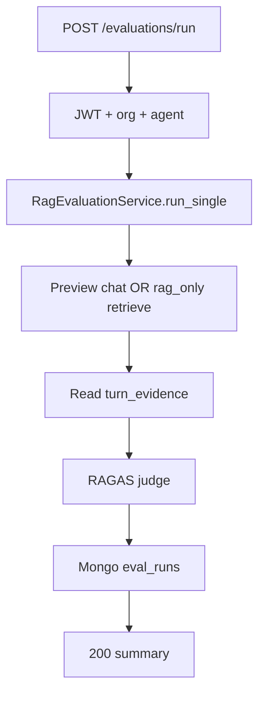

# Evaluation API (Phase 2)

REST endpoints for RAGAS eval runs and datasets. **Admin / builder UI only** — same auth as agent preview.

**Status:** Done — routes on `api/v1/agents.py`.

Parent: [00-overview.md](./00-overview.md) · Metrics: [02-ragas-metrics.md](./02-ragas-metrics.md)

**Base path:** `/api/v1/agents/{agent_id}/evaluations`

**Auth:** Clerk JWT + org scope (same as [../agent/01-create-agent-diagrams.md](../agent/01-create-agent-diagrams.md) Flow 1).

---

## Endpoints summary

| Method | Path | Purpose |
|--------|------|---------|
| `POST` | `.../evaluations/run` | Run single eval (sync) |
| `POST` | `.../evaluations/batch` | Run dataset (async Celery) — **deferred 2.11b** |
| `GET` | `.../evaluations/runs` | List runs for agent |
| `GET` | `.../evaluations/runs/{run_id}` | Full run + metric breakdown |
| `GET` | `.../evaluations/datasets` | List custom + built-in datasets |
| `POST` | `.../evaluations/datasets` | Save user test cases |
| `GET` | `.../evaluations/datasets/dummy` | Load fixture by agent profile |

---

# `POST /evaluations/run`

Run one evaluation question against the agent.

## Request

```http
POST /api/v1/agents/67agent001/evaluations/run
Authorization: Bearer <clerk_jwt>
Content-Type: application/json
```

```json
{
  "question": "What is the minimum balance for urban savings?",
  "ground_truth": "Urban minimum balance is ₹10,000; non-maintenance fee ₹350 + GST.",
  "mode": "full_bot",
  "knowledge_base_names": ["savings-policy"],
  "sender_id": "eval-session-9f2a"
}
```

| Field | Required | Notes |
|-------|----------|-------|
| `question` | yes | User message to send |
| `ground_truth` | no | Needed for Context Recall / better Precision |
| `mode` | no | `full_bot` (default) or `rag_only` |
| `knowledge_base_names` | no | Scope `search_knowledge` |
| `sender_id` | no | Preview session id; auto-generated if omitted |

## Response `200`

```json
{
  "run_id": "6a3f9012d8139334274ff02",
  "status": "complete",
  "scores": {
    "faithfulness": 0.75,
    "answer_relevancy": 0.92,
    "context_precision": 0.89,
    "context_recall": 0.80
  },
  "thresholds": {
    "faithfulness": 0.8,
    "context_precision": 0.7
  },
  "passed": false
}
```

## Flow



## Errors

| Status | When |
|--------|------|
| `401` | Invalid JWT |
| `404` | Agent not found for org |
| `422` | Invalid body |
| `503` | `RAG_EVAL_ENABLED=false` |

---

# `POST /evaluations/batch` *(deferred 2.11b — not implemented)*

Run all cases in a dataset. Returns immediately; poll runs list or use webhook later (v2).

## Request

```json
{
  "dataset_id": "6a3f9012d8139334274ff03",
  "mode": "full_bot"
}
```

Or inline cases:

```json
{
  "cases": [
    {
      "question": "What is minimum balance?",
      "ground_truth": "Urban ₹10,000..."
    }
  ],
  "mode": "full_bot"
}
```

## Response `202`

```json
{
  "batch_id": "6a3f9012d8139334274ff04",
  "status": "queued",
  "case_count": 5
}
```

---

# `GET /evaluations/runs`

List evaluation runs for an agent (paginated).

## Request

```http
GET /api/v1/agents/67agent001/evaluations/runs?limit=20&offset=0
Authorization: Bearer <clerk_jwt>
```

## Response `200`

```json
{
  "items": [
    {
      "run_id": "6a3f9012d8139334274ff02",
      "question": "What is the minimum balance?",
      "mode": "full_bot",
      "status": "complete",
      "scores": {
        "faithfulness": 0.75,
        "answer_relevancy": 0.92,
        "context_precision": 0.89,
        "context_recall": 0.80
      },
      "passed": false,
      "created_at": "2026-06-20T21:33:35.100Z"
    }
  ],
  "total": 1
}
```

---

# `GET /evaluations/runs/{run_id}`

Full detail for Eval Lab UI (claims, chunks, P@k).

## Response `200`

```json
{
  "run_id": "6a3f9012d8139334274ff02",
  "agent_id": "67agent001",
  "question": "What is the minimum balance?",
  "ground_truth": "Urban minimum balance is ₹10,000...",
  "mode": "full_bot",
  "status": "complete",
  "turn_evidence": {
    "user_message": "What is the minimum balance?",
    "assistant_replies": ["The urban minimum is ₹10,000..."],
    "rag_retrievals": [
      {
        "query": "minimum balance",
        "chunks": [
          { "rank": 1, "text": "Min balance ₹10,000 urban", "score": 0.91, "kb_id": "67kb001" }
        ]
      }
    ]
  },
  "scores": {
    "faithfulness": 0.75,
    "answer_relevancy": 0.92,
    "context_precision": 0.89,
    "context_recall": 0.80
  },
  "faithfulness_detail": {
    "claims": [
      { "text": "Urban minimum is ₹10,000", "verdict": "grounded", "source_chunk_index": 0 },
      { "text": "Free online transfer", "verdict": "hallucinated", "source_chunk_index": null }
    ]
  },
  "answer_relevancy_detail": {
    "generated_questions": ["What is urban minimum balance?"],
    "similarities": [0.95],
    "score": 0.95
  },
  "context_precision_detail": {
    "ranked_chunks": [
      { "rank": 1, "text": "Min balance ₹10,000 urban", "label": "relevant" }
    ],
    "precision_at_k": [1.0],
    "score": 1.0
  },
  "context_recall_detail": {
    "reference_claims": [
      { "text": "Urban minimum ₹10,000", "verdict": "supported", "chunk_index": 0 }
    ],
    "score": 1.0
  },
  "created_at": "2026-06-20T21:33:35.100Z"
}
```

---

# `GET /evaluations/datasets`

List datasets available to the agent (custom Mongo + built-in YAML names).

## Response `200`

```json
{
  "items": [
    {
      "dataset_id": "builtin:financial_services:payment_collections",
      "name": "Financial — Payment Collections",
      "source": "builtin",
      "case_count": 8
    },
    {
      "dataset_id": "6a3f9012d8139334274ff05",
      "name": "My regression set",
      "source": "custom",
      "case_count": 3
    }
  ]
}
```

---

# `POST /evaluations/datasets`

Save custom test cases for the agent.

## Request

```json
{
  "name": "Savings FAQ regression",
  "cases": [
    {
      "question": "What is minimum balance?",
      "ground_truth": "Urban ₹10,000; rural ₹2,500.",
      "knowledge_base_names": ["savings-policy"]
    }
  ]
}
```

## Response `201`

```json
{
  "dataset_id": "6a3f9012d8139334274ff05",
  "name": "Savings FAQ regression",
  "case_count": 1
}
```

---

# `GET /evaluations/datasets/dummy`

Load built-in fixture cases from agent `industry` + `agent_type`.

## Request

```http
GET /api/v1/agents/67agent001/evaluations/datasets/dummy
Authorization: Bearer <clerk_jwt>
```

Uses agent doc fields: `industry`, `agent_type`. Falls back to `other` + generic cases if no fixture file.

## Response `200`

```json
{
  "name": "Financial — Payment Collections (builtin)",
  "industry": "financial_services",
  "agent_type": "payment_collections",
  "cases": [
    {
      "question": "What is the minimum balance for urban savings?",
      "ground_truth": "Urban minimum balance is ₹10,000; non-maintenance fee ₹350 + GST."
    }
  ]
}
```

Fixture path: `config/eval/datasets/{industry}/{agent_type}.yml`

---

## Pydantic schemas

| Schema | File |
|--------|------|
| `EvalRunRequest` | `schemas/evaluation.py` |
| `EvalRunSummary` | `schemas/evaluation.py` |
| `EvalRunDetailResponse` | `schemas/evaluation.py` |
| `EvalDatasetCreate` | `schemas/evaluation.py` |
| `EvalDatasetResponse` | `schemas/evaluation.py` |

---

## Router wiring

| File | Role |
|------|------|
| `api/v1/agents.py` | Route handlers under `/{agent_id}/evaluations/...` |
| `di/evaluation.py` | `RagEvaluationService` DI |
| `services/rag_evaluation_service.py` | Orchestrate chat + RAGAS + persist |

---

## Eval Lab UI usage

| UI action | Endpoints |
|-----------|-----------|
| Load dummy cases | `GET .../datasets/dummy` |
| Run test case | `POST .../run` then `GET .../runs/{run_id}` |
| Metric panels | Response fields on run detail (`faithfulness_detail`, etc.) |

Frontend route: `/agent/{agentId}/evaluation` — see [04-eval-lab-ui.md](./04-eval-lab-ui.md).

---

## Related

- Preview chat (full_bot mode): [../chat/06-preview-chat-diagrams.md](../chat/06-preview-chat-diagrams.md)
- UI: [04-eval-lab-ui.md](./04-eval-lab-ui.md)
