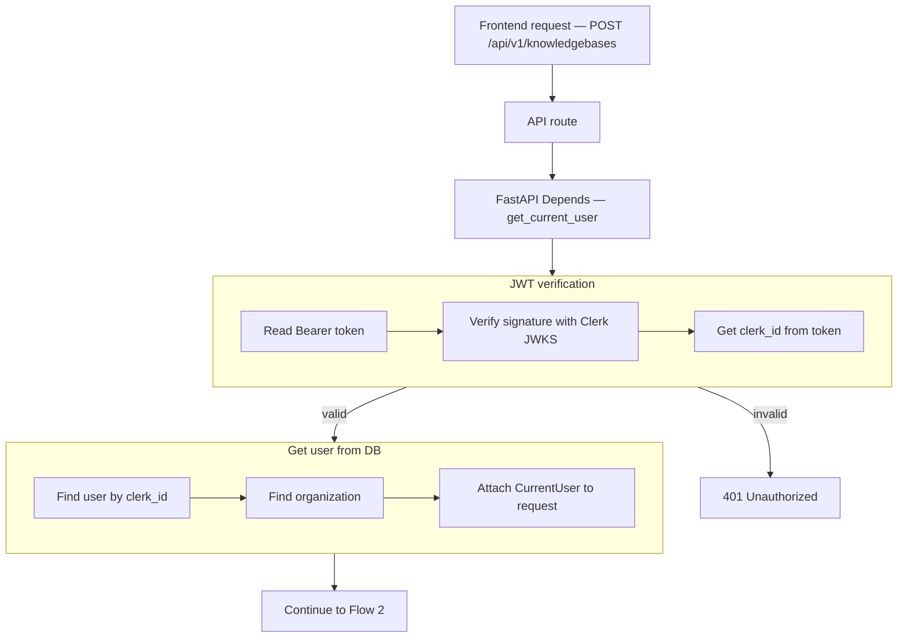
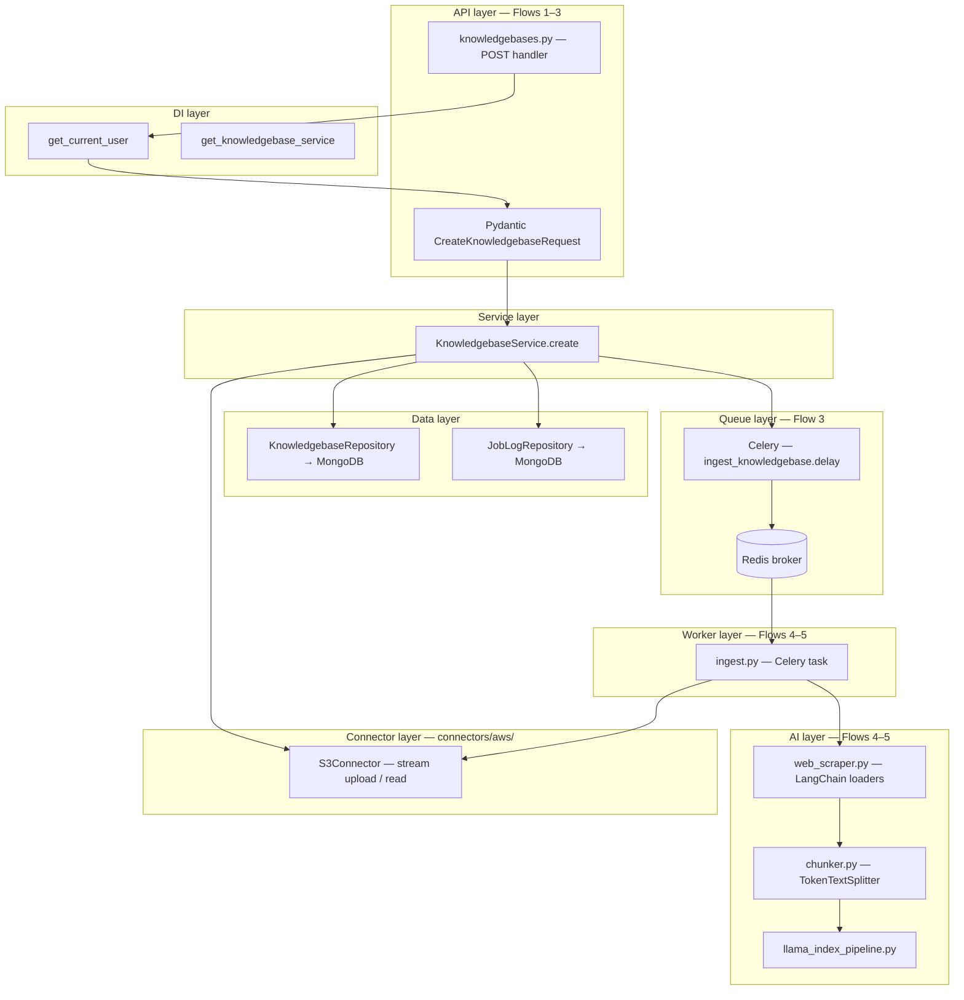
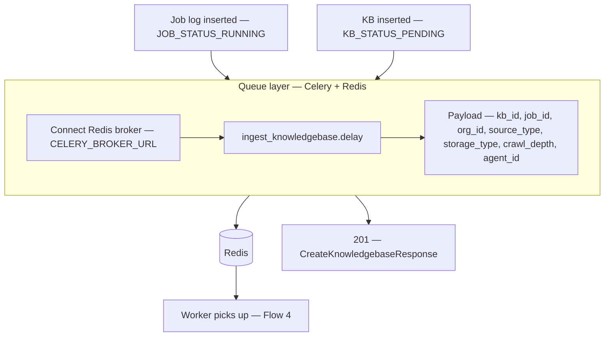
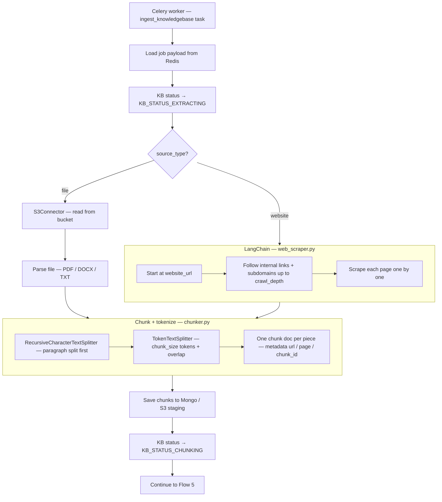
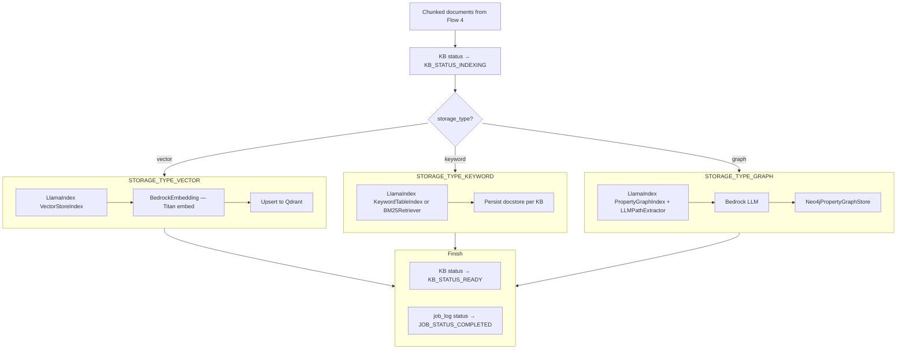
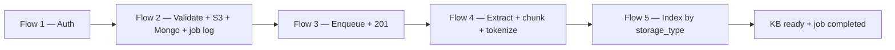

# Create Knowledge Base — `POST /api/v1/knowledgebases`

**Agentic migration:** Phase A **Done** — `routing_hint` when `agent_id` set; PATCH: [04-update-knowledgebase-agent-diagrams.md](./04-update-knowledgebase-agent-diagrams.md). Phase B **no REST change**. Phase C **Done** — `routing_hint` guides LLM `search_knowledge` at chat. Phase D **no REST change**. See [../agentic/updets/api-migration-agentic-phase-d.md](../agentic/updets/api-migration-agentic-phase-d.md). **LangChain proper (Done, no REST change):** [../agentic/updets/migration-langchain-proper.md](../agentic/updets/migration-langchain-proper.md).

# Flow 1 — Auth

## Flow



## Navigate to auth files

| Flow step | What happens | Open file |
|-----------|--------------|-----------|
| API route | `POST /api/v1/knowledgebases` handler | [knowledgebases.py](../../app/api/v1/knowledgebases.py) *(planned)* |
| Router | Mount knowledgebases routes under `/api/v1` | [router.py](../../app/api/v1/router.py) |
| Depends | Inject `CurrentUser` | [auth.py](../../app/di/auth.py) |
| Read Bearer token | Parse `Authorization` header | [clerk_authenticator.py](../../app/infrastructure/auth/clerk_authenticator.py) |
| Verify JWT | Clerk JWKS signature check | [clerk_jwt.py](../../app/infrastructure/auth/clerk_jwt.py) |
| Get clerk_id | Read `sub` from token claims | [clerk_authenticator.py](../../app/infrastructure/auth/clerk_authenticator.py) |
| 401 Unauthorized | Invalid or expired token | [main.py](../../app/main.py) |
| Find user | Mongo lookup by `clerk_id` | [user_repository.py](../../app/infrastructure/db/repositories/mongo/user_repository.py) |
| Find organization | Mongo lookup by `organization_id` | [organization_repository.py](../../app/infrastructure/db/repositories/mongo/organization_repository.py) |
| Attach to request | Build `CurrentUser` | [current_user.py](../../app/domain/models/current_user.py) |

## JSON at each step

| Step | JSON |
|------|------|
| Start | `{}` |
| After JWT verification | `clerk_id`, `token_valid` |
| After user lookup | + `user_id`, `email` |
| After organization lookup | + `organization_id`, `organization_name` |

**Start**

```json
{}
```

**After JWT verification** (+2 fields)

```json
{
  "clerk_id": "user_3FZX0ugQeNkL7VO8cMOY8mhRAS5",
  "token_valid": true
}
```

**After user lookup** (+2 fields)

```json
{
  "clerk_id": "user_3FZX0ugQeNkL7VO8cMOY8mhRAS5",
  "token_valid": true,
  "user_id": "6a3b7c61d8139334274fbbfd",
  "email": "jayasingheshehan1995@gmail.com"
}
```

**After organization lookup** (+2 fields)

```json
{
  "clerk_id": "user_3FZX0ugQeNkL7VO8cMOY8mhRAS5",
  "token_valid": true,
  "user_id": "6a3b7c61d8139334274fbbfd",
  "email": "jayasingheshehan1995@gmail.com",
  "organization_id": "6a3b7c61d8139334274fbbfc",
  "organization_name": "abc bank"
}
```

---

# Layer layout



## Navigate to layer files

| Layer | What happens | Open file |
|-------|--------------|-----------|
| API route | `POST /api/v1/knowledgebases` handler | [knowledgebases.py](../../app/api/v1/knowledgebases.py) *(planned)* |
| Router | Mount knowledgebases routes under `/api/v1` | [router.py](../../app/api/v1/router.py) |
| Pydantic | `CreateKnowledgebaseRequest` validation | [knowledgebase.py](../../app/schemas/knowledgebase.py) *(planned)* |
| Depends — auth | Inject `CurrentUser` | [auth.py](../../app/di/auth.py) |
| Depends — service | Inject `KnowledgebaseService` | [knowledgebases.py](../../app/di/knowledgebases.py) *(planned)* |
| Service | Orchestrate create flow | [knowledgebase_service.py](../../app/services/knowledgebase_service.py) *(planned)* |
| Constants | CAPITAL_CASE enums | [knowledgebase_constants.py](../../app/domain/constants/knowledgebase_constants.py) *(planned)* |
| S3 connector | Stream upload / read from bucket | [s3_connector.py](../../app/infrastructure/connectors/aws/s3_connector.py) *(planned)* |
| KB repository | Insert / update `knowledgebases` | [knowledgebase_repository.py](../../app/infrastructure/db/repositories/mongo/knowledgebase_repository.py) *(planned)* |
| Job log repository | Insert / update `job_logs` | [job_log_repository.py](../../app/infrastructure/db/repositories/mongo/job_log_repository.py) *(planned)* |
| Repository DI | Wire Mongo repositories | [repositories.py](../../app/di/repositories.py) |
| Celery app | Broker + queue config | [celery_app.py](../../app/workers/celery_app.py) *(planned)* |
| Ingest task | Worker entry — Flow 4 + 5 | [ingest.py](../../app/workers/tasks/ingest.py) *(planned)* |
| Web scrape | LangChain `RecursiveUrlLoader` / `SitemapLoader` | [web_scraper.py](../../app/infrastructure/ai/web_scraper.py) *(planned)* |
| Chunk + tokenize | LangChain `RecursiveCharacterTextSplitter` | [chunker.py](../../app/infrastructure/ai/chunker.py) |
| LlamaIndex pipeline | Index by `storage_type` | [llama_index_pipeline.py](../../app/infrastructure/ai/indexers/llama_index_pipeline.py) → [index_factory.py](../../app/infrastructure/ai/llamaindex/index_factory.py) |
| Bedrock embed | Titan via LlamaIndex adapter | [bedrock_embedding.py](../../app/infrastructure/ai/llamaindex/bedrock_embedding.py) |
| Qdrant | Vector store | `QdrantVectorStore` in [index_factory.py](../../app/infrastructure/ai/llamaindex/index_factory.py) |
| Keyword | BM25 persist + load | [persistence.py](../../app/infrastructure/ai/llamaindex/persistence.py) + `BM25Retriever` |
| Neo4j graph | Property graph index | [graph_store.py](../../app/infrastructure/ai/llamaindex/graph_store.py) + [bedrock_llm.py](../../app/infrastructure/ai/llamaindex/bedrock_llm.py) |
| Redis / Celery env | `CELERY_BROKER_URL`, `REDIS_URL` | [config.py](../../app/config.py) |

---

# Flow 2 — Validate + S3 + Mongo + job log

Runs after auth. KB belongs to **organization** — `organization_id` comes from `CurrentUser`, not the request body.

**File source:** stream upload to S3 **before** Mongo insert.  
**Website source:** store `website_url` + `crawl_depth` in Mongo (no S3 at create).

## Flow

```mermaid
flowchart TB
    AUTH[CurrentUser — organization_id from auth]

    AUTH --> BODY[Multipart body — name, source_type, storage_type]

    subgraph VALIDATE["Pydantic validation"]
        V1{source_type?}
        V2[file required + stream]
        V3[website_url + crawl_depth required]
        V4[storage_type — vector | keyword | graph]
        V5[agent_id optional — same org]
        V1 -->|file| V2
        V1 -->|website| V3
        V2 --> V4
        V3 --> V4
        V4 --> V5
    end

    BODY --> VALIDATE
    VALIDATE -->|invalid| E422[422 Validation error]

    VALIDATE -->|file| S3FLOW
    VALIDATE -->|website| MONGO

    subgraph S3FLOW["Connector — S3Connector stream upload"]
        S1[Build key organization_id/kb_id/file_name]
        S2[Stream file chunks to S3 bucket]
        S3[Return s3_uri + s3_key]
        S1 --> S2 --> S3
    end

    subgraph MONGO["Data layer — KnowledgebaseRepository"]
        M1[Insert knowledgebases doc]
        M2[organization_id from CurrentUser]
        M3[status = KB_STATUS_PENDING]
        M4[source_type + storage_type + s3_key or website_url + crawl_depth + agent_id]
        M1 --> M2 --> M3 --> M4
    end

    S3FLOW --> MONGO

    subgraph JOB["Data layer — JobLogRepository"]
        J1[Insert job_logs doc]
        J2[status = JOB_STATUS_RUNNING]
        J3[knowledgebase_id + storage_type]
        J1 --> J2 --> J3
    end

    MONGO --> JOB
    JOB --> F3[Continue to Flow 3]
```

## Navigate to Flow 2 files

| Flow step | What happens | Open file |
|-----------|--------------|-----------|
| Request validation | Pydantic `CreateKnowledgebaseRequest` | [knowledgebase.py](../../app/schemas/knowledgebase.py) *(planned)* |
| 422 Validation error | Invalid body / missing file, URL, or crawl_depth | [knowledgebase.py](../../app/schemas/knowledgebase.py) *(planned)* |
| Source type constants | `SOURCE_TYPE_FILE`, `SOURCE_TYPE_WEBSITE` | [knowledgebase_constants.py](../../app/domain/constants/knowledgebase_constants.py) *(planned)* |
| Storage type constants | `STORAGE_TYPE_VECTOR`, `STORAGE_TYPE_KEYWORD`, `STORAGE_TYPE_GRAPH` | [knowledgebase_constants.py](../../app/domain/constants/knowledgebase_constants.py) *(planned)* |
| KB status constant | `KB_STATUS_PENDING` | [knowledgebase_constants.py](../../app/domain/constants/knowledgebase_constants.py) *(planned)* |
| Job status constant | `JOB_STATUS_RUNNING` | [knowledgebase_constants.py](../../app/domain/constants/knowledgebase_constants.py) *(planned)* |
| Service | Orchestrate validate → S3 → Mongo → job log | [knowledgebase_service.py](../../app/services/knowledgebase_service.py) *(planned)* |
| S3 stream upload | File chunks → S3 bucket | [s3_connector.py](../../app/infrastructure/connectors/aws/s3_connector.py) *(planned)* |
| Org scoping | Set `organization_id` from `current_user.organization_id` | [knowledgebase_service.py](../../app/services/knowledgebase_service.py) *(planned)* |
| Agent attach | Optional `agent_id` — validate same org | [knowledgebase_service.py](../../app/services/knowledgebase_service.py) *(planned)* |
| Save KB | Insert into `knowledgebases` collection | [knowledgebase_repository.py](../../app/infrastructure/db/repositories/mongo/knowledgebase_repository.py) *(planned)* |
| Save job log | Insert into `job_logs` collection | [job_log_repository.py](../../app/infrastructure/db/repositories/mongo/job_log_repository.py) *(planned)* |

## Request body (frontend)

**File source** — multipart form:

```json
{
  "name": "Acme product docs",
  "description": "Support content",
  "source_type": "file",
  "storage_type": "vector",
  "agent_id": "67agent001",
  "file": "<multipart upload>"
}
```

**Website source** — multipart or JSON fields:

```json
{
  "name": "Acme product docs",
  "description": "Support content",
  "source_type": "website",
  "storage_type": "keyword",
  "website_url": "https://acme.com/help",
  "crawl_depth": 2,
  "agent_id": "67agent001"
}
```

### Pydantic validation rules

| Field | Rule |
|-------|------|
| `name` | required, 1–200 chars |
| `description` | optional, max 2000 chars |
| `source_type` | required enum: `file`, `website` |
| `file` | required when `source_type=file` — streamed upload |
| `website_url` | required when `source_type=website` — valid URL |
| `crawl_depth` | required when `source_type=website` — integer 1–5 (link levels / subdomains to follow) |
| `crawl_depth` | must be omitted when `source_type=file` |
| `storage_type` | required enum: `vector`, `keyword`, `graph` |
| `agent_id` | optional — attach KB to agent; must belong to same `organization_id` |

### What the client does NOT send

| Field | Source |
|-------|--------|
| `organization_id` | `CurrentUser.organization_id` from auth |
| `user_id` | not stored as owner — KB is org-level |

## Constants file (`knowledgebase_constants.py`)

| Key | Value |
|-----|-------|
| `SOURCE_TYPE_FILE` | `"file"` |
| `SOURCE_TYPE_WEBSITE` | `"website"` |
| `STORAGE_TYPE_VECTOR` | `"vector"` |
| `STORAGE_TYPE_KEYWORD` | `"keyword"` |
| `STORAGE_TYPE_GRAPH` | `"graph"` |
| `KB_STATUS_PENDING` | `"pending"` |
| `KB_STATUS_EXTRACTING` | `"extracting"` |
| `KB_STATUS_CHUNKING` | `"chunking"` |
| `KB_STATUS_INDEXING` | `"indexing"` |
| `KB_STATUS_READY` | `"ready"` |
| `KB_STATUS_FAILED` | `"failed"` |
| `JOB_STATUS_RUNNING` | `"running"` |
| `JOB_STATUS_COMPLETED` | `"completed"` |
| `JOB_STATUS_FAILED` | `"failed"` |
| `DEFAULT_CHUNK_SIZE` | `1024` tokens |
| `DEFAULT_CHUNK_OVERLAP` | `20` tokens |

## JSON at each step

| Step | Fields added |
|------|----------------|
| After auth | `organization_id` (from auth — not in request body) |
| After Pydantic validation | `name`, `source_type`, `storage_type`, `file` or `website_url`, `crawl_depth`, `agent_id` |
| After S3 upload (file only) | `s3_key`, `s3_uri` |
| After KB insert | `id`, `status: pending` |
| After job log insert | `job_id`, `job_status: running` |
| Next | Flow 3 — enqueue + 201 |

**After validation** (+request fields — website)

```json
{
  "name": "Acme product docs",
  "source_type": "website",
  "storage_type": "keyword",
  "website_url": "https://acme.com/help",
  "crawl_depth": 2,
  "agent_id": "67agent001",
  "description": "Support content"
}
```

**After KB insert** (+id, status, org)

```json
{
  "id": "67abc123",
  "name": "Acme product docs",
  "organization_id": "6a3b7c61d8139334274fbbfc",
  "source_type": "website",
  "storage_type": "keyword",
  "website_url": "https://acme.com/help",
  "crawl_depth": 2,
  "agent_id": "67agent001",
  "s3_key": null,
  "status": "pending",
  "created_at": "2026-06-24T12:00:00Z"
}
```

**After job log insert** (+job fields)

```json
{
  "id": "67abc125",
  "knowledgebase_id": "67abc123",
  "organization_id": "6a3b7c61d8139334274fbbfc",
  "storage_type": "keyword",
  "status": "running",
  "created_at": "2026-06-24T12:00:00Z"
}
```

---

# Flow 3 — Redis enqueue + 201 response

Runs after KB and job log are saved. API enqueues to Redis and returns `201` immediately. Worker processing starts in **Flow 4**.

## Flow



## Navigate to Flow 3 files

| Flow step | What happens | Open file |
|-----------|--------------|-----------|
| Enqueue job | `ingest_knowledgebase.delay(...)` | [ingest.py](../../app/workers/tasks/ingest.py) *(planned)* |
| Celery app | Broker URL + queue routing | [celery_app.py](../../app/workers/celery_app.py) *(planned)* |
| Redis broker | Job queue connection | [config.py](../../app/config.py) |
| Service | Call Celery after Mongo saves | [knowledgebase_service.py](../../app/services/knowledgebase_service.py) *(planned)* |
| Response schema | `CreateKnowledgebaseResponse` (`201`) | [knowledgebase.py](../../app/schemas/knowledgebase.py) *(planned)* |

## Celery task payload

```json
{
  "knowledgebase_id": "67abc123",
  "job_id": "67abc125",
  "organization_id": "6a3b7c61d8139334274fbbfc",
  "source_type": "website",
  "storage_type": "keyword",
  "website_url": "https://acme.com/help",
  "crawl_depth": 2,
  "agent_id": "67agent001",
  "s3_key": null
}
```

## Env settings

| Env / setting | Used for |
|---------------|----------|
| `REDIS_URL` → `settings.redis_url` | API session cache (existing) |
| `CELERY_BROKER_URL` | Celery job queue broker *(planned)* |
| `CELERY_RESULT_BACKEND` | Optional task results *(planned)* |
| `AWS_REGION` → `settings.aws_region` | S3 connector region |
| S3 bucket env *(planned)* | Target bucket for file uploads |

## Final API response (`201 Created`)

```json
{
  "id": "67abc123",
  "name": "Acme product docs",
  "description": "Support content",
  "organization_id": "6a3b7c61d8139334274fbbfc",
  "source_type": "website",
  "storage_type": "keyword",
  "website_url": "https://acme.com/help",
  "crawl_depth": 2,
  "agent_id": "67agent001",
  "status": "pending",
  "job_id": "67abc125",
  "job_status": "running",
  "created_at": "2026-06-24T12:00:00Z"
}
```

---

# Flow 4 — Extract + scrape + chunk + tokenize

Celery worker picks up job from Redis. Reads source by `source_type`, then chunks and tokenizes before indexing.

## Flow



## Navigate to Flow 4 files

| Flow step | What happens | Open file |
|-----------|--------------|-----------|
| Worker task entry | Celery `ingest_knowledgebase` | [ingest.py](../../app/workers/tasks/ingest.py) *(planned)* |
| S3 read | Download / stream from bucket | [s3_connector.py](../../app/infrastructure/connectors/aws/s3_connector.py) *(planned)* |
| Web scrape | `RecursiveUrlLoader` / `SitemapLoader` | [web_scraper.py](../../app/infrastructure/ai/web_scraper.py) *(planned)* |
| Chunk + tokenize | `TokenTextSplitter` + paragraph split | [chunker.py](../../app/infrastructure/ai/chunker.py) *(planned)* |
| Chunk defaults | `DEFAULT_CHUNK_SIZE`, `DEFAULT_CHUNK_OVERLAP` | [knowledgebase_constants.py](../../app/domain/constants/knowledgebase_constants.py) *(planned)* |
| Update KB status | `extracting` → `chunking` | [knowledgebase_repository.py](../../app/infrastructure/db/repositories/mongo/knowledgebase_repository.py) *(planned)* |

## JSON at each step

| Step | Fields updated |
|------|----------------|
| Worker start | KB `status: extracting` |
| After scrape / S3 read | raw text per page or file |
| After chunk + tokenize | list of chunk docs with token counts |
| After save | KB `status: chunking` |
| Next | Flow 5 — index by storage_type |

---

# Flow 5 — Index by storage_type (LlamaIndex)

Runs after Flow 4 chunks exist. Branch on `storage_type` — each type uses LlamaIndex adapters (**Done**).

**Migration plan:** [../agentic/updets/migration-llamaindex-rag.md](../agentic/updets/migration-llamaindex-rag.md)

## Flow



## Navigate to Flow 5 files

| Flow step | What happens | Open file |
|-----------|--------------|-----------|
| LlamaIndex pipeline | Route index by `storage_type` | [llama_index_pipeline.py](../../app/infrastructure/ai/indexers/llama_index_pipeline.py) → [index_factory.py](../../app/infrastructure/ai/llamaindex/index_factory.py) |
| LlamaIndex adapters | Bedrock embed/LLM, Qdrant, BM25 persist, graph store | [llamaindex/](../../app/infrastructure/ai/llamaindex/) — [migration plan](../agentic/updets/migration-llamaindex-rag.md) **Done** |
| Bedrock embed | Titan embeddings — vector | [bedrock_embedding.py](../../app/infrastructure/ai/llamaindex/bedrock_embedding.py) |
| Qdrant upsert | Dense vector storage | `QdrantVectorStore` in [index_factory.py](../../app/infrastructure/ai/llamaindex/index_factory.py) |
| Keyword index | BM25 search | `BM25Retriever` in index/retriever factories + [persistence.py](../../app/infrastructure/ai/llamaindex/persistence.py) |
| Neo4j graph | Entity + relation storage + query | [graph_store.py](../../app/infrastructure/ai/llamaindex/graph_store.py) + `PropertyGraphIndex` |
| Update KB status | `indexing` → `ready` or `failed` | [knowledgebase_repository.py](../../app/infrastructure/db/repositories/mongo/knowledgebase_repository.py) |
| Update job log | `running` → `completed` or `failed` | [job_log_repository.py](../../app/infrastructure/db/repositories/mongo/job_log_repository.py) |

## Index backend by storage_type

| `storage_type` | Backend | Library |
|----------------|---------|---------|
| `vector` | Qdrant | LlamaIndex `VectorStoreIndex` + `BedrockLlamaEmbedding` |
| `keyword` | `{RAG_INDEX_DIR}/{org}/{kb}/bm25/` | LlamaIndex `BM25Retriever` |
| `graph` | Neo4j + `graph.ready` marker | LlamaIndex `PropertyGraphIndex` + `BedrockLlamaLLM` |

**Deploy note:** Re-ingest KBs after deploy if upgrading from pre-LlamaIndex indexes (old `.joblib` keyword files incompatible). No REST API change.

---

# End-to-end order



| Step | Flow | Layer | Action |
|------|------|-------|--------|
| 1 | Flow 1 | Auth | JWT → `organization_id` |
| 2 | Flow 2 | API + Pydantic | Validate `source_type`, `storage_type`, file/URL, `crawl_depth`, `agent_id` |
| 3 | Flow 2 | Connector | Stream file → S3 (file only) |
| 4 | Flow 2 | Data | Insert KB with `KB_STATUS_PENDING` |
| 5 | Flow 2 | Data | Insert job_log with `JOB_STATUS_RUNNING` |
| 6 | Flow 3 | Queue | `ingest_knowledgebase.delay(...)` via Redis |
| 7 | Flow 3 | API | Return `201` |
| 8 | Flow 4 | Worker | Extract / scrape → chunk → tokenize |
| 9 | Flow 5 | Worker | Index by `storage_type` → KB `ready`, job `completed` |

## What is NOT in Flows 1–3 (API create)

| Item | Where |
|------|-------|
| Extract / chunk / tokenize | Flow 4 — Celery worker |
| Index by storage_type | Flow 5 — Celery worker |
| KB status → ready | Flow 5 — worker updates |
| Job status → completed | Flow 5 — worker updates |
| Per-user KB isolation | not supported — org-scoped only |
