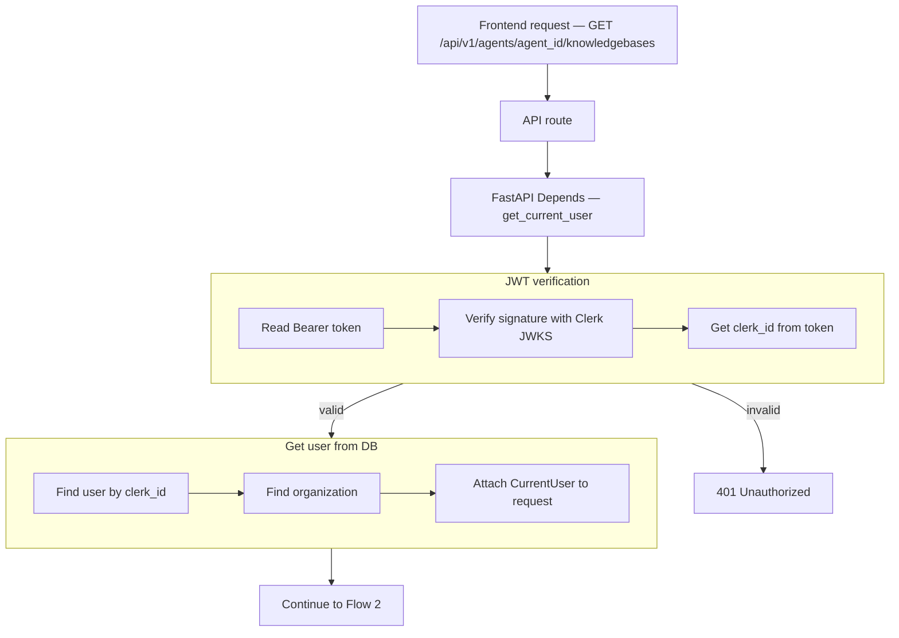
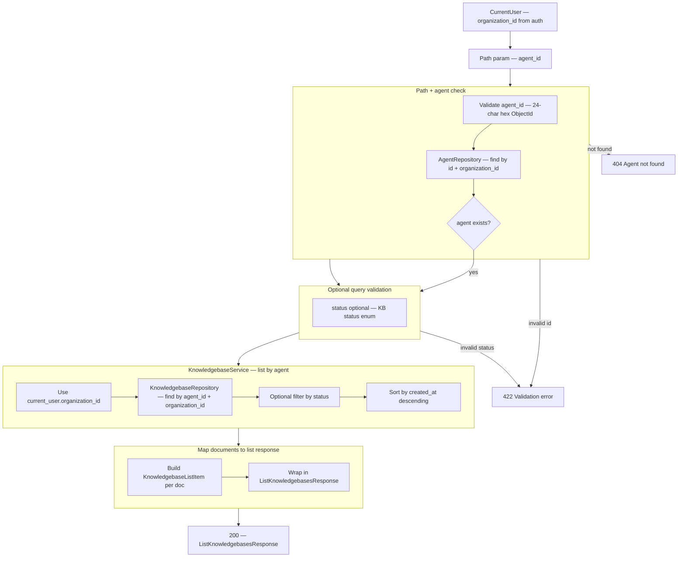
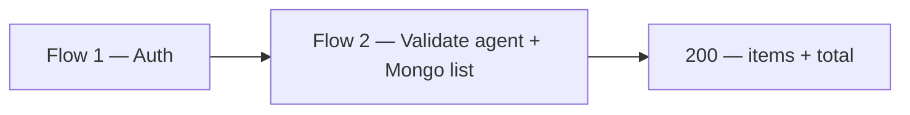

# List Knowledge Bases by Agent — `GET /api/v1/agents/{agent_id}/knowledgebases`

Returns all knowledge bases attached to an agent. Scoped to the authenticated user's **organization** — `organization_id` comes from JWT auth (`CurrentUser`), not from the client.

The path parameter `agent_id` is required. The agent must belong to the same `organization_id` as the caller.

# Flow 1 — Auth

## Flow



## Navigate to auth files

| Flow step | What happens | Open file |
|-----------|--------------|-----------|
| API route | `GET /api/v1/agents/{agent_id}/knowledgebases` handler | [knowledgebases.py](../../app/api/v1/knowledgebases.py) *(planned)* |
| Router | Mount under `/api/v1` | [router.py](../../app/api/v1/router.py) |
| Depends | Inject `CurrentUser` | [auth.py](../../app/di/auth.py) |
| Read Bearer token | Parse `Authorization` header | [clerk_authenticator.py](../../app/infrastructure/auth/clerk_authenticator.py) |
| Verify JWT | Clerk JWKS signature check | [clerk_jwt.py](../../app/infrastructure/auth/clerk_jwt.py) |
| Get clerk_id | Read `sub` from token claims | [clerk_authenticator.py](../../app/infrastructure/auth/clerk_authenticator.py) |
| 401 Unauthorized | Invalid or expired token | [main.py](../../app/main.py) |
| Find user | Mongo lookup by `clerk_id` | [user_repository.py](../../app/infrastructure/db/repositories/mongo/user_repository.py) |
| Find organization | Mongo lookup by `organization_id` | [organization_repository.py](../../app/infrastructure/db/repositories/mongo/organization_repository.py) |
| Attach to request | Build `CurrentUser` | [current_user.py](../../app/domain/models/current_user.py) |

## JSON at each step

| Step | JSON |
|------|------|
| Start | `{}` |
| After JWT verification | `clerk_id`, `token_valid` |
| After user lookup | + `user_id`, `email` |
| After organization lookup | + `organization_id`, `organization_name` |
| Next | Flow 2 — validate `agent_id` + list from Mongo |

**Start**

```json
{}
```

**After JWT verification** (+2 fields)

```json
{
  "clerk_id": "user_3FZX0ugQeNkL7VO8cMOY8mhRAS5",
  "token_valid": true
}
```

**After user lookup** (+2 fields)

```json
{
  "clerk_id": "user_3FZX0ugQeNkL7VO8cMOY8mhRAS5",
  "token_valid": true,
  "user_id": "6a3b7c61d8139334274fbbfd",
  "email": "jayasingheshehan1995@gmail.com"
}
```

**After organization lookup** (+2 fields)

```json
{
  "clerk_id": "user_3FZX0ugQeNkL7VO8cMOY8mhRAS5",
  "token_valid": true,
  "user_id": "6a3b7c61d8139334274fbbfd",
  "email": "jayasingheshehan1995@gmail.com",
  "organization_id": "6a3b7c61d8139334274fbbfc",
  "organization_name": "abc bank"
}
```

---

# Flow 2 — Validate agent + Mongo list

Runs after auth. Validates path `agent_id`, confirms the agent belongs to the caller's organization, then loads knowledge bases from MongoDB.

## Flow



## Navigate to Flow 2 files

| Flow step | What happens | Open file |
|-----------|--------------|-----------|
| API route | `GET /api/v1/agents/{agent_id}/knowledgebases` | [knowledgebases.py](../../app/api/v1/knowledgebases.py) *(planned)* |
| Path validation | `agent_id` — 24-char hex | [agents.py](../../app/api/v1/agents.py) *(reuse AgentIdPath pattern)* |
| 422 Validation error | Invalid `agent_id` or `status` | [knowledgebase.py](../../app/schemas/knowledgebase.py) *(planned)* |
| 404 Agent not found | Agent missing or wrong org | [agent_service.py](../../app/services/agent_service.py) |
| Depends — service | Inject `KnowledgebaseService` | [knowledgebases.py](../../app/di/knowledgebases.py) |
| Service | `list_by_agent(current_user, agent_id, status?)` | [knowledgebase_service.py](../../app/services/knowledgebase_service.py) *(planned)* |
| Agent check | `find_by_id_for_organization()` | [agent_repository.py](../../app/infrastructure/db/repositories/mongo/agent_repository.py) |
| Organization scope | Always filter `organization_id` from `CurrentUser` | [knowledgebase_service.py](../../app/services/knowledgebase_service.py) *(planned)* |
| Repository DI | `get_knowledgebase_repository()` | [repositories.py](../../app/di/repositories.py) |
| Load KBs | `find_all_by_agent()` | [knowledgebase_repository.py](../../app/infrastructure/db/repositories/mongo/knowledgebase_repository.py) *(planned)* |
| KB status constants | `KB_STATUS_*` filter values | [knowledgebase_constants.py](../../app/domain/constants/knowledgebase_constants.py) |
| List item schema | `KnowledgebaseListItem` | [knowledgebase.py](../../app/schemas/knowledgebase.py) *(planned)* |
| Response schema | `ListKnowledgebasesResponse` (`200`) | [knowledgebase.py](../../app/schemas/knowledgebase.py) *(planned)* |

## Path parameters (required)

| Param | Location | Required | Example |
|-------|----------|----------|---------|
| `agent_id` | path | yes | `67agent001` |

### Path validation rules

| Param | Rule |
|-------|--------|
| `agent_id` | required, 24-char hex MongoDB ObjectId |

## Query parameters (optional)

| Param | Location | Required | Example |
|-------|----------|----------|---------|
| `status` | query string | no | `ready` |

### Query validation rules

| Param | Rule |
|-------|--------|
| `status` | optional enum: `pending`, `extracting`, `chunking`, `indexing`, `ready`, `failed` |

### What the client does NOT send

| Field | Source |
|-------|--------|
| `organization_id` | `CurrentUser.organization_id` from auth |

## Example requests

**All knowledge bases for an agent**

```http
GET /api/v1/agents/67agent001/knowledgebases
Authorization: Bearer <clerk_jwt>
```

**Ready knowledge bases only**

```http
GET /api/v1/agents/67agent001/knowledgebases?status=ready
Authorization: Bearer <clerk_jwt>
```

## MongoDB query (repository)

Collection: `knowledgebases`

```json
{
  "organization_id": "6a3b7c61d8139334274fbbfc",
  "agent_id": "67agent001"
}
```

Optional filter when `status` query param is provided:

```json
{
  "organization_id": "6a3b7c61d8139334274fbbfc",
  "agent_id": "67agent001",
  "status": "ready"
}
```

Sort: `created_at` descending (newest first).

## Response shape

List returns **summary items** (no `s3_key`, `s3_uri`, or chunk data). Use a future `GET /api/v1/knowledgebases/{kb_id}` for full detail if needed.

| Field | In list response |
|-------|------------------|
| `id` | yes |
| `name` | yes |
| `description` | yes |
| `source_type` | yes |
| `storage_type` | yes |
| `website_url` | yes (when `source_type=website`) |
| `crawl_depth` | yes (when `source_type=website`) |
| `agent_id` | yes |
| `status` | yes |
| `organization_id` | yes |
| `created_at` | yes |
| `s3_key` | no |
| `s3_uri` | no |
| `job_id` | no *(future: join latest `job_logs`)* |
| `job_status` | no *(future: join latest `job_logs`)* |

## JSON at each step

| Step | Fields added |
|------|----------------|
| After auth | `organization_id` (from auth — not in request) |
| After path validation | `agent_id` |
| After agent check | agent exists in same org |
| After optional query | `status` filter if provided |
| After DB query | array of matching KB documents |
| Final response | `items`, `total` |

**After auth** (+org from token)

```json
{
  "organization_id": "6a3b7c61d8139334274fbbfc"
}
```

**After path validation** (+agent_id)

```json
{
  "organization_id": "6a3b7c61d8139334274fbbfc",
  "agent_id": "67agent001"
}
```

**After optional status filter** (+status)

```json
{
  "organization_id": "6a3b7c61d8139334274fbbfc",
  "agent_id": "67agent001",
  "status": "ready"
}
```

**After DB query** (+items)

```json
{
  "organization_id": "6a3b7c61d8139334274fbbfc",
  "agent_id": "67agent001",
  "items": [
    {
      "id": "67abc123",
      "name": "abc bank knowledge base",
      "description": "Payment and collections assistant for customers",
      "source_type": "website",
      "storage_type": "vector",
      "website_url": "https://acme.com/help",
      "crawl_depth": 2,
      "agent_id": "67agent001",
      "status": "ready",
      "organization_id": "6a3b7c61d8139334274fbbfc",
      "created_at": "2026-06-24T12:00:00Z"
    }
  ]
}
```

**Final API response** (`200 OK`)

```json
{
  "items": [
    {
      "id": "67abc123",
      "name": "abc bank knowledge base",
      "description": "Payment and collections assistant for customers",
      "source_type": "website",
      "storage_type": "vector",
      "website_url": "https://acme.com/help",
      "crawl_depth": 2,
      "agent_id": "67agent001",
      "status": "ready",
      "organization_id": "6a3b7c61d8139334274fbbfc",
      "created_at": "2026-06-24T12:00:00Z"
    },
    {
      "id": "67abc456",
      "name": "abc bank knowledge base",
      "description": null,
      "source_type": "file",
      "storage_type": "keyword",
      "website_url": null,
      "crawl_depth": null,
      "agent_id": "67agent001",
      "status": "pending",
      "organization_id": "6a3b7c61d8139334274fbbfc",
      "created_at": "2026-06-25T10:15:00Z"
    }
  ],
  "total": 2
}
```

**Empty list** (`200 OK`)

```json
{
  "items": [],
  "total": 0
}
```

## Error responses

| Status | When |
|--------|------|
| `401` | Missing, invalid, or expired JWT |
| `404` | `agent_id` not found or not in caller's organization |
| `422` | Invalid `agent_id` format or invalid `status` query value |

## End-to-end order



| Step | Flow | Layer | Action |
|------|------|-------|--------|
| 1 | Flow 1 | Auth | JWT → `organization_id` |
| 2 | Flow 2 | API | Validate path `agent_id` |
| 3 | Flow 2 | Service | Verify agent belongs to org |
| 4 | Flow 2 | Data | Query `knowledgebases` by `agent_id` + `organization_id` |
| 5 | Flow 2 | API | Return `200` with `ListKnowledgebasesResponse` |

## What is NOT in this phase

| Item | Status |
|------|--------|
| Client-supplied `organization_id` | not allowed — always from auth |
| Cross-organization listing | not allowed |
| Knowledge bases with `agent_id: null` | not included — only KBs linked to the given agent |
| Pagination (`page`, `limit`) | future enhancement |
| Latest `job_id` / `job_status` in list | future enhancement — join `job_logs` |
| Full KB detail in list | future `GET /api/v1/knowledgebases/{kb_id}` |
| Search / sort options | future enhancement |

## Planned implementation (not coded yet)

| File | Change |
|------|--------|
| [knowledgebases.py](../../app/api/v1/knowledgebases.py) | Add `GET` list route on agents nested path *(or mount on agents router)* |
| [knowledgebase.py](../../app/schemas/knowledgebase.py) | Add `KnowledgebaseStatus`, `KnowledgebaseListItem`, `ListKnowledgebasesResponse` |
| [knowledgebase_service.py](../../app/services/knowledgebase_service.py) | Add `list_by_agent()` |
| [knowledgebase_repository.py](../../app/infrastructure/db/repositories/mongo/knowledgebase_repository.py) | Add `find_all_by_agent()` |
