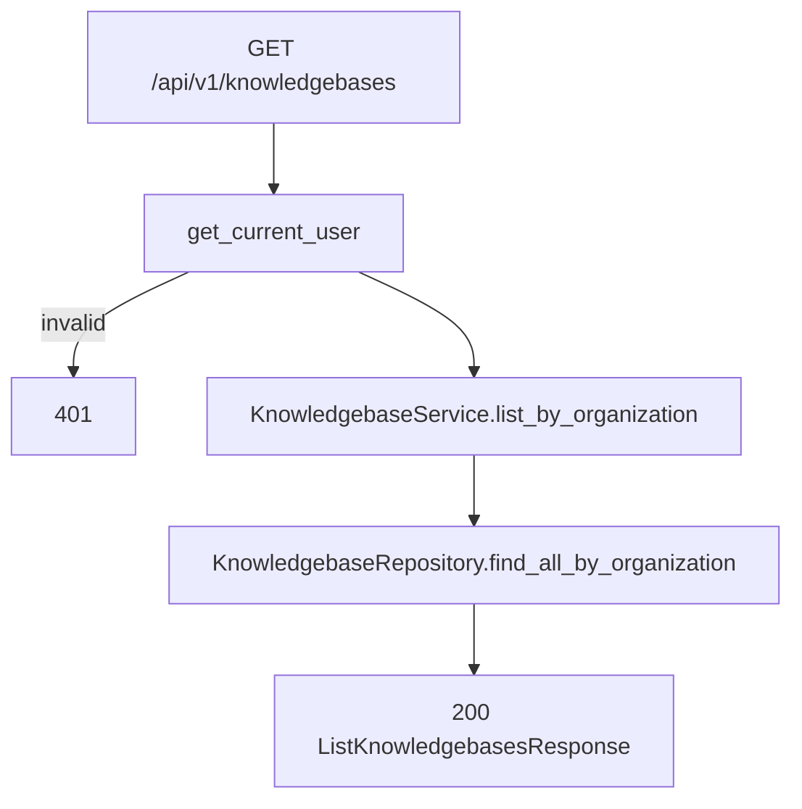

# List Knowledge Bases — `GET /api/v1/knowledgebases`

Organization-scoped list of all knowledge bases. Used by the agent detail **Attach / Detach** UI to show every KB in the org (not only those already linked to one agent).

Related:

- List by agent: [02-list-knowledgebases-by-agent-diagrams.md](./02-list-knowledgebases-by-agent-diagrams.md)
- Attach / detach: [04-update-knowledgebase-agent-diagrams.md](./04-update-knowledgebase-agent-diagrams.md)

`organization_id` comes from JWT auth (`CurrentUser`), not the request body.

---

# Flow



---

# Query parameters (optional)

| Param | Rule |
|-------|------|
| `agent_id` | 24-char ObjectId — filter KBs attached to that agent |
| `status` | `pending`, `extracting`, `chunking`, `indexing`, `ready`, `failed` |

If `agent_id` is sent, the agent must exist in the caller's organization (`404` otherwise).

---

# Example request

```http
GET /api/v1/knowledgebases
Authorization: Bearer <clerk_jwt>
```

**Only KBs attached to an agent:**

```http
GET /api/v1/knowledgebases?agent_id=67agent001
```

---

# Response `200`

```json
{
  "items": [
    {
      "id": "6a3f9012d8139334274fbc01",
      "name": "Policy docs",
      "description": null,
      "source_type": "file",
      "storage_type": "vector",
      "website_url": null,
      "crawl_depth": null,
      "agent_id": "67agent001",
      "status": "ready",
      "organization_id": "6a3b7c61d8139334274fbbfc",
      "created_at": "2026-06-26T10:00:00Z"
    }
  ],
  "total": 1
}
```

Sort: `created_at` descending.

---

# UI mapping

| UI | API |
|----|-----|
| Show all org KBs on agent page | `GET /knowledgebases` |
| Show only attached KBs | `GET /knowledgebases?agent_id={id}` or `GET /agents/{id}/knowledgebases` |
| **Attach** button | `PATCH /knowledgebases/{id}` with `{ "agent_id": "{agentId}" }` |
| **Detach** button | `PATCH /knowledgebases/{id}` with `{ "agent_id": null }` |

---

# Navigate to implementation files

| Layer | File |
|-------|------|
| API route | [knowledgebases.py](../../app/api/v1/knowledgebases.py) |
| Service | [knowledgebase_service.py](../../app/services/knowledgebase_service.py) |
| Repository | [knowledgebase_repository.py](../../app/infrastructure/db/repositories/mongo/knowledgebase_repository.py) |
| Schema | [knowledgebase.py](../../app/schemas/knowledgebase.py) |
