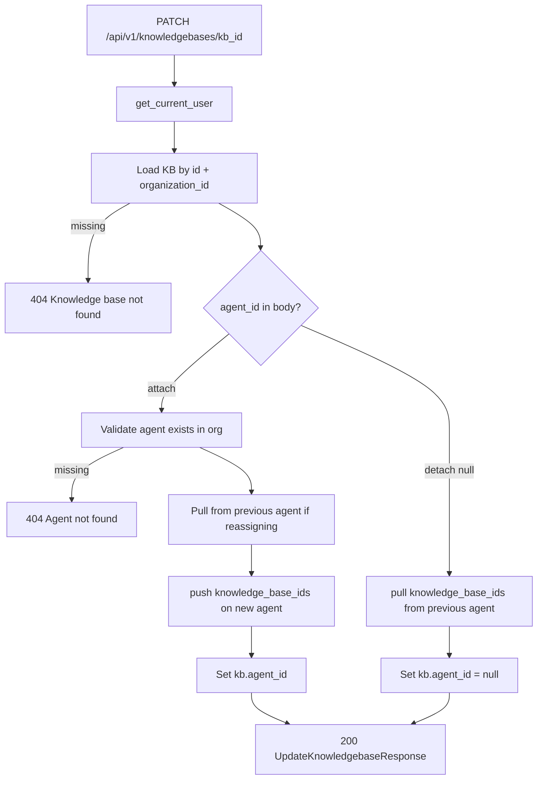

# Update Knowledge Base Agent — `PATCH /api/v1/knowledgebases/{knowledgebase_id}`

Attach or detach a knowledge base to an agent by setting `agent_id`.

Used by the agent detail **Attach / Detach** buttons.

- **Attach:** `{ "agent_id": "<agent_object_id>" }`
- **Detach:** `{ "agent_id": null }`

Also syncs `agent.knowledge_base_ids` on the agent document (`$addToSet` on attach, `$pull` on detach).

List all KBs: [03-list-knowledgebases-diagrams.md](./03-list-knowledgebases-diagrams.md)

---

# Flow



---

# Request body (MVP)

Only `agent_id` is updatable in this phase.

| Field | Rule |
|-------|------|
| `agent_id` | 24-char ObjectId to attach, or `null` to detach |

At least one field required. Empty body → `422`.

### Attach example

```http
PATCH /api/v1/knowledgebases/6a3f9012d8139334274fbc01
Authorization: Bearer <clerk_jwt>
Content-Type: application/json

{
  "agent_id": "67agent001"
}
```

### Detach example

```json
{
  "agent_id": null
}
```

---

# Response `200`

```json
{
  "id": "6a3f9012d8139334274fbc01",
  "name": "Policy docs",
  "description": null,
  "source_type": "file",
  "storage_type": "vector",
  "website_url": null,
  "crawl_depth": null,
  "agent_id": "67agent001",
  "status": "ready",
  "organization_id": "6a3b7c61d8139334274fbbfc",
  "created_at": "2026-06-26T10:00:00Z",
  "updated_at": "2026-06-26T12:00:00Z"
}
```

---

# Error responses

| Status | When |
|--------|------|
| `401` | Invalid JWT |
| `404` | Knowledge base or agent not found |
| `422` | Invalid ObjectId, empty body |

---

# Navigate to implementation files

| Layer | File |
|-------|------|
| API route | [knowledgebases.py](../../app/api/v1/knowledgebases.py) |
| Service | `KnowledgebaseService.update()` in [knowledgebase_service.py](../../app/services/knowledgebase_service.py) |
| Agent sync | `push_knowledge_base_id` / `pull_knowledge_base_id` in [agent_repository.py](../../app/infrastructure/db/repositories/mongo/agent_repository.py) |
| Schema | `UpdateKnowledgebaseRequest` in [knowledgebase.py](../../app/schemas/knowledgebase.py) |
| Exception | [knowledgebase.py](../../app/shared/exceptions/knowledgebase.py) |
