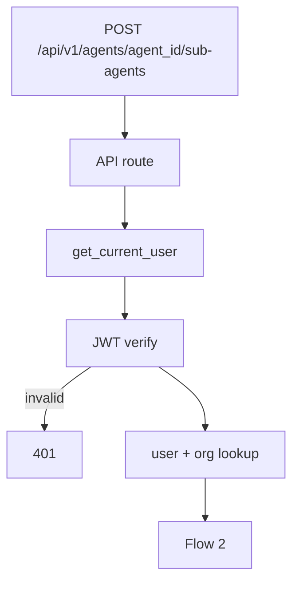
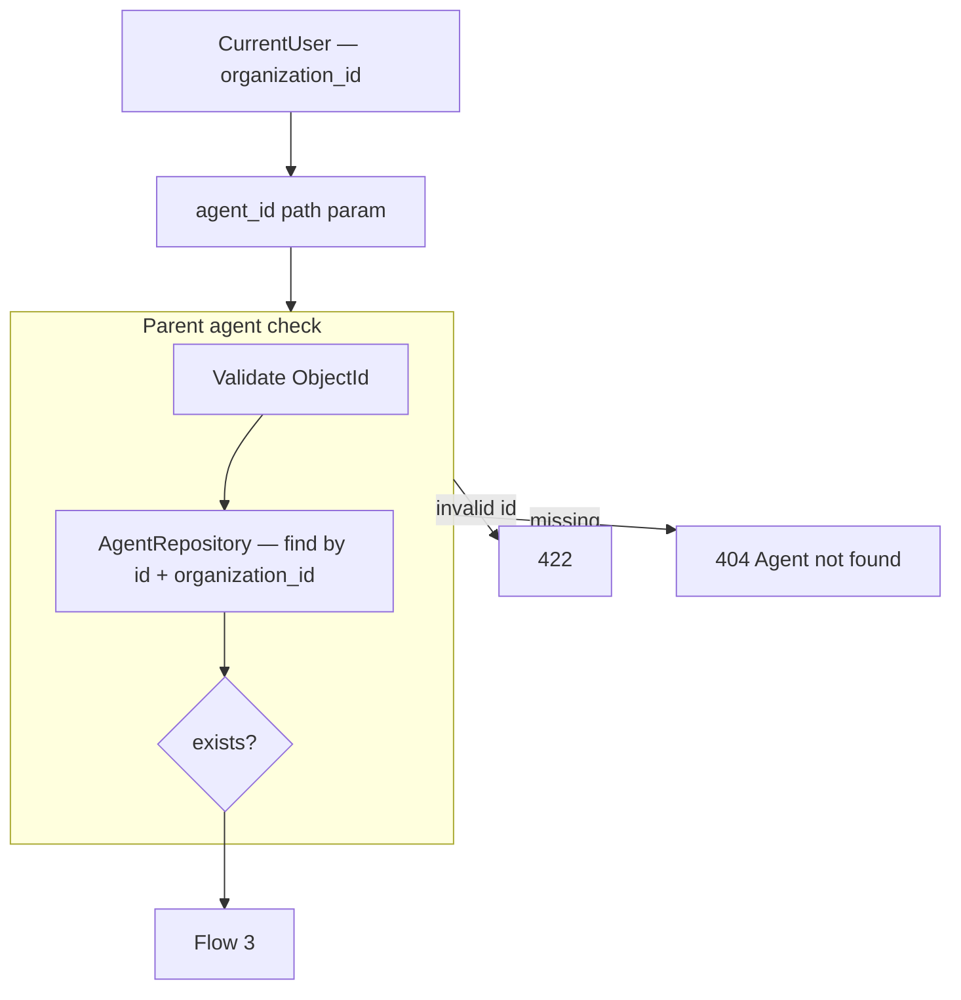
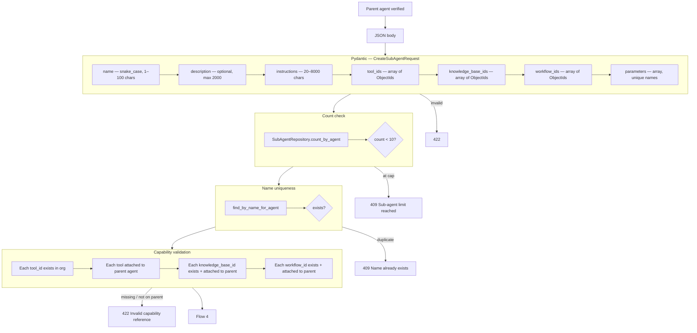
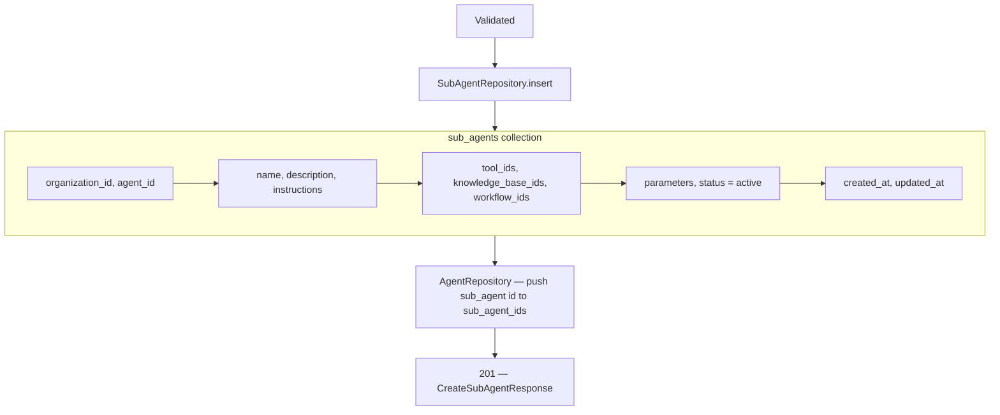

# Create Sub Agent — `POST /api/v1/agents/{agent_id}/sub-agents`

**Agentic migration:** Phase A **Done** — `routing_hint` on create/PATCH → [04-update-sub-agent-diagrams.md](./04-update-sub-agent-diagrams.md). Phase B **no REST change**. Phase C **Done** — sub-agent RAG via `search_knowledge` in `create_agent()`. Phase D **Done** — sticky handover at chat (no REST change). See [../agentic/updets/api-migration-agentic-phase-d.md](../agentic/updets/api-migration-agentic-phase-d.md). **LangChain proper (Done, no REST change):** [../agentic/updets/migration-langchain-proper.md](../agentic/updets/migration-langchain-proper.md).

Creates a **Sub Agent** under a parent agent. Used by the **Add Sub Agent** modal on the agent detail **Sub Agents** tab.

Model reference: [00-sub-agent-model.md](./00-sub-agent-model.md)

`organization_id` comes from JWT auth (`CurrentUser`), not the request body.

---

# Flow 1 — Auth

Same as [tools/01-create-tool-diagrams.md](../tools/01-create-tool-diagrams.md) Flow 1 and [agent/01-create-agent-diagrams.md](../agent/01-create-agent-diagrams.md).



---

# Flow 2 — Validate parent agent



---

# Flow 3 — Validate request body



### Pydantic validation rules

| Field | Rule |
|-------|------|
| `name` | required, `^[a-z][a-z0-9_]*$`, 1–100 chars |
| `description` | optional, max 2000 chars |
| `instructions` | required, 20–8000 chars |
| `tool_ids` | optional list of 24-char ObjectIds — default `[]` |
| `knowledge_base_ids` | optional list of 24-char ObjectIds — default `[]` |
| `workflow_ids` | optional list of 24-char ObjectIds — default `[]` |
| `parameters` | optional list — each item validated (see model doc) |

### Parameter item rules

| Field | Rule |
|-------|------|
| `name` | `snake_case`, unique within request |
| `type` | `string`, `number`, or `boolean` |
| `description` | optional, max 500 |
| `required` | boolean, default `true` |

---

# Flow 4 — Save + attach to parent



---

# Example request

```http
POST /api/v1/agents/67agent001/sub-agents
Authorization: Bearer <clerk_jwt>
Content-Type: application/json
```

```json
{
  "name": "research_agent",
  "description": "Delegates research tasks to a specialized agent when the user asks for deep investigation.",
  "instructions": "You are a research assistant. Use attached knowledge bases and tools. Be concise and cite sources when available.",
  "tool_ids": ["6a3f9012d8139334274fbc01"],
  "knowledge_base_ids": ["6a3f9012d8139334274fbc02"],
  "workflow_ids": [],
  "parameters": [
    {
      "name": "query",
      "type": "string",
      "description": "The research question to answer",
      "required": true
    }
  ]
}
```

### Minimal request (instructions only)

```json
{
  "name": "research_agent",
  "instructions": "You are a research assistant focused on factual answers.",
  "tool_ids": [],
  "knowledge_base_ids": [],
  "workflow_ids": [],
  "parameters": []
}
```

---

# Response `201`

```json
{
  "id": "6a3f9012d8139334274fbc00",
  "name": "research_agent",
  "description": "Delegates research tasks to a specialized agent when the user asks for deep investigation.",
  "instructions": "You are a research assistant. Use attached knowledge bases and tools. Be concise and cite sources when available.",
  "tool_ids": ["6a3f9012d8139334274fbc01"],
  "knowledge_base_ids": ["6a3f9012d8139334274fbc02"],
  "workflow_ids": [],
  "parameters": [
    {
      "name": "query",
      "type": "string",
      "description": "The research question to answer",
      "required": true
    }
  ],
  "status": "active",
  "agent_id": "67agent001",
  "organization_id": "6a3b7c61d8139334274fbbfc",
  "created_at": "2026-06-26T10:00:00Z",
  "updated_at": "2026-06-26T10:00:00Z"
}
```

---

# Error responses

| Status | When |
|--------|------|
| `401` | Invalid JWT |
| `404` | Parent agent not found |
| `409` | Sub-agent limit reached (10 per parent) or `name` already exists for parent |
| `422` | Invalid body, bad ObjectId, parameter validation, capability not on parent |

---

# UI notes

| Action | API |
|--------|-----|
| Open **Add Sub Agent** modal | — |
| Pick skills in modal | IDs from parent’s attached tools / KBs / workflows |
| **Save** | `POST /agents/{agent_id}/sub-agents` |
| Refresh list after create | `GET /agents/{agent_id}/sub-agents` *(planned)* |

Route: `/agent/{agent_id}` — **Sub Agents** tab.

---

# Navigate to implementation files

| What | Open file |
|------|-----------|
| API route | `create_sub_agent` in [agents.py](../../app/api/v1/agents.py) |
| Request schema | `CreateSubAgentRequest` in [schemas/sub_agent.py](../../app/schemas/sub_agent.py) |
| Service | `SubAgentService.create()` in [sub_agent_service.py](../../app/services/sub_agent_service.py) |
| Repository | [sub_agent_repository.py](../../app/infrastructure/db/repositories/mongo/sub_agent_repository.py) |
| Parent push | `push_sub_agent_id` in [agent_repository.py](../../app/infrastructure/db/repositories/mongo/agent_repository.py) |
| Limit constant | `MAX_SUB_AGENTS_PER_AGENT` in [sub_agent_constants.py](../../app/domain/constants/sub_agent_constants.py) |
| Frontend modal | Sub Agents tab on [AgentDetailPage.tsx](../../../frontend/src/pages/agent/AgentDetailPage.tsx) *(planned)* |
