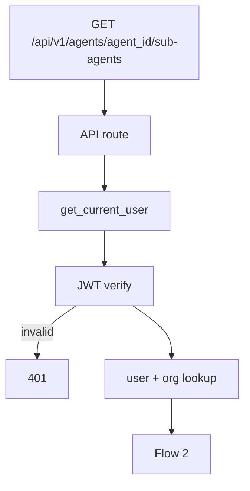

# List Sub Agents — `GET /api/v1/agents/{agent_id}/sub-agents`

Returns all sub-agents for a **parent agent**. Scoped to the authenticated user's **organization**.

Used by the agent detail **Sub Agents** tab list (max 10 per parent in MVP).

Model reference: [00-sub-agent-model.md](./00-sub-agent-model.md)

`organization_id` comes from JWT auth (`CurrentUser`), not the request body.

---

# Flow 1 — Auth

Same as [01-create-sub-agent-diagrams.md](./01-create-sub-agent-diagrams.md) Flow 1.



---

# Flow 2 — Validate parent agent + list

```mermaid
flowchart TB
    AUTH[CurrentUser — organization_id]

    AUTH --> PATH[agent_id path param]

    subgraph AGENT["Parent agent check"]
        A1[Validate ObjectId]
        A2[AgentRepository — find by id + organization_id]
        A3{exists?}
        A1 --> A2 --> A3
    end

    PATH --> AGENT
    AGENT -->|invalid id| E422[422]
    AGENT -->|missing| E404[404 Agent not found]
    A3 --> QUERY

    subgraph QUERY["Optional filters"]
        Q1[status — active | disabled]
    end

    QUERY --> SVC[SubAgentService.list_by_agent]
    SVC --> REPO[SubAgentRepository.find by agent_id + organization_id]
    REPO --> MAP[Map to SubAgentListItem]
    MAP --> RES[200 ListSubAgentsResponse]
```

---

# Query parameters (optional)

| Param | Rule |
|-------|------|
| `status` | optional: `active`, `disabled` |

---

# Example request

```http
GET /api/v1/agents/67agent001/sub-agents
Authorization: Bearer <clerk_jwt>
```

**Active sub-agents only:**

```http
GET /api/v1/agents/67agent001/sub-agents?status=active
```

---

# MongoDB query

Collection: `sub_agents`

```json
{
  "organization_id": "6a3b7c61d8139334274fbbfc",
  "agent_id": "67agent001"
}
```

Sort: `created_at` descending.

---

# Response `200`

```json
{
  "items": [
    {
      "id": "6a3f9012d8139334274fbc00",
      "name": "research_agent",
      "description": "Delegates research tasks to a specialized agent.",
      "status": "active",
      "tool_count": 1,
      "knowledge_base_count": 1,
      "workflow_count": 0,
      "parameter_count": 1,
      "agent_id": "67agent001",
      "organization_id": "6a3b7c61d8139334274fbbfc",
      "created_at": "2026-06-26T10:00:00Z",
      "updated_at": "2026-06-26T10:00:00Z"
    }
  ],
  "total": 1
}
```

List items omit full `instructions`, `tool_ids`, `knowledge_base_ids`, `workflow_ids`, and `parameters` for performance — load via `GET /agents/{agent_id}/sub-agents/{sub_agent_id}`.

| Field | Notes |
|-------|-------|
| `tool_count` | Derived: `len(tool_ids)` |
| `knowledge_base_count` | Derived: `len(knowledge_base_ids)` |
| `workflow_count` | Derived: `len(workflow_ids)` |
| `parameter_count` | Derived: `len(parameters)` |
| `total` | Count of items returned (max 10 per parent in MVP) |

---

# Error responses

| Status | When |
|--------|------|
| `401` | Invalid JWT |
| `404` | Parent agent not found |
| `422` | Invalid `agent_id` format |

---

# UI mapping

| UI element | Behavior |
|------------|----------|
| Sub Agents tab list | `GET /agents/{agent_id}/sub-agents` on tab mount |
| Sub-agent row / card | `name`, `description`, skill counts |
| Click row → edit modal | `GET /agents/{agent_id}/sub-agents/{id}` |
| **+ Add Sub Agent** | Hidden or disabled when `total >= 10` |
| Refresh after create | Re-fetch list |

Route: `/agent/{agent_id}` — **Sub Agents** tab.

---

# Navigate to planned files

| What | Open file |
|------|-----------|
| API route | `list_sub_agents` in [agents.py](../../app/api/v1/agents.py) *(planned)* |
| Service | `SubAgentService.list_by_agent()` in `services/sub_agent_service.py` *(planned)* |
| Repository | `sub_agent_repository.py` *(planned)* |
| List schema | `SubAgentListItem` in `schemas/sub_agent.py` *(planned)* |
| Frontend tab | Sub Agents panel on [AgentDetailPage.tsx](../../../frontend/src/pages/agent/AgentDetailPage.tsx) *(planned)* |
