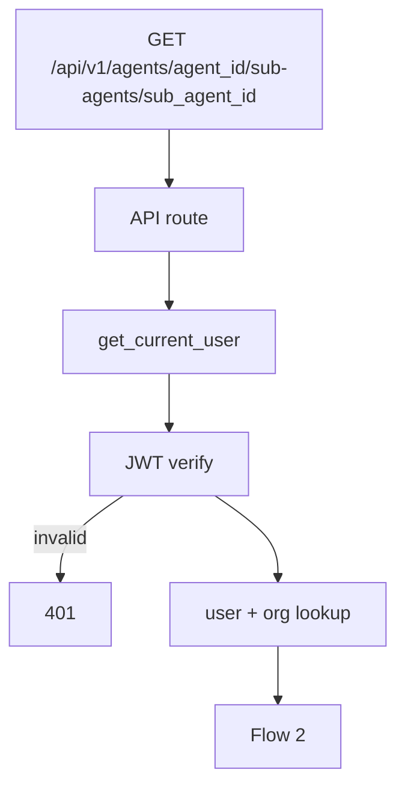
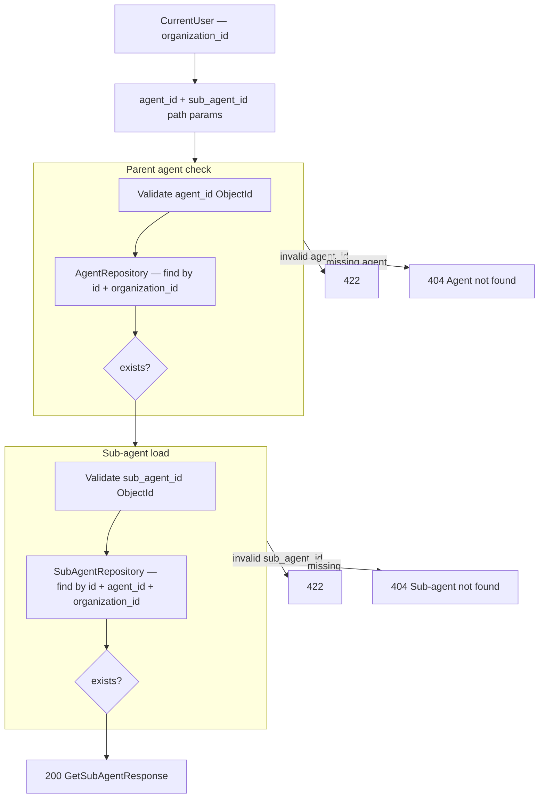

# Get Sub Agent — `GET /api/v1/agents/{agent_id}/sub-agents/{sub_agent_id}`

Returns one sub-agent with full config for the **Edit Sub Agent** modal.

Model reference: [00-sub-agent-model.md](./00-sub-agent-model.md)

`organization_id` comes from JWT auth (`CurrentUser`), not the request body.

---

# Flow 1 — Auth

Same as [01-create-sub-agent-diagrams.md](./01-create-sub-agent-diagrams.md) Flow 1.



---

# Flow 2 — Validate paths + load



Sub-agent must belong to the parent `agent_id` in the path — a valid id on another parent returns `404`.

---

# Example request

```http
GET /api/v1/agents/67agent001/sub-agents/6a3f9012d8139334274fbc00
Authorization: Bearer <clerk_jwt>
```

---

# Response `200`

```json
{
  "id": "6a3f9012d8139334274fbc00",
  "name": "research_agent",
  "description": "Delegates research tasks to a specialized agent.",
  "instructions": "You are a research assistant. Answer using attached knowledge bases and tools only.",
  "tool_ids": ["6a3f9012d8139334274fbc01"],
  "knowledge_base_ids": ["6a3f9012d8139334274fbc02"],
  "workflow_ids": [],
  "parameters": [
    {
      "name": "query",
      "type": "string",
      "description": "The research question to answer",
      "required": true
    }
  ],
  "status": "active",
  "agent_id": "67agent001",
  "organization_id": "6a3b7c61d8139334274fbbfc",
  "created_at": "2026-06-26T10:00:00Z",
  "updated_at": "2026-06-26T10:00:00Z"
}
```

Same shape as [01-create-sub-agent-diagrams.md](./01-create-sub-agent-diagrams.md) create response.

---

# Error responses

| Status | When |
|--------|------|
| `401` | Invalid JWT |
| `404` | Parent agent or sub-agent not found, or sub-agent not under parent |
| `422` | Invalid `agent_id` or `sub_agent_id` format |

---

# UI mapping

| UI field | Data source |
|----------|-------------|
| Sub Agent Name | `name` |
| Description | `description` |
| Instructions | `instructions` |
| Skills picker | `tool_ids`, `knowledge_base_ids`, `workflow_ids` |
| Parameters list | `parameters` |
| Status toggle (if shown) | `status` |

Load on modal open: `GET /agents/{agent_id}/sub-agents/{sub_agent_id}`.

---

# Navigate to planned files

| What | Open file |
|------|-----------|
| API route | `get_sub_agent` in [agents.py](../../app/api/v1/agents.py) *(planned)* |
| Service | `SubAgentService.get_by_id()` in `services/sub_agent_service.py` *(planned)* |
| Repository | `sub_agent_repository.py` *(planned)* |
| Response schema | `GetSubAgentResponse` in `schemas/sub_agent.py` *(planned)* |
| Frontend modal | Sub Agents tab on [AgentDetailPage.tsx](../../../frontend/src/pages/agent/AgentDetailPage.tsx) *(planned)* |
