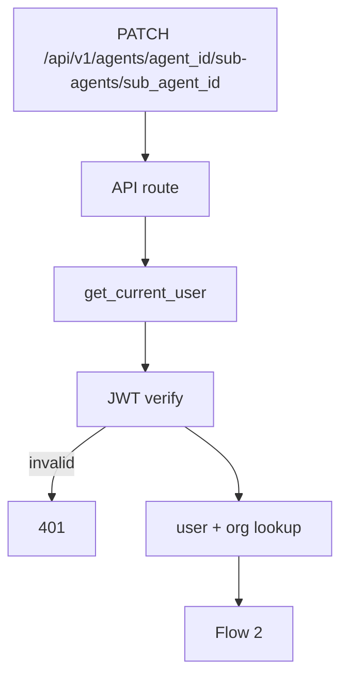
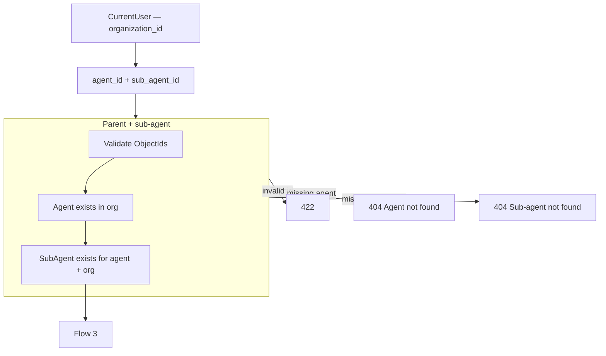

# Update Sub Agent — `PATCH /api/v1/agents/{agent_id}/sub-agents/{sub_agent_id}`

Partially update a sub-agent. Used by the **Edit Sub Agent** modal **Save** button.

Model reference: [00-sub-agent-model.md](./00-sub-agent-model.md)

`organization_id` comes from JWT auth (`CurrentUser`), not the request body.

---

# Flow 1 — Auth

Same as [03-get-sub-agent-diagrams.md](./03-get-sub-agent-diagrams.md) Flow 1.



---

# Flow 2 — Validate paths + load existing



---

# Flow 3 — Validate request body (partial)

All fields optional — only sent fields are updated. At least one field required.

```mermaid
flowchart TB
    EXIST[Existing sub-agent loaded]

    EXIST --> BODY[JSON body]

    subgraph VALIDATE["Pydantic — UpdateSubAgentRequest"]
        V1[name — snake_case, 1–100 chars]
        V2[description — max 2000 or null]
        V3[instructions — 20–8000 chars]
        V4[tool_ids — array of ObjectIds]
        V5[knowledge_base_ids — array of ObjectIds]
        V6[workflow_ids — array of ObjectIds]
        V7[parameters — array, unique names]
        V8[status — active | disabled]
        V1 --> V2 --> V3 --> V4 --> V5 --> V6 --> V7 --> V8
    end

    BODY --> VALIDATE
    VALIDATE -->|invalid| E422[422]
    VALIDATE -->|empty body| E422
    VALIDATE --> NAME

    subgraph NAME["Name uniqueness if name changed"]
        N1{name changed?}
        N2[find_by_name_for_agent — exclude current id]
        N3{duplicate?}
        N1 -->|no| CAPS
        N1 -->|yes| N2 --> N3
        N3 -->|yes| E409[409 Name already exists]
    end

    NAME --> CAPS

    subgraph CAPS["Capability validation if IDs sent"]
        C1[Each tool_id exists in org]
        C2[Each tool attached to parent agent]
        C3[Each knowledge_base_id exists + attached to parent]
        C4[Each workflow_id exists + attached to parent]
        C1 --> C2 --> C3 --> C4
    end

    CAPS -->|missing / not on parent| E422C[422 Invalid capability reference]
    CAPS --> SAVE

    subgraph SAVE["Persist"]
        S1[SubAgentRepository.update]
        S2[Set updated_at]
        S1 --> S2
    end

    SAVE --> RES[200 UpdateSubAgentResponse]
```

---

# Updatable fields (MVP)

| Field | Rule |
|-------|------|
| `name` | optional — `snake_case`, unique per parent |
| `description` | optional — max 2000 chars, or `null` to clear |
| `instructions` | optional — 20–8000 chars |
| `tool_ids` | optional — full replacement array |
| `knowledge_base_ids` | optional — full replacement array |
| `workflow_ids` | optional — full replacement array |
| `parameters` | optional — full replacement array |
| `status` | optional — `active` or `disabled` |

Array fields replace the entire array when sent (not merge-by-id).

### Immutable via PATCH (MVP)

| Field | Reason |
|-------|--------|
| `organization_id` | From auth only |
| `agent_id` | Parent is fixed — delete + recreate to move |
| `id` | Path param |
| `created_at` | Set on insert |

---

# Request body examples

**Save full edit modal**

```http
PATCH /api/v1/agents/67agent001/sub-agents/6a3f9012d8139334274fbc00
Authorization: Bearer <clerk_jwt>
Content-Type: application/json
```

```json
{
  "name": "research_agent",
  "description": "Delegates research when the user asks for deep investigation.",
  "instructions": "You are a research assistant. Use attached knowledge bases and tools. Be concise.",
  "tool_ids": ["6a3f9012d8139334274fbc01"],
  "knowledge_base_ids": ["6a3f9012d8139334274fbc02"],
  "workflow_ids": [],
  "parameters": [
    {
      "name": "query",
      "type": "string",
      "description": "The research question to answer",
      "required": true
    }
  ]
}
```

**Update instructions only**

```json
{
  "instructions": "You are a research assistant focused on factual, cited answers."
}
```

**Disable sub-agent**

```json
{
  "status": "disabled"
}
```

**Clear description**

```json
{
  "description": null
}
```

---

# Response `200`

Same shape as [03-get-sub-agent-diagrams.md](./03-get-sub-agent-diagrams.md) — full sub-agent document with new `updated_at`.

---

# Error responses

| Status | When |
|--------|------|
| `401` | Invalid JWT |
| `404` | Parent agent or sub-agent not found |
| `409` | `name` already exists for parent |
| `422` | Invalid body, empty PATCH, bad ObjectId, parameter validation, capability not on parent |

---

# UI mapping

| Action | API |
|--------|-----|
| Open edit modal | `GET /agents/{agent_id}/sub-agents/{id}` |
| **Save** in modal | `PATCH /agents/{agent_id}/sub-agents/{id}` |
| Refresh list after save | `GET /agents/{agent_id}/sub-agents` |

Route: `/agent/{agent_id}` — **Sub Agents** tab.

---

# Navigate to planned files

| What | Open file |
|------|-----------|
| API route | `update_sub_agent` in [agents.py](../../app/api/v1/agents.py) *(planned)* |
| Request schema | `UpdateSubAgentRequest` in `schemas/sub_agent.py` *(planned)* |
| Service | `SubAgentService.update()` in `services/sub_agent_service.py` *(planned)* |
| Repository | `sub_agent_repository.py` *(planned)* |
| Frontend modal | Sub Agents tab on [AgentDetailPage.tsx](../../../frontend/src/pages/agent/AgentDetailPage.tsx) *(planned)* |
