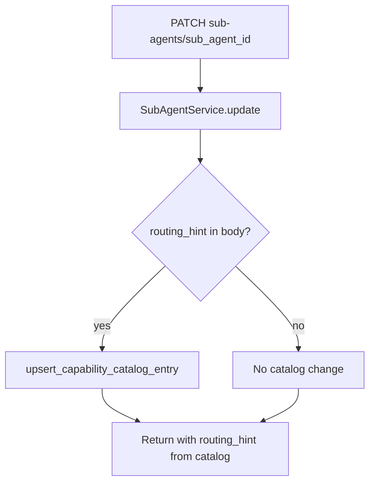

# Update Sub-Agent — `PATCH /api/v1/agents/{agent_id}/sub-agents/{sub_agent_id}`

**Agentic migration:** Phase A **Done**. Phase B **no REST change**. See [../agentic/updets/api-migration-agentic.md](../agentic/updets/api-migration-agentic.md).

Create sub-agent: [01-create-sub-agent-diagrams.md](./01-create-sub-agent-diagrams.md)

---

## Request body (agentic fields)

| Field | When set | Effect |
|-------|----------|--------|
| `routing_hint` | optional | Upserts or clears hint in `agent.capability_catalog.sub_agents[sub_agent_id]` |
| `name`, `instructions`, `tool_ids`, etc. | content edit | Updates sub-agent document only |

Sub-agents are **always scoped to one parent agent** — there is no `agent_id` move on PATCH (unlike tools/KBs/workflows).

```json
{
  "routing_hint": "Escalate billing and payment disputes"
}
```

Clear hint:

```json
{ "routing_hint": null }
```

---

## Service flow



---

## Navigate to files

| Step | File |
|------|------|
| API route | [agents.py](../../app/api/v1/agents.py) |
| Service | [sub_agent_service.py](../../app/services/sub_agent_service.py) |
| Schema | [sub_agent.py](../../app/schemas/sub_agent.py) — `UpdateSubAgentRequest` |
| Repository | [agent_repository.py](../../app/infrastructure/db/repositories/mongo/agent_repository.py) |

---

## List with hints

`GET /api/v1/agents/{agent_id}/sub-agents` and `GET .../sub-agents/{sub_agent_id}` return `routing_hint` from the parent agent catalog.
