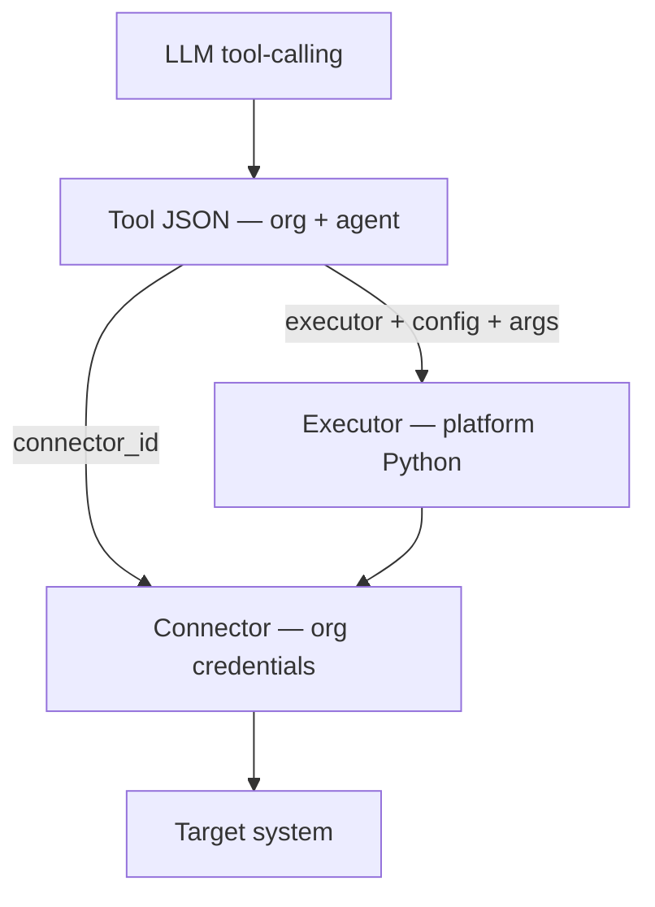

# Executor Catalog — `GET /api/v1/executors`

Platform-built **executor functions** — generic reusable code the runtime calls when an LLM picks a **Tool**.

- Organizations **never** write executors.
- Organizations create **Tools** (JSON) that select an `executor`, a `connector_id`, and a per-call `config`.
- Executors are **technical operations**, not business logic (`get_loyalty_points` is a Tool config, not a Python function).

Related docs:

- Connector types: [../connectors/00-connector-types-catalog.md](../connectors/00-connector-types-catalog.md)
- Create tool: [01-create-tool-diagrams.md](./01-create-tool-diagrams.md)
- Runtime: [03-execute-tool-at-chat-diagrams.md](./03-execute-tool-at-chat-diagrams.md)

---

# Architecture



| Layer | Who creates | Example |
|-------|-------------|---------|
| **Connector** | Organization | Mongo URI, HTTP base URL |
| **Tool** | Organization + Agent | `executor: mongo_find_one`, `collection: customers` |
| **Executor** | Platform (you) | `mongo_find_one()` Python function |

---

# Launch MVP executors (7)

| # | `executor` | Label | Connector `type` | Operation |
|---|------------|-------|------------------|-----------|
| 1 | `mongo_find_one` | MongoDB — Find One | `mongo` | `find_one` |
| 2 | `mongo_find_many` | MongoDB — Find Many | `mongo` | `find` + limit |
| 3 | `mongo_insert` | MongoDB — Insert | `mongo` | `insert_one` |
| 4 | `mongo_update` | MongoDB — Update | `mongo` | `update_one` |
| 5 | `mongo_delete` | MongoDB — Delete | `mongo` | `delete_one` |
| 6 | `mongo_aggregate` | MongoDB — Aggregate | `mongo` | `aggregate` |
| 7 | `http_request` | HTTP — Request | `http` | any HTTP method |

Phase 2: `sql_*`, `graphql_*`, `grpc_call`, `redis_*`, `vector_*` — see [Phase 2 executors](#phase-2-executors).

---

# Template variables

Tool `config` and `filter` / `body` values may contain `{{arg_name}}` placeholders.

At runtime the executor replaces them with arguments the LLM passes when calling the tool.

```json
{
  "filter": { "customer_id": "{{customer_id}}" }
}
```

LLM call args:

```json
{ "customer_id": "CUST-8842" }
```

Resolved filter:

```json
{ "filter": { "customer_id": "CUST-8842" } }
```

Rules:

- Only top-level string values support `{{key}}` substitution (MVP).
- Missing args → `400` at execution with clear error.
- Never interpolate into connector credentials — only tool `config`.

---

# Executor definitions (MVP)

## `mongo_find_one`

Find a single document.

**Connector:** `type: mongo`

**Tool `config` schema:**

| Field | Required | Type | Notes |
|-------|----------|------|-------|
| `collection` | yes | string | Collection name |
| `filter` | yes | object | Query filter; supports `{{args}}` |
| `projection` | no | array of strings | Fields to return |

**Example tool:**

```json
{
  "name": "customer_lookup",
  "description": "Get customer loyalty info when user asks about points or tier",
  "executor": "mongo_find_one",
  "connector_id": "6a3f8c12d8139334274fbbfe",
  "config": {
    "collection": "customers",
    "filter": { "customer_id": "{{customer_id}}" },
    "projection": ["name", "loyalty_points", "tier"]
  }
}
```

**LLM argument schema (for tool-calling):**

| Arg | Required | Description |
|-----|----------|-------------|
| `customer_id` | yes | Customer identifier |

**Executor behavior:**

1. Load connector `uri` + `database`.
2. Resolve `{{customer_id}}` in `filter`.
3. `db[collection].find_one(filter, projection)`.
4. Return document JSON or `null`.

**Planned implementation:** [mongo_find_one.py](../../app/domain/executors/mongo/find_one.py) *(planned)*

---

## `mongo_find_many`

Find multiple documents.

**Connector:** `type: mongo`

**Tool `config` schema:**

| Field | Required | Type | Notes |
|-------|----------|------|-------|
| `collection` | yes | string | |
| `filter` | yes | object | Supports `{{args}}` |
| `projection` | no | array | |
| `sort` | no | object | e.g. `{ "price": 1 }` |
| `limit` | no | integer | default `100`, max `1000` |

**Example tool:**

```json
{
  "name": "list_available_foods",
  "description": "List menu items that are currently available",
  "executor": "mongo_find_many",
  "connector_id": "6a3f8c12d8139334274fbbff",
  "config": {
    "collection": "foods",
    "filter": { "available": true },
    "projection": ["name", "price", "category"],
    "sort": { "name": 1 },
    "limit": 50
  }
}
```

**LLM argument schema:** none required (static filter).

**Executor behavior:** `find(filter, projection).sort(sort).limit(limit)` → list.

**Planned implementation:** [find_many.py](../../app/domain/executors/mongo/find_many.py) *(planned)*

---

## `mongo_insert`

Insert one document.

**Connector:** `type: mongo`

**Tool `config` schema:**

| Field | Required | Type | Notes |
|-------|----------|------|-------|
| `collection` | yes | string | |
| `document` | yes | object | Supports `{{args}}` in string values |

**Example tool:**

```json
{
  "name": "create_support_ticket",
  "description": "Create a support ticket when user reports an issue",
  "executor": "mongo_insert",
  "connector_id": "6a3f8c12d8139334274fbbfe",
  "config": {
    "collection": "tickets",
    "document": {
      "customer_id": "{{customer_id}}",
      "subject": "{{subject}}",
      "status": "open",
      "created_at": "{{_now_iso}}"
    }
  }
}
```

**LLM argument schema:**

| Arg | Required | Description |
|-----|----------|-------------|
| `customer_id` | yes | |
| `subject` | yes | Ticket subject line |

**Special runtime vars (platform):**

| Var | Value |
|-----|-------|
| `{{_now_iso}}` | Current UTC ISO timestamp |

**Executor behavior:** `insert_one(document)` → return `inserted_id`.

---

## `mongo_update`

Update one document.

**Connector:** `type: mongo`

**Tool `config` schema:**

| Field | Required | Type | Notes |
|-------|----------|------|-------|
| `collection` | yes | string | |
| `filter` | yes | object | Supports `{{args}}` |
| `update` | yes | object | Mongo update operators e.g. `$set` |

**Example tool:**

```json
{
  "name": "update_loyalty_points",
  "description": "Update customer loyalty points after a purchase",
  "executor": "mongo_update",
  "connector_id": "6a3f8c12d8139334274fbbfe",
  "config": {
    "collection": "customers",
    "filter": { "customer_id": "{{customer_id}}" },
    "update": { "$inc": { "loyalty_points": "{{points}}" } }
  }
}
```

**Note:** numeric `{{points}}` coerced to number when arg is numeric.

**Executor behavior:** `update_one(filter, update)` → `matched_count`, `modified_count`.

---

## `mongo_delete`

Delete one document.

**Connector:** `type: mongo`

**Tool `config` schema:**

| Field | Required | Type | Notes |
|-------|----------|------|-------|
| `collection` | yes | string | |
| `filter` | yes | object | Supports `{{args}}` |

**Example tool:**

```json
{
  "name": "cancel_draft_order",
  "description": "Delete a draft order when user cancels before payment",
  "executor": "mongo_delete",
  "connector_id": "6a3f8c12d8139334274fbbfe",
  "config": {
    "collection": "orders",
    "filter": { "order_id": "{{order_id}}", "status": "draft" }
  }
}
```

**Executor behavior:** `delete_one(filter)` → `deleted_count`.

---

## `mongo_aggregate`

Run an aggregation pipeline.

**Connector:** `type: mongo`

**Tool `config` schema:**

| Field | Required | Type | Notes |
|-------|----------|------|-------|
| `collection` | yes | string | |
| `pipeline` | yes | array | Mongo aggregation stages; string values may use `{{args}}` |

**Example tool:**

```json
{
  "name": "monthly_sales_summary",
  "description": "Summarize sales for a given month",
  "executor": "mongo_aggregate",
  "connector_id": "6a3f8c12d8139334274fbbfe",
  "config": {
    "collection": "orders",
    "pipeline": [
      { "$match": { "month": "{{month}}", "year": "{{year}}" } },
      { "$group": { "_id": "$category", "total": { "$sum": "$amount" } } }
    ]
  }
}
```

**Executor behavior:** `aggregate(pipeline)` → list of result docs.

---

## `http_request`

Call a REST endpoint.

**Connector:** `type: http` — provides `base_url`, auth, default headers.

**Tool `config` schema:**

| Field | Required | Type | Notes |
|-------|----------|------|-------|
| `method` | yes | string | `GET`, `POST`, `PUT`, `PATCH`, `DELETE` |
| `path` | yes | string | Appended to connector `base_url`; supports `{{args}}` |
| `headers` | no | object | Merged over connector `default_headers` |
| `query` | no | object | Query string params |
| `body` | no | object | JSON body for POST/PUT/PATCH |

**Example tool:**

```json
{
  "name": "create_invoice",
  "description": "Create an invoice in the billing system",
  "executor": "http_request",
  "connector_id": "6a3f8c12d8139334274fbbff",
  "config": {
    "method": "POST",
    "path": "/invoices",
    "body": {
      "customer_id": "{{customer_id}}",
      "amount": "{{amount}}",
      "currency": "USD"
    }
  }
}
```

**Executor behavior:**

1. Build URL: `base_url + path` (resolve `{{args}}` in path).
2. Apply connector auth (`oauth2_client_credentials`, `api_key`, `basic`, `bearer`).
   - `oauth2_client_credentials`: POST `token_url` → cache `access_token` → `Authorization: Bearer …`
3. Merge headers.
4. `httpx` request with timeout 30s.
5. Return `{ "status_code", "headers", "body" }` — parse JSON body when possible.

**Implementation:** [http_ops.py](../../app/domain/executors/http_ops.py) · [http_token_provider.py](../../app/domain/executors/http_token_provider.py)

---

# What is NOT an executor

These are **business names** for Tools — same executors, different JSON:

| ❌ Not a Python function | ✅ Instead |
|--------------------------|-----------|
| `get_loyalty_points()` | Tool + `mongo_find_one` |
| `find_available_foods()` | Tool + `mongo_find_many` |
| `create_invoice()` | Tool + `http_request` POST |
| `get_customer_orders()` | Tool + `mongo_find_many` or `http_request` GET |

---

# Executor ↔ connector validation

When creating a Tool, `connector.type` must match the executor:

| Executor | Required connector `type` |
|----------|---------------------------|
| `mongo_find_one` | `mongo` |
| `mongo_find_many` | `mongo` |
| `mongo_insert` | `mongo` |
| `mongo_update` | `mongo` |
| `mongo_delete` | `mongo` |
| `mongo_aggregate` | `mongo` |
| `http_request` | `http` |

Mismatch → `422` at tool create.

---

# API response — `GET /api/v1/executors`

Read-only catalog for Add Tool UI (executor dropdown + dynamic config form).

```json
{
  "items": [
    {
      "executor": "mongo_find_one",
      "label": "MongoDB — Find One",
      "description": "Retrieve a single document from a collection.",
      "connector_type": "mongo",
      "mvp": true,
      "config_schema": {
        "collection": { "type": "string", "required": true },
        "filter": { "type": "object", "required": true },
        "projection": { "type": "array", "required": false }
      }
    },
    {
      "executor": "http_request",
      "label": "HTTP — Request",
      "description": "Send an HTTP request to a REST API.",
      "connector_type": "http",
      "mvp": true,
      "config_schema": {
        "method": { "type": "enum", "values": ["GET", "POST", "PUT", "PATCH", "DELETE"], "required": true },
        "path": { "type": "string", "required": true },
        "headers": { "type": "object", "required": false },
        "query": { "type": "object", "required": false },
        "body": { "type": "object", "required": false }
      }
    }
  ]
}
```

---

# Phase 2 executors

| Executor | Connector `type` | Notes |
|----------|------------------|-------|
| `sql_select` | `sql` | Parameterized SELECT |
| `sql_insert` | `sql` | INSERT |
| `sql_update` | `sql` | UPDATE |
| `sql_delete` | `sql` | DELETE |
| `graphql_query` | `graphql` | Query string + variables |
| `graphql_mutation` | `graphql` | Mutation string + variables |
| `grpc_call` | `grpc` | service + method + payload |
| `redis_get` | `redis` | GET key |
| `redis_set` | `redis` | SET key + value + TTL |
| `redis_delete` | `redis` | DEL key |
| `vector_search` | `vector` | Similarity search |
| `vector_upsert` | `vector` | Upsert vectors |
| `vector_delete` | `vector` | Delete by id |

---

# Planned code layout

```text
app/domain/executors/
  __init__.py
  registry.py              # EXECUTOR_REGISTRY: name → run fn
  context.py               # ExecutorContext(connector, tool_config, args)
  template.py              # resolve {{args}} in config
  mongo/
    find_one.py
    find_many.py
    insert.py
    update.py
    delete.py
    aggregate.py
  http/
    request.py

app/domain/catalog/
  executor_catalog.py      # static list for GET /executors

app/api/v1/
  executors.py             # GET /executors *(planned)*
```

**Registry interface (planned):**

```python
async def run(
    executor: str,
    *,
    connector: dict,
    config: dict,
    args: dict,
) -> Any: ...
```

---

# Navigate to related files

| What | Open file |
|------|-----------|
| Executor registry | [registry.py](../../app/domain/executors/registry.py) *(planned)* |
| Static catalog | [executor_catalog.py](../../app/domain/catalog/executor_catalog.py) *(planned)* |
| API route | [executors.py](../../app/api/v1/executors.py) *(planned)* |
| Tool router (runtime) | [router.py](../../app/domain/pipeline/tools/router.py) *(planned)* |
| Legacy stub | [router.py](../../app/domain/pipeline/skills/router.py) — replace with ToolRouter |
