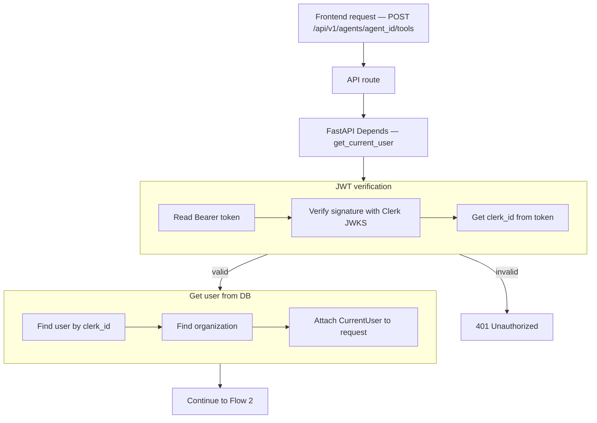
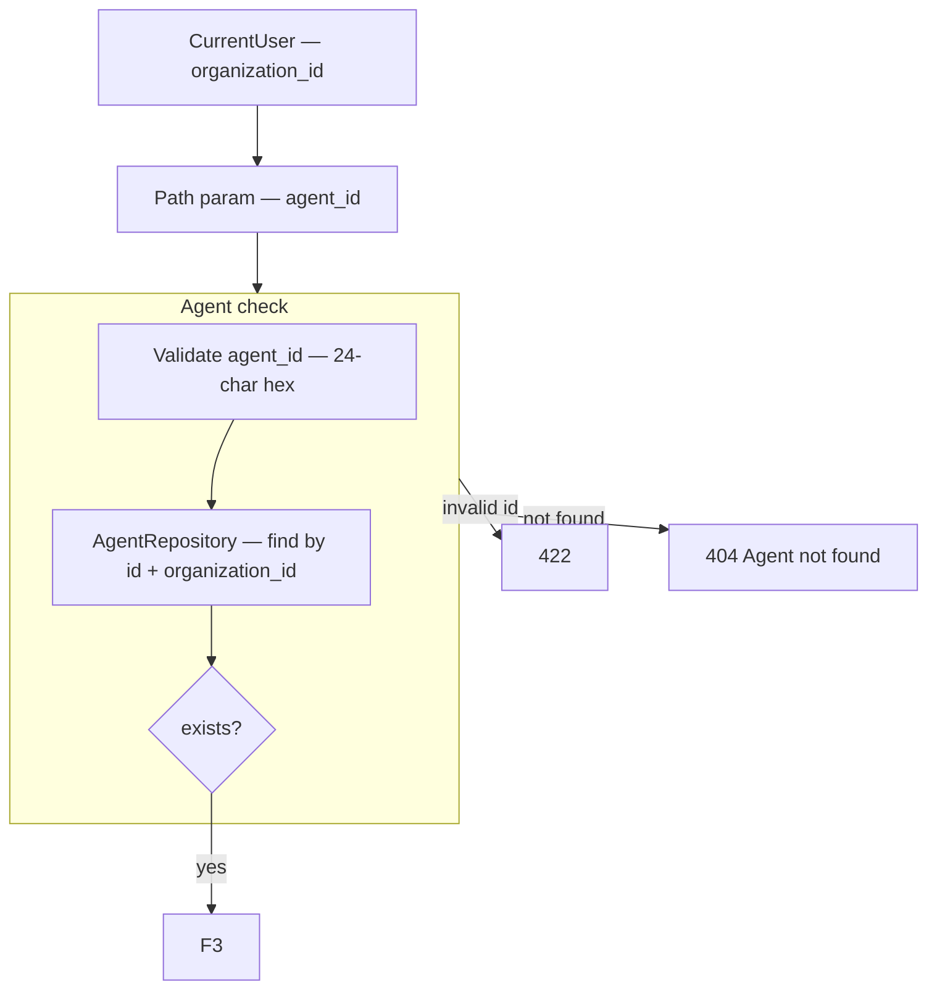
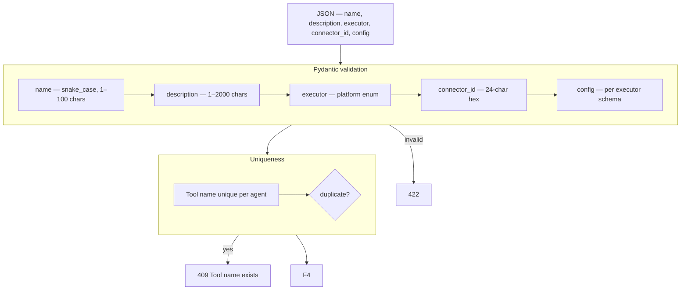
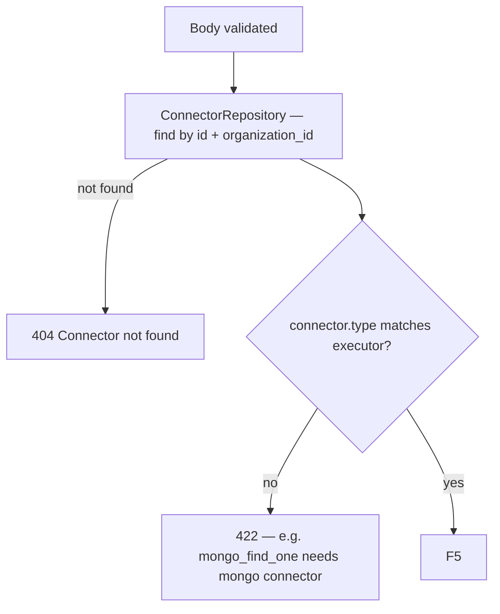
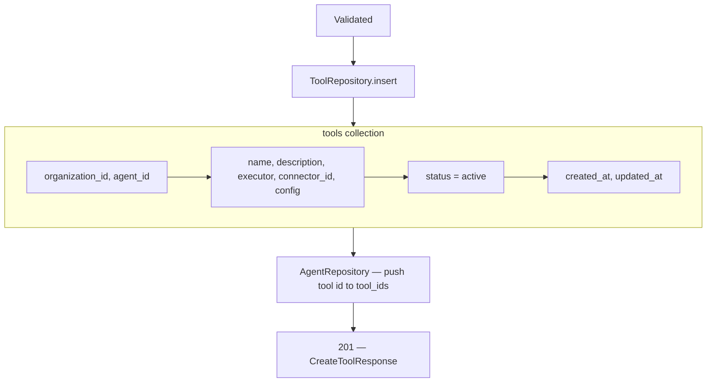

# Create Tool — `POST /api/v1/agents/{agent_id}/tools`

**Agentic migration:** Phase A **Done** — `routing_hint` on create/PATCH → [08-update-tool-agent-diagrams.md](./08-update-tool-agent-diagrams.md). Phase B **no REST change**. Phase C **no REST change**. See [../agentic/updets/api-migration-agentic-phase-c.md](../agentic/updets/api-migration-agentic-phase-c.md).

Organization creates a **Tool** — JSON config that tells the platform which **executor** to run, which **connector** to use, and operation-specific **config**.

`organization_id` comes from JWT auth (`CurrentUser`), not the request body.

Executor catalog: [00-executor-catalog.md](./00-executor-catalog.md)  
Connector docs: [../connectors/01-create-connector-diagrams.md](../connectors/01-create-connector-diagrams.md)

---

# Tool document shape

```json
{
  "name": "customer_lookup",
  "description": "Retrieve customer loyalty information",
  "executor": "mongo_find_one",
  "connector_id": "6a3f8c12d8139334274fbbfe",
  "config": {
    "collection": "customers",
    "filter": { "customer_id": "{{customer_id}}" },
    "projection": ["name", "loyalty_points", "tier"]
  }
}
```

| Field | Source |
|-------|--------|
| `executor` | Platform catalog — [00-executor-catalog.md](./00-executor-catalog.md) |
| `connector_id` | Org connector — [../connectors/](../connectors/) |
| `config` | Per-executor schema — operation details |
| `description` | Helps LLM decide when to call the tool |

---

# Launch MVP — end-to-end (UI wizard)

Route: `/agent/{agent_id}/tools/new` — 4 steps.

| Step | UI | API |
|------|-----|-----|
| 1 | Pick connection type (`mongo` or `http`) | `GET /api/v1/connector-types` |
| 2 | Configure connector + **Test connection** | `POST /api/v1/connectors` with `test_connection: true` |
| 3 | Pick executor + operation config | `GET /api/v1/executors` |
| 4 | Tool name, description, review | `POST /api/v1/agents/{agent_id}/tools` |

After create, tools list on agent detail: `GET /api/v1/agents/{agent_id}/tools`.

### Example A — MongoDB find customer

**Connector** (`type: mongo`):

```json
{ "uri": "mongodb+srv://...", "database": "loyalty_db" }
```

**Tool** (`executor: mongo_find_one`):

```json
{
  "name": "get_customer_by_id",
  "description": "Look up a customer by ID when the user asks about loyalty or account details.",
  "executor": "mongo_find_one",
  "connector_id": "<mongo-connector-id>",
  "config": {
    "collection": "customers",
    "filter": { "customer_id": "{{customer_id}}" },
    "projection": ["name", "tier", "loyalty_points"]
  }
}
```

### Example B — REST API with Keycloak OAuth2

**Connector** (`type: http`, `auth_type: oauth2_client_credentials`):

```json
{
  "base_url": "https://api.loyalty.example.com",
  "auth_type": "oauth2_client_credentials",
  "token_url": "https://idp.loyalty.example.com/auth/realms/shoutout-loyalty-system/protocol/openid-connect/token",
  "client_id": "my-app-client",
  "client_secret": "...",
  "grant_type": "client_credentials"
}
```

**Tool** (`executor: http_request`):

```json
{
  "name": "get_loyalty_balance",
  "description": "Get loyalty points for a customer when they ask about rewards.",
  "executor": "http_request",
  "connector_id": "<http-connector-id>",
  "config": {
    "method": "GET",
    "path": "/customers/{{customer_id}}/loyalty"
  }
}
```

Auth stays in the connector. Path and method stay in the tool.

---

# Flow 1 — Auth

Same as connectors and knowledge bases.

## Flow



## Navigate to auth files

| Flow step | What happens | Open file |
|-----------|--------------|-----------|
| API route | `POST /api/v1/agents/{agent_id}/tools` | [agents.py](../../app/api/v1/agents.py) *(planned)* |
| Router | Mount under `/api/v1` | [router.py](../../app/api/v1/router.py) |
| Depends | Inject `CurrentUser` | [auth.py](../../app/di/auth.py) |
| JWT + user + org | Same as KB / connectors | [clerk_authenticator.py](../../app/infrastructure/auth/clerk_authenticator.py) |

---

# Flow 2 — Validate agent



Register `/{agent_id}/tools` **before** `/{agent_id}` in [agents.py](../../app/api/v1/agents.py) *(planned)*.

---

# Flow 3 — Validate request body



### Pydantic validation rules

| Field | Rule |
|-------|------|
| `name` | required, snake_case `[a-z][a-z0-9_]*`, 1–100 chars, unique per agent |
| `description` | required, 1–2000 chars — shown to LLM as tool description |
| `executor` | required, must exist in [executor catalog](./00-executor-catalog.md) MVP list |
| `connector_id` | required for MVP executors |
| `config` | required object — validated by `executor` (discriminated union) |
| `organization_id` | **must not** be in body |

### Example requests

**Mongo — customer lookup**

```json
{
  "name": "customer_lookup",
  "description": "Get customer loyalty info when user asks about points or tier",
  "executor": "mongo_find_one",
  "connector_id": "6a3f8c12d8139334274fbbfe",
  "config": {
    "collection": "customers",
    "filter": { "customer_id": "{{customer_id}}" },
    "projection": ["name", "loyalty_points", "tier"]
  }
}
```

**HTTP — create invoice**

```json
{
  "name": "create_invoice",
  "description": "Create an invoice in the billing system",
  "executor": "http_request",
  "connector_id": "6a3f8c12d8139334274fbbff",
  "config": {
    "method": "POST",
    "path": "/invoices",
    "body": {
      "customer_id": "{{customer_id}}",
      "amount": "{{amount}}"
    }
  }
}
```

---

# Flow 4 — Validate connector + executor match



| Executor | Required `connector.type` |
|----------|---------------------------|
| `mongo_*` | `mongo` |
| `http_request` | `http` |

---

# Flow 5 — Save + attach to agent



**Mongo `tools` document:**

```json
{
  "_id": "6a3f9012d8139334274fbc00",
  "organization_id": "6a3b7c61d8139334274fbbfc",
  "agent_id": "67agent001",
  "name": "customer_lookup",
  "description": "Get customer loyalty info when user asks about points or tier",
  "executor": "mongo_find_one",
  "connector_id": "6a3f8c12d8139334274fbbfe",
  "config": {
    "collection": "customers",
    "filter": { "customer_id": "{{customer_id}}" },
    "projection": ["name", "loyalty_points", "tier"]
  },
  "status": "active",
  "created_at": "2026-06-25T12:00:00Z",
  "updated_at": "2026-06-25T12:00:00Z"
}
```

**Agent update:**

```json
{
  "tool_ids": ["6a3f9012d8139334274fbc00"]
}
```

Use `tool_ids` on agent (may alias existing `skill_ids` during migration).

**Response `201`:**

```json
{
  "id": "6a3f9012d8139334274fbc00",
  "name": "customer_lookup",
  "description": "Get customer loyalty info when user asks about points or tier",
  "executor": "mongo_find_one",
  "connector_id": "6a3f8c12d8139334274fbbfe",
  "config": {
    "collection": "customers",
    "filter": { "customer_id": "{{customer_id}}" },
    "projection": ["name", "loyalty_points", "tier"]
  },
  "status": "active",
  "agent_id": "67agent001",
  "organization_id": "6a3b7c61d8139334274fbbfc",
  "created_at": "2026-06-25T12:00:00Z",
  "updated_at": "2026-06-25T12:00:00Z"
}
```

## Error responses

| Status | When |
|--------|------|
| `401` | Invalid JWT |
| `404` | Agent or connector not found / wrong org |
| `409` | Tool `name` already exists on agent |
| `422` | Invalid body, config, or connector type mismatch |

---

# Navigate to implementation files

| Layer | Open file |
|-------|-----------|
| API route | [agents.py](../../app/api/v1/agents.py) |
| Schemas | [tool.py](../../app/schemas/tool.py) |
| Service | [tool_service.py](../../app/services/tool_service.py) |
| Repository | [tool_repository.py](../../app/infrastructure/db/repositories/mongo/tool_repository.py) |
| Executor validation | [executor_catalog.py](../../app/domain/catalog/executor_catalog.py) |
| Config validation | [tool_config.py](../../app/schemas/tool_config.py) |
| Frontend wizard | [AddToolPage.tsx](../../../frontend/src/pages/agent/AddToolPage.tsx) |
| Frontend tools panel | [AgentToolsPanel.tsx](../../../frontend/src/components/agent/AgentToolsPanel.tsx) |
