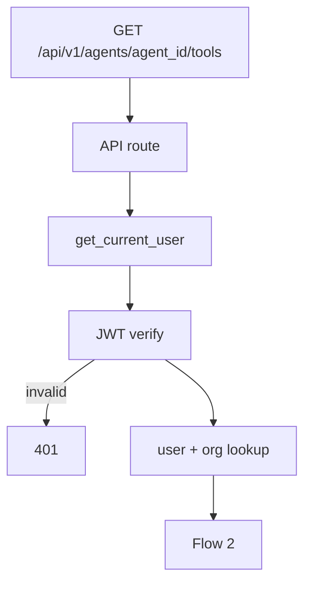

# List Tools by Agent — `GET /api/v1/agents/{agent_id}/tools`

Returns all tools attached to an agent. Scoped to the authenticated user's **organization**.

Used by the agent **Tools** panel in the UI.

Executor catalog: [00-executor-catalog.md](./00-executor-catalog.md)

---

# Flow 1 — Auth

Same as [01-create-tool-diagrams.md](./01-create-tool-diagrams.md) Flow 1 and [../knowledgebase/02-list-knowledgebases-by-agent-diagrams.md](../knowledgebase/02-list-knowledgebases-by-agent-diagrams.md) Flow 1.



---

# Flow 2 — Validate agent + list

```mermaid
flowchart TB
    AUTH[CurrentUser — organization_id]

    AUTH --> PATH[agent_id path param]

    subgraph AGENT["Agent check"]
        A1[Validate ObjectId]
        A2[find by id + organization_id]
        A3{exists?}
        A1 --> A2 --> A3
    end

    PATH --> AGENT
    AGENT -->|invalid| E422[422]
    AGENT -->|missing| E404[404]
    A3 --> QUERY

    subgraph QUERY["Optional filters"]
        Q1[status — active | disabled]
        Q2[executor — mongo_find_one, http_request, …]
    end

    A3 --> QUERY
    QUERY --> SVC[ToolService.list_by_agent]
    SVC --> REPO[ToolRepository.find by agent_id + organization_id]
    REPO --> MAP[Map to ToolListItem]
    MAP --> RES[200 ListToolsResponse]
```

## Query parameters (optional)

| Param | Rule |
|-------|------|
| `status` | optional: `active`, `disabled` |
| `executor` | optional: any MVP executor name |

## Example request

```http
GET /api/v1/agents/67agent001/tools
Authorization: Bearer <clerk_jwt>
```

**Active mongo tools only:**

```http
GET /api/v1/agents/67agent001/tools?executor=mongo_find_one&status=active
```

## MongoDB query

Collection: `tools`

```json
{
  "organization_id": "6a3b7c61d8139334274fbbfc",
  "agent_id": "67agent001"
}
```

Sort: `created_at` descending.

## Response `200`

```json
{
  "items": [
    {
      "id": "6a3f9012d8139334274fbc00",
      "name": "customer_lookup",
      "description": "Get customer loyalty info when user asks about points or tier",
      "executor": "mongo_find_one",
      "connector_id": "6a3f8c12d8139334274fbbfe",
      "config": {
        "collection": "customers",
        "filter": { "customer_id": "{{customer_id}}" },
        "projection": ["name", "loyalty_points", "tier"]
      },
      "status": "active",
      "agent_id": "67agent001",
      "organization_id": "6a3b7c61d8139334274fbbfc",
      "created_at": "2026-06-25T12:00:00Z",
      "updated_at": "2026-06-25T12:00:00Z"
    },
    {
      "id": "6a3f9012d8139334274fbc01",
      "name": "create_invoice",
      "description": "Create an invoice in the billing system",
      "executor": "http_request",
      "connector_id": "6a3f8c12d8139334274fbbff",
      "config": {
        "method": "POST",
        "path": "/invoices",
        "body": { "customer_id": "{{customer_id}}", "amount": "{{amount}}" }
      },
      "status": "active",
      "agent_id": "67agent001",
      "organization_id": "6a3b7c61d8139334274fbbfc",
      "created_at": "2026-06-25T11:00:00Z",
      "updated_at": "2026-06-25T11:00:00Z"
    }
  ],
  "total": 2
}
```

Tool `config` is **not** secret — connector credentials stay in `connectors` collection only.

## Navigate to planned files

| What | Open file |
|------|-----------|
| API route | [agents.py](../../app/api/v1/agents.py) *(planned)* |
| Service | [tool_service.py](../../app/services/tool_service.py) *(planned)* |
| Repository | [tool_repository.py](../../app/infrastructure/db/repositories/mongo/tool_repository.py) *(planned)* |
| List schema | [tool.py](../../app/schemas/tool.py) *(planned)* |
