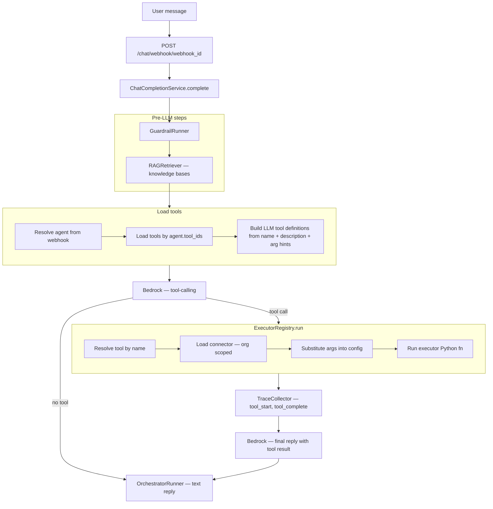
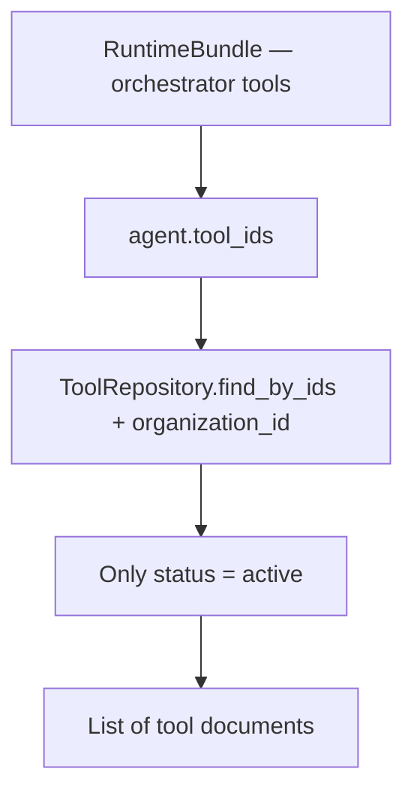
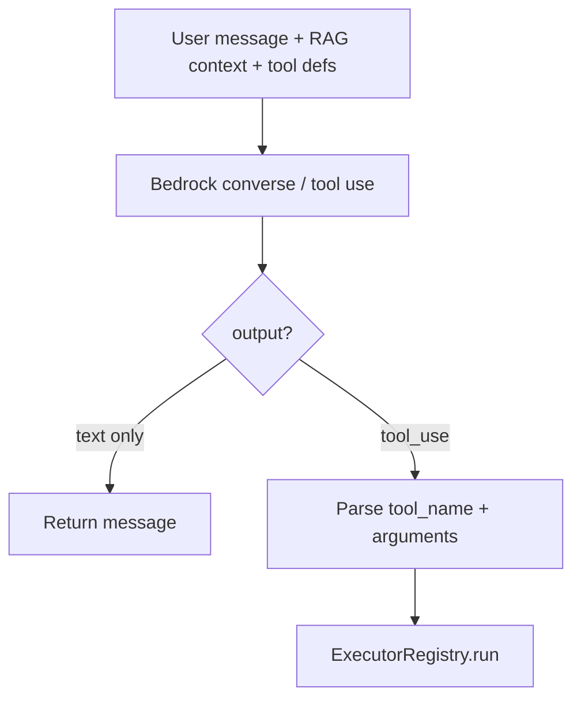

# Execute Tool at Chat — runtime flow

When a user sends a message, the platform may run one or more **Tools** via **Executors** and **Connectors**.

This is **not** a REST endpoint for org users — it runs inside `ChatCompletionService` on `POST /api/v1/chat/webhook/{webhook_id}`.

Executor catalog: [00-executor-catalog.md](./00-executor-catalog.md)

---

# High-level flow



---

# Flow 1 — Load agent tools



**Planned files:**

| Step | File |
|------|------|
| Agent load | [runtime_bundle_loader.py](../../app/services/runtime_bundle_loader.py) |
| Tool load | [tool_repository.py](../../app/infrastructure/db/repositories/mongo/tool_repository.py) |

---

# Flow 2 — Build LLM tool definitions

Each tool becomes a Bedrock/OpenAI-style function schema:

```json
{
  "name": "customer_lookup",
  "description": "Get customer loyalty info when user asks about points or tier",
  "input_schema": {
    "type": "object",
    "properties": {
      "customer_id": {
        "type": "string",
        "description": "Customer identifier"
      }
    },
    "required": ["customer_id"]
  }
}
```

Arg hints derived from `{{placeholders}}` in tool `config` (MVP) or explicit `argument_schema` on tool doc (phase 2).

**Planned:** [tool_llm_schema.py](../../app/domain/tools/tool_llm_schema.py) *(planned)*

---

# Flow 3 — LLM picks tool + args



**Trace events:**

| Event | Payload |
|-------|---------|
| `tool_start` | `tool_name`, `executor`, `arguments` |
| `tool_complete` | `tool_name`, `result_summary`, `duration_ms` |
| `tool_error` | `tool_name`, `error` |

---

# Flow 4 — ExecutorRegistry.run

```mermaid
flowchart TB
    IN[executor, connector, config, args]

    IN --> REG{executor in registry?}
    REG -->|no| ERR[500 Executor not implemented]
    REG -->|yes| TMPL[template.resolve — {{args}}]

    TMPL --> TYPE{executor family?}

    TYPE -->|mongo_*| M[motor/pymongo client from connector]
    TYPE -->|http_request| H[httpx from connector base_url + auth]

    M --> RESULT[JSON result]
    H --> RESULT
    RESULT --> LLM[Pass result back to LLM]
```

**ExecutorContext (planned):**

```python
@dataclass
class ExecutorContext:
    executor: str
    connector: dict      # full connector doc incl. config secrets
    tool_config: dict    # tool.config after template resolution
    args: dict           # LLM-provided arguments
```

**Registry (planned):**

```python
EXECUTOR_REGISTRY = {
    "mongo_find_one": mongo_find_one.run,
    "mongo_find_many": mongo_find_many.run,
    "mongo_insert": mongo_insert.run,
    "mongo_update": mongo_update.run,
    "mongo_delete": mongo_delete.run,
    "mongo_aggregate": mongo_aggregate.run,
    "http_request": http_request.run,
}
```

---

# Flow 5 — Per-executor runtime (MVP)

| Executor | Runtime action |
|----------|----------------|
| `mongo_find_one` | `collection.find_one(filter, projection)` |
| `mongo_find_many` | `find().sort().limit()` |
| `mongo_insert` | `insert_one(document)` |
| `mongo_update` | `update_one(filter, update)` |
| `mongo_delete` | `delete_one(filter)` |
| `mongo_aggregate` | `aggregate(pipeline)` |
| `http_request` | `httpx.request(method, url, ...)` |

Connector provides connection; tool `config` provides operation.

---

# Error handling

| Error | Behavior |
|-------|----------|
| Tool not found | Skip — log trace `tool_error` |
| Connector missing / wrong org | `tool_error` — LLM apologizes |
| Missing `{{arg}}` | `tool_error` with field name |
| Mongo / HTTP failure | `tool_error` — sanitized message to LLM |
| Executor timeout | 30s default — cancel and `tool_error` |

Never return raw connector secrets to the LLM or user.

---

# Relationship to Knowledge Base

| Feature | Path | Purpose |
|---------|------|---------|
| **Knowledge Base** | `RAGRetriever` | Semantic retrieval — separate from tools |
| **Tools** | `ToolRouter` / `ExecutorRegistry` | Actions — query DB, call APIs |

Both run in `ChatCompletionService` before the final LLM reply. KB is read-only retrieval; tools are side-effect operations.

---

# Navigate to implementation files

| Layer | File |
|-------|------|
| Chat entry | [chat.py](../../app/api/v1/chat.py) |
| Entry service | [chat_completion_service.py](../../app/services/chat_completion_service.py) |
| Orchestrator | [orchestrator.py](../../app/domain/graph/orchestrator.py) |
| Executor registry | [executors/registry.py](../../app/domain/executors/registry.py) |
| Template resolver | [executors/template.py](../../app/domain/executors/template.py) |
| Trace | [trace.py](../../app/domain/pipeline/observability/trace.py) |
