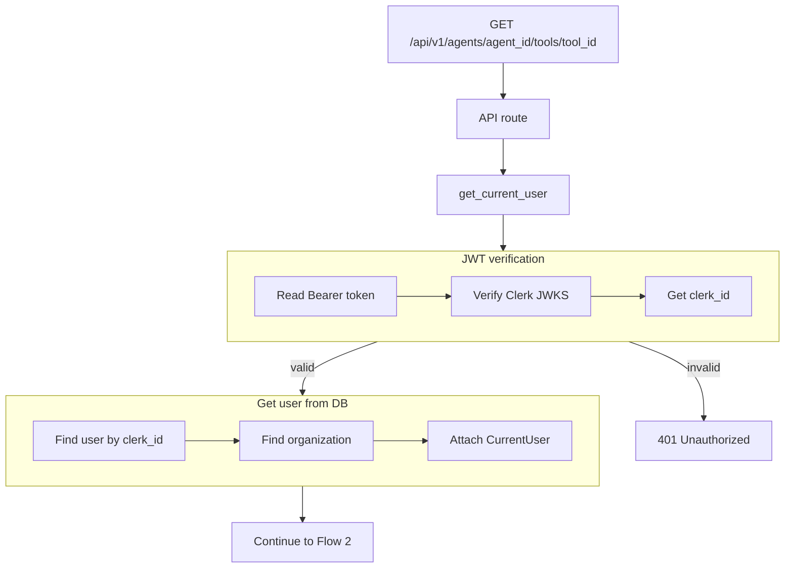
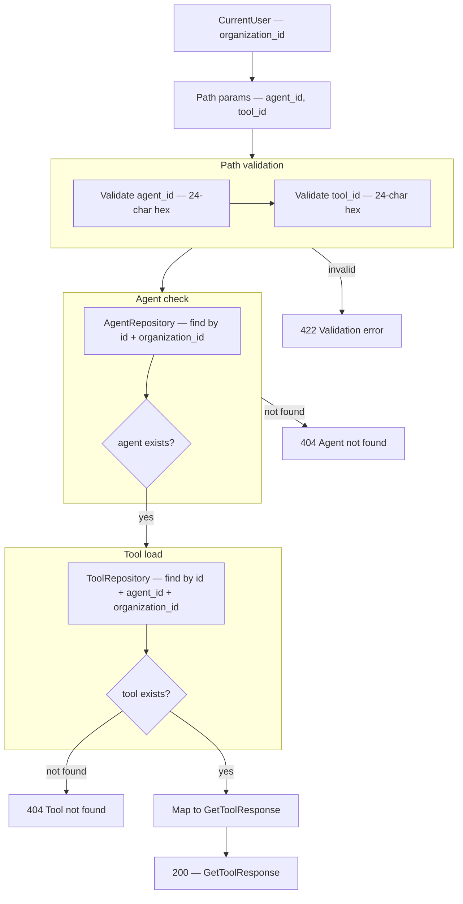

# Get Tool — `GET /api/v1/agents/{agent_id}/tools/{tool_id}`

Returns one tool for an agent. Scoped to the authenticated user's **organization** — used by the **Edit Tool** screen.

Related: [01-create-tool-diagrams.md](./01-create-tool-diagrams.md) · [02-list-tools-by-agent-diagrams.md](./02-list-tools-by-agent-diagrams.md)

---

# Flow 1 — Auth

Same as [01-create-tool-diagrams.md](./01-create-tool-diagrams.md) Flow 1.



## Navigate to auth files

| Flow step | What happens | Open file |
|-----------|--------------|-----------|
| API route | `GET /api/v1/agents/{agent_id}/tools/{tool_id}` | [agents.py](../../app/api/v1/agents.py) *(planned)* |
| Router | Mount under `/api/v1` | [router.py](../../app/api/v1/router.py) |
| Depends | Inject `CurrentUser` | [auth.py](../../app/di/auth.py) |
| JWT + user + org | Same as KB / connectors | [clerk_authenticator.py](../../app/infrastructure/auth/clerk_authenticator.py) |

## JSON at each step

| Step | Fields |
|------|--------|
| After organization lookup | `organization_id`, `organization_name` |
| Next | Flow 2 — path params |

---

# Flow 2 — Validate path + load tool

Runs after auth. Validates `agent_id` and `tool_id`, confirms agent belongs to org, then loads the tool.

## Flow



## Navigate to Flow 2 files

| Flow step | What happens | Open file |
|-----------|--------------|-----------|
| API route | Handler | [agents.py](../../app/api/v1/agents.py) *(planned)* |
| Path validation | `agent_id`, `tool_id` ObjectId format | [tool.py](../../app/schemas/tool.py) *(planned)* |
| 404 Agent | Wrong org or missing agent | [agent_repository.py](../../app/infrastructure/db/repositories/mongo/agent_repository.py) |
| 404 Tool | Missing or wrong agent/org | [tool_repository.py](../../app/infrastructure/db/repositories/mongo/tool_repository.py) *(planned)* |
| Service | `ToolService.get(current_user, agent_id, tool_id)` | [tool_service.py](../../app/services/tool_service.py) *(planned)* |
| Response schema | `GetToolResponse` | [tool.py](../../app/schemas/tool.py) *(planned)* |

## Path parameters (required)

| Param | Location | Required | Example |
|-------|----------|----------|---------|
| `agent_id` | path | yes | `67agent001` |
| `tool_id` | path | yes | `6a3f9012d8139334274fbc00` |

### Path validation rules

| Param | Rule |
|-------|--------|
| `agent_id` | required, 24-char hex MongoDB ObjectId |
| `tool_id` | required, 24-char hex MongoDB ObjectId |

### What the client does NOT send

| Field | Source |
|-------|--------|
| `organization_id` | `CurrentUser.organization_id` from auth |

## Example request

```http
GET /api/v1/agents/67agent001/tools/6a3f9012d8139334274fbc00
Authorization: Bearer <clerk_jwt>
```

## MongoDB query (repository)

Collection: `tools`

```json
{
  "_id": "6a3f9012d8139334274fbc00",
  "agent_id": "67agent001",
  "organization_id": "6a3b7c61d8139334274fbbfc"
}
```

All three fields required — prevents reading a tool from another agent or org.

## Response shape (`200`)

Same fields as list item — full tool detail for edit form.

| Field | In response |
|-------|-------------|
| `id` | yes |
| `name` | yes |
| `description` | yes |
| `executor` | yes |
| `connector_id` | yes |
| `config` | yes — not secret (connector holds credentials) |
| `status` | yes |
| `agent_id` | yes |
| `organization_id` | yes |
| `created_at` | yes |
| `updated_at` | yes |

## JSON at each step

| Step | Fields added |
|------|----------------|
| After auth | `organization_id` |
| After path validation | `agent_id`, `tool_id` |
| After agent check | agent exists in org |
| After tool load | full tool document |
| Final response | mapped `GetToolResponse` |

**Final response (`200`)**

```json
{
  "id": "6a3f9012d8139334274fbc00",
  "name": "customer_lookup",
  "description": "Get customer loyalty info when user asks about points or tier",
  "executor": "mongo_find_one",
  "connector_id": "6a3f8c12d8139334274fbbfe",
  "config": {
    "collection": "customers",
    "filter": { "customer_id": "{{customer_id}}" },
    "projection": ["name", "loyalty_points", "tier"]
  },
  "status": "active",
  "agent_id": "67agent001",
  "organization_id": "6a3b7c61d8139334274fbbfc",
  "created_at": "2026-06-25T12:00:00Z",
  "updated_at": "2026-06-25T12:00:00Z"
}
```

## Error responses

| Status | When |
|--------|------|
| `401` | Invalid or missing JWT |
| `404` | Agent not found, or tool not found for this agent/org |
| `422` | Invalid `agent_id` or `tool_id` format |

---

# Route ordering note

Register agent sub-routes **before** `GET /{agent_id}`:

```text
GET  /agents/{agent_id}/tools
POST /agents/{agent_id}/tools
GET  /agents/{agent_id}/tools/{tool_id}
PATCH /agents/{agent_id}/tools/{tool_id}
DELETE /agents/{agent_id}/tools/{tool_id}
GET  /agents/{agent_id}
```
