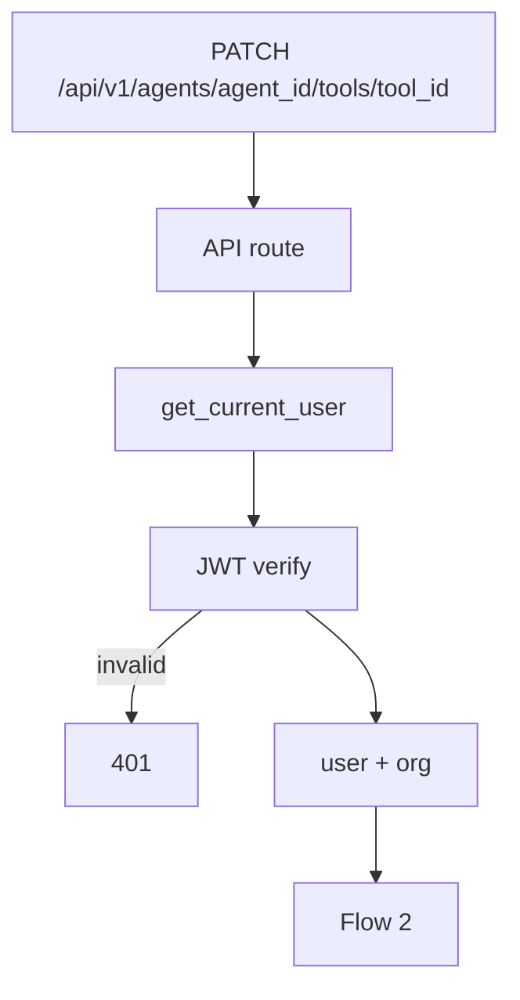
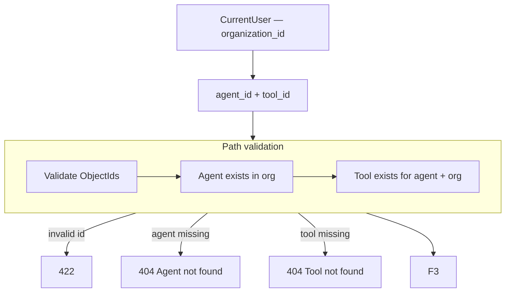
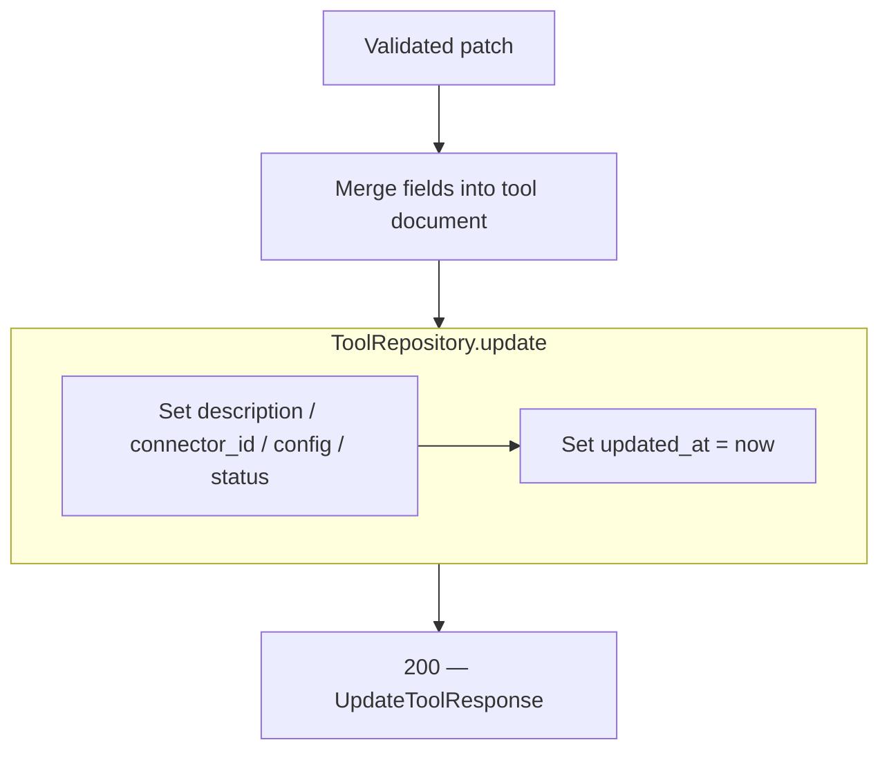

# Update Tool — `PATCH /api/v1/agents/{agent_id}/tools/{tool_id}`

Partially update a tool. Used by the **Edit Tool** modal.

Immutable after create: `name`, `executor` (changing executor would invalidate `config` — create a new tool instead).

Executor catalog: [00-executor-catalog.md](./00-executor-catalog.md)

---

# Flow 1 — Auth

Same as [04-get-tool-diagrams.md](./04-get-tool-diagrams.md) Flow 1.



---

# Flow 2 — Validate path + load existing tool



Same path checks as [04-get-tool-diagrams.md](./04-get-tool-diagrams.md) Flow 2.

---

# Flow 3 — Validate request body (partial)

All fields optional — only sent fields are updated.

```mermaid
flowchart TB
    EXIST[Existing tool loaded]

    EXIST --> BODY[JSON body — optional fields]

    subgraph VALIDATE["Pydantic — UpdateToolRequest"]
        V1[description — 1–2000 chars]
        V2[connector_id — ObjectId]
        V3[config — per existing executor schema]
        V4[status — active | disabled]
        V1 --> V2 --> V3 --> V4
    end

    BODY --> VALIDATE
    VALIDATE -->|invalid| E422[422]
    VALIDATE -->|empty body| E422

    VALIDATE --> CONN

    subgraph CONN["Connector check — if connector_id sent"]
        C1[ConnectorRepository — find by id + org]
        C2{type matches tool.executor?}
        C1 --> C2
    end

    CONN -->|not found| E404C[404 Connector not found]
    CONN -->|type mismatch| E422C[422 — connector type mismatch]
    CONN --> F4
```

### Updatable fields

| Field | Updatable | Rule |
|-------|-----------|------|
| `name` | **no** | Immutable — LLM tool name stable; create new tool to rename |
| `executor` | **no** | Immutable — config schema is per executor |
| `description` | yes | 1–2000 chars |
| `connector_id` | yes | Must exist in org; `type` must match existing `executor` |
| `config` | yes | Validated against **existing** `tool.executor` schema |
| `status` | yes | `active` or `disabled` |

### Example request — update description + config

```http
PATCH /api/v1/agents/67agent001/tools/6a3f9012d8139334274fbc00
Authorization: Bearer <clerk_jwt>
Content-Type: application/json

{
  "description": "Look up customer loyalty points and tier by customer ID",
  "config": {
    "collection": "customers",
    "filter": { "customer_id": "{{customer_id}}" },
    "projection": ["name", "loyalty_points", "tier", "email"]
  }
}
```

### Example request — disable tool

```json
{
  "status": "disabled"
}
```

### Example request — switch connector (same type)

```json
{
  "connector_id": "6a3f8c12d8139334274fbc02"
}
```

New connector must be `type: mongo` if executor is `mongo_find_one`.

### What the client does NOT send

| Field | Source |
|-------|--------|
| `organization_id` | auth |
| `agent_id` | path |
| `executor` | unchanged on document |

---

# Flow 4 — Persist



**Mongo update** (example — config + description only):

```json
{
  "$set": {
    "description": "Look up customer loyalty points and tier by customer ID",
    "config": {
      "collection": "customers",
      "filter": { "customer_id": "{{customer_id}}" },
      "projection": ["name", "loyalty_points", "tier", "email"]
    },
    "updated_at": "2026-06-25T14:30:00Z"
  }
}
```

`agent.tool_ids` unchanged — tool id already attached.

## Response shape (`200`)

Same as [04-get-tool-diagrams.md](./04-get-tool-diagrams.md) — full tool after update.

```json
{
  "id": "6a3f9012d8139334274fbc00",
  "name": "customer_lookup",
  "description": "Look up customer loyalty points and tier by customer ID",
  "executor": "mongo_find_one",
  "connector_id": "6a3f8c12d8139334274fbbfe",
  "config": {
    "collection": "customers",
    "filter": { "customer_id": "{{customer_id}}" },
    "projection": ["name", "loyalty_points", "tier", "email"]
  },
  "status": "active",
  "agent_id": "67agent001",
  "organization_id": "6a3b7c61d8139334274fbbfc",
  "created_at": "2026-06-25T12:00:00Z",
  "updated_at": "2026-06-25T14:30:00Z"
}
```

## Error responses

| Status | When |
|--------|------|
| `401` | Invalid JWT |
| `404` | Agent, tool, or connector not found |
| `422` | Invalid body, empty patch, config schema error, connector type mismatch |
| `400` | Attempt to send `name` or `executor` in body *(reject unknown/immutable fields)* |

## Navigate to planned files

| What | Open file |
|------|-----------|
| API route | [agents.py](../../app/api/v1/agents.py) *(planned)* |
| Update schema | `UpdateToolRequest` in [tool.py](../../app/schemas/tool.py) *(planned)* |
| Config validation | [tool_config.py](../../app/schemas/tool_config.py) *(planned)* |
| Service | `ToolService.update()` in [tool_service.py](../../app/services/tool_service.py) *(planned)* |
| Repository | [tool_repository.py](../../app/infrastructure/db/repositories/mongo/tool_repository.py) *(planned)* |

---

# UI notes

| Action | API |
|--------|-----|
| Open edit modal | `GET .../tools/{tool_id}` |
| Save changes | `PATCH .../tools/{tool_id}` |
| Disable without delete | `PATCH` with `{ "status": "disabled" }` |
| Rename tool | Not supported — delete + create with new `name` |
