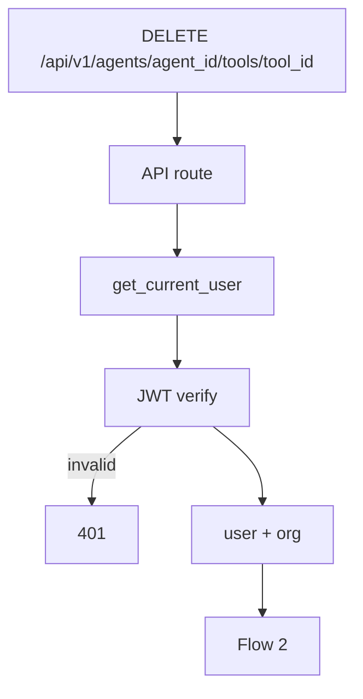
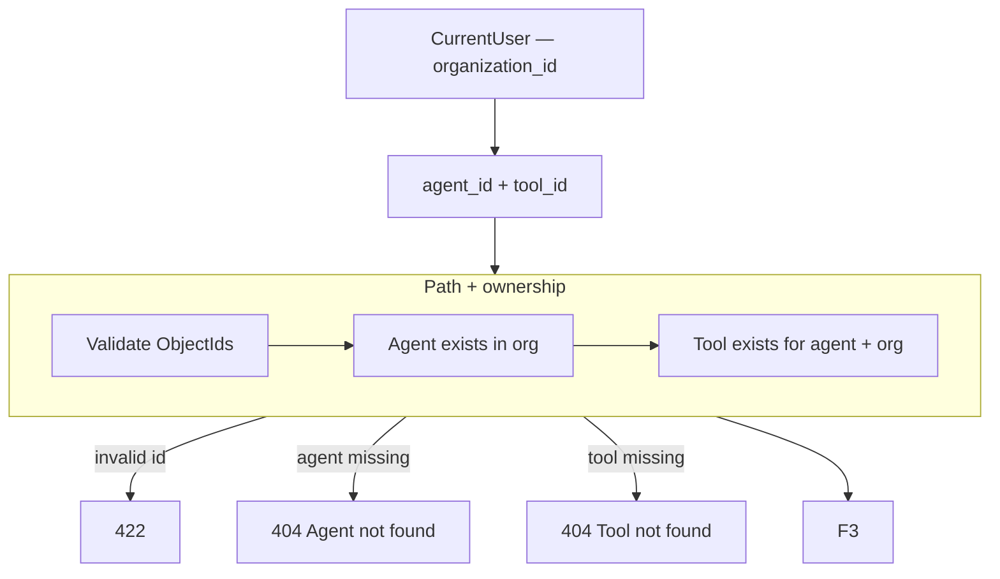
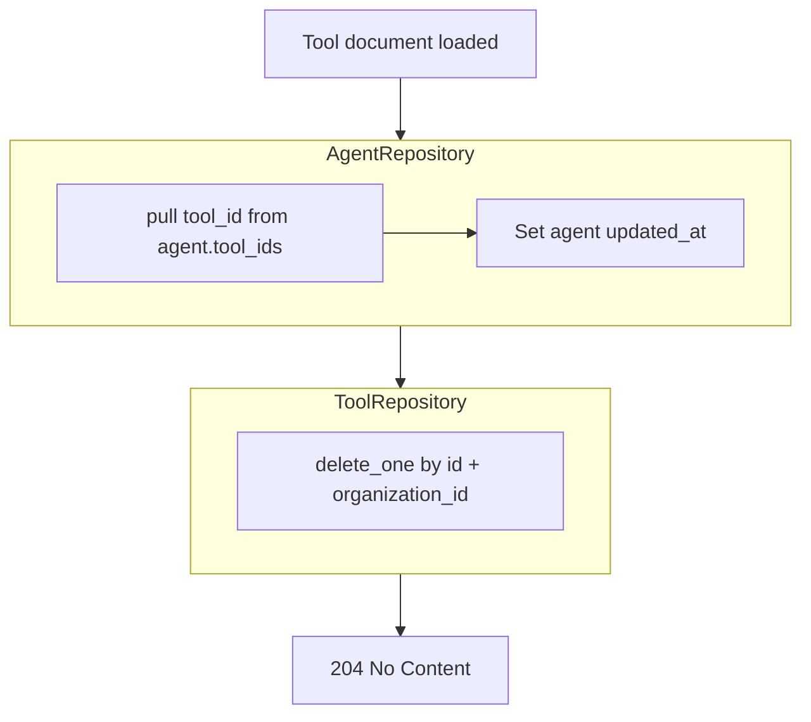

# Delete Tool — `DELETE /api/v1/agents/{agent_id}/tools/{tool_id}`

Removes a tool from an agent. Detaches tool id from `agent.tool_ids`, then deletes the `tools` document.

Used by the **Tools** panel delete action.

Related: [01-create-tool-diagrams.md](./01-create-tool-diagrams.md) · [04-get-tool-diagrams.md](./04-get-tool-diagrams.md)

---

# Flow 1 — Auth

Same as [04-get-tool-diagrams.md](./04-get-tool-diagrams.md) Flow 1.



---

# Flow 2 — Validate path + load tool



---

# Flow 3 — Detach from agent + delete tool



**Order:** detach from agent first, then delete tool — avoids orphan id on agent if delete fails midway. Use a transaction or compensating logic if both must be atomic (Mongo multi-doc transaction optional for MVP).

## Mongo operations

**1. Agent update** — collection: `agents`

```json
{
  "filter": {
    "_id": "67agent001",
    "organization_id": "6a3b7c61d8139334274fbbfc"
  },
  "update": {
    "$pull": {
      "tool_ids": "6a3f9012d8139334274fbc00"
    },
    "$set": {
      "updated_at": "2026-06-25T15:00:00Z"
    }
  }
}
```

Also support `skill_ids` pull during migration if agent still uses that field.

**2. Tool delete** — collection: `tools`

```json
{
  "filter": {
    "_id": "6a3f9012d8139334274fbc00",
    "organization_id": "6a3b7c61d8139334274fbbfc",
    "agent_id": "67agent001"
  }
}
```

## Example request

```http
DELETE /api/v1/agents/67agent001/tools/6a3f9012d8139334274fbc00
Authorization: Bearer <clerk_jwt>
```

## Response

| Status | Body |
|--------|------|
| `204` | empty — success |
| `401` | invalid JWT |
| `404` | agent or tool not found |
| `422` | invalid path ids |

No response body on `204`.

## JSON at each step

| Step | State |
|------|--------|
| Before delete | `agent.tool_ids` contains tool id; tool doc exists |
| After `$pull` | tool id removed from agent |
| After `delete_one` | tool doc gone |
| Chat runtime | tool no longer loaded for LLM |

---

# Impact on chat runtime

After delete:

- `ToolRouter` will not load this tool (id not in `agent.tool_ids`, doc gone).
- LLM cannot call deleted tool on next message.
- No soft-delete in MVP — hard delete. Use `PATCH status: disabled` to keep but hide ([05-update-tool-diagrams.md](./05-update-tool-diagrams.md)).

---

# Connector impact

Deleting a tool does **not** delete the connector. Other tools may still reference the same `connector_id`.

---

# Navigate to planned files

| What | Open file |
|------|-----------|
| API route | [agents.py](../../app/api/v1/agents.py) *(planned)* |
| Service | `ToolService.delete()` in [tool_service.py](../../app/services/tool_service.py) *(planned)* |
| Tool repository | [tool_repository.py](../../app/infrastructure/db/repositories/mongo/tool_repository.py) *(planned)* |
| Agent repository | `pull_tool_id()` in [agent_repository.py](../../app/infrastructure/db/repositories/mongo/agent_repository.py) *(planned)* |

---

# Full tools API index

| Method | Path | Doc |
|--------|------|-----|
| `POST` | `/agents/{agent_id}/tools` | [01-create-tool-diagrams.md](./01-create-tool-diagrams.md) |
| `GET` | `/agents/{agent_id}/tools` | [02-list-tools-by-agent-diagrams.md](./02-list-tools-by-agent-diagrams.md) |
| `GET` | `/agents/{agent_id}/tools/{tool_id}` | [04-get-tool-diagrams.md](./04-get-tool-diagrams.md) |
| `PATCH` | `/agents/{agent_id}/tools/{tool_id}` | [05-update-tool-diagrams.md](./05-update-tool-diagrams.md) |
| `DELETE` | `/agents/{agent_id}/tools/{tool_id}` | [06-delete-tool-diagrams.md](./06-delete-tool-diagrams.md) |
| — | Executors (platform) | [00-executor-catalog.md](./00-executor-catalog.md) |
| — | Chat runtime | [03-execute-tool-at-chat-diagrams.md](./03-execute-tool-at-chat-diagrams.md) |
