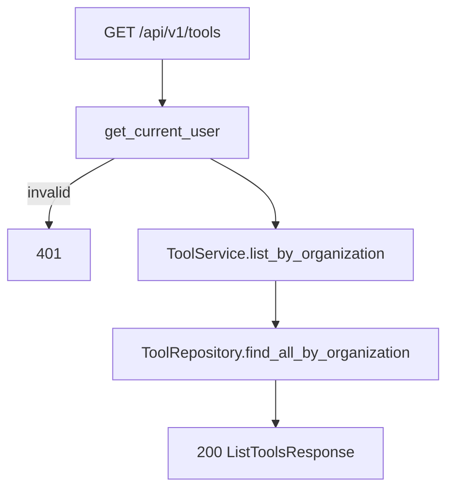

# List Tools — `GET /api/v1/tools`

Organization-scoped list of all tools. Used by the agent detail **Attach / Detach** UI to show every tool in the org.

Related:

- List by agent: [02-list-tools-by-agent-diagrams.md](./02-list-tools-by-agent-diagrams.md)
- Attach / detach: [08-update-tool-agent-diagrams.md](./08-update-tool-agent-diagrams.md)
- Edit tool fields (description, config): [05-update-tool-diagrams.md](./05-update-tool-diagrams.md) *(planned under agent path)*

`organization_id` comes from JWT auth (`CurrentUser`), not the request body.

---

# Flow



---

# Query parameters (optional)

| Param | Rule |
|-------|------|
| `agent_id` | 24-char ObjectId — filter tools attached to that agent |
| `status` | `active`, `disabled` |
| `executor` | MVP executor name e.g. `mongo_find_one`, `http_request` |

If `agent_id` is sent, the agent must exist in the caller's organization (`404` otherwise).

---

# Example request

```http
GET /api/v1/tools
Authorization: Bearer <clerk_jwt>
```

**Unattached tools only** (client-side filter where `agent_id` is null) or attached to one agent:

```http
GET /api/v1/tools?agent_id=67agent001
```

---

# Response `200`

```json
{
  "items": [
    {
      "id": "6a3f9012d8139334274fbc00",
      "name": "customer_lookup",
      "description": "Get customer loyalty info",
      "executor": "mongo_find_one",
      "connector_id": "6a3f8c12d8139334274fbbfe",
      "config": {
        "collection": "customers",
        "filter": { "customer_id": "{{customer_id}}" }
      },
      "status": "active",
      "agent_id": "67agent001",
      "organization_id": "6a3b7c61d8139334274fbbfc",
      "created_at": "2026-06-25T12:00:00Z",
      "updated_at": "2026-06-25T12:00:00Z"
    }
  ],
  "total": 1
}
```

`agent_id` may be `null` when the tool is detached from any agent.

Sort: `created_at` descending.

---

# UI mapping

| UI | API |
|----|-----|
| Show all org tools on agent page | `GET /tools` |
| Show only attached tools | `GET /tools?agent_id={id}` or `GET /agents/{id}/tools` |
| **Attach** button | `PATCH /tools/{id}` with `{ "agent_id": "{agentId}" }` |
| **Detach** button | `PATCH /tools/{id}` with `{ "agent_id": null }` |

---

# Navigate to implementation files

| Layer | File |
|-------|------|
| API route | [tools.py](../../app/api/v1/tools.py) |
| Router mount | [router.py](../../app/api/v1/router.py) |
| Service | [tool_service.py](../../app/services/tool_service.py) |
| Repository | [tool_repository.py](../../app/infrastructure/db/repositories/mongo/tool_repository.py) |
| Schema | [tool.py](../../app/schemas/tool.py) |
