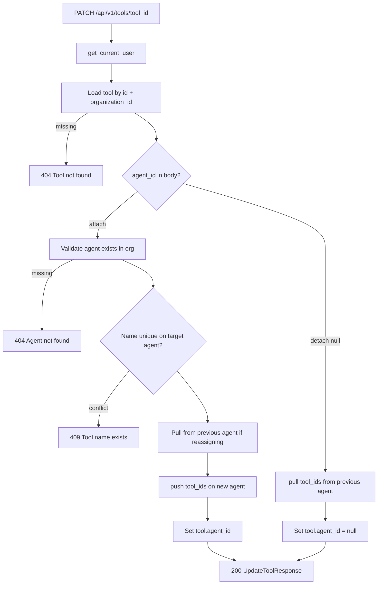

# Update Tool Agent — `PATCH /api/v1/tools/{tool_id}`

Attach or detach a tool to an agent by setting `agent_id`.

Used by the agent detail **Attach / Detach** buttons.

- **Attach:** `{ "agent_id": "<agent_object_id>" }`
- **Detach:** `{ "agent_id": null }`

Also syncs `agent.tool_ids` on the agent document (`$addToSet` on attach, `$pull` on detach).

Org list: [07-list-tools-diagrams.md](./07-list-tools-diagrams.md)

**Note:** This endpoint is for **agent assignment only**. Editing `description`, `config`, or `status` is documented separately in [05-update-tool-diagrams.md](./05-update-tool-diagrams.md) under the agent-scoped path.

---

# Flow



---

# Request body (MVP)

Only `agent_id` is updatable on this route in this phase.

| Field | Rule |
|-------|------|
| `agent_id` | 24-char ObjectId to attach, or `null` to detach |

At least one field required. Empty body → `422`.

### Attach example

```http
PATCH /api/v1/tools/6a3f9012d8139334274fbc00
Authorization: Bearer <clerk_jwt>
Content-Type: application/json

{
  "agent_id": "67agent001"
}
```

### Detach example

```json
{
  "agent_id": null
}
```

Detach does **not** delete the tool document.

---

# Response `200`

```json
{
  "id": "6a3f9012d8139334274fbc00",
  "name": "customer_lookup",
  "description": "Get customer loyalty info",
  "executor": "mongo_find_one",
  "connector_id": "6a3f8c12d8139334274fbbfe",
  "config": {
    "collection": "customers",
    "filter": { "customer_id": "{{customer_id}}" }
  },
  "status": "active",
  "agent_id": "67agent001",
  "organization_id": "6a3b7c61d8139334274fbbfc",
  "created_at": "2026-06-25T12:00:00Z",
  "updated_at": "2026-06-26T12:00:00Z"
}
```

After detach, `agent_id` is `null`.

---

# Error responses

| Status | When |
|--------|------|
| `401` | Invalid JWT |
| `404` | Tool or agent not found |
| `409` | Tool name already exists on target agent |
| `422` | Invalid ObjectId, empty body |

---

# Reassign between agents

When moving a tool from agent A → agent B:

1. `$pull` tool id from A.`tool_ids`
2. `$addToSet` tool id on B.`tool_ids`
3. Update `tool.agent_id` to B

---

# Navigate to implementation files

| Layer | File |
|-------|------|
| API route | [tools.py](../../app/api/v1/tools.py) |
| Service | `ToolService.update()` in [tool_service.py](../../app/services/tool_service.py) |
| Agent sync | `push_tool_id` / `pull_tool_id` in [agent_repository.py](../../app/infrastructure/db/repositories/mongo/agent_repository.py) |
| Schema | `UpdateToolRequest` in [tool.py](../../app/schemas/tool.py) |
