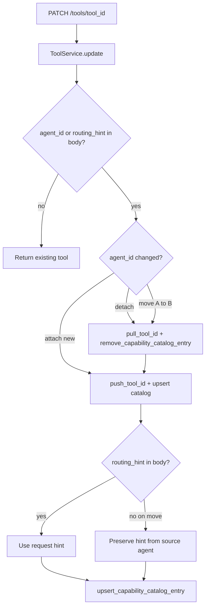

# Update Tool — attach / detach / move — `PATCH /api/v1/tools/{tool_id}`

**Agentic migration:** Phase A **Done**. Phase B **no REST change**. See [../agentic/updets/api-migration-agentic.md](../agentic/updets/api-migration-agentic.md).

Create tool: [01-create-tool-diagrams.md](./01-create-tool-diagrams.md)

---

## Request body (agentic fields)

| Field | When set | Effect |
|-------|----------|--------|
| `agent_id` | attach / detach / move | Updates `tool.agent_id` and syncs `agent.tool_ids` |
| `routing_hint` | optional | Upserts or clears hint in `agent.capability_catalog.tools[tool_id]` |

```json
{
  "agent_id": "6a3b7c61d8139334274fbbf1",
  "routing_hint": "Use when user asks about account balance"
}
```

Detach:

```json
{ "agent_id": null }
```

---

## Service flow



---

## Catalog rules

| Action | `tool_ids` | `capability_catalog.tools` |
|--------|------------|----------------------------|
| Attach (`null` → agent) | `push_tool_id` | upsert entry |
| Detach (agent → `null`) | `pull_tool_id` | `$unset` entry |
| Move (agent A → B) | pull A, push B | remove from A; upsert on B |
| Hint-only PATCH (same agent) | no change | upsert entry |
| Re-PATCH same `agent_id` without hint | no change | **no catalog upsert** (avoids wiping hint) |
| Move without `routing_hint` in body | — | **preserves** hint from source agent |

---

## Navigate to files

| Step | File |
|------|------|
| API route | [tools.py](../../app/api/v1/tools.py) |
| Service | [tool_service.py](../../app/services/tool_service.py) |
| Schema | [tool.py](../../app/schemas/tool.py) — `UpdateToolRequest` |
| Catalog helpers | [capability_catalog.py](../../app/domain/models/capability_catalog.py) |
| Repository | [agent_repository.py](../../app/infrastructure/db/repositories/mongo/agent_repository.py) |

---

## List with hints

`GET /api/v1/tools?agent_id={id}` returns `routing_hint` on each item (read from agent catalog). Agent-scoped list: `GET /api/v1/agents/{agent_id}/tools`.
