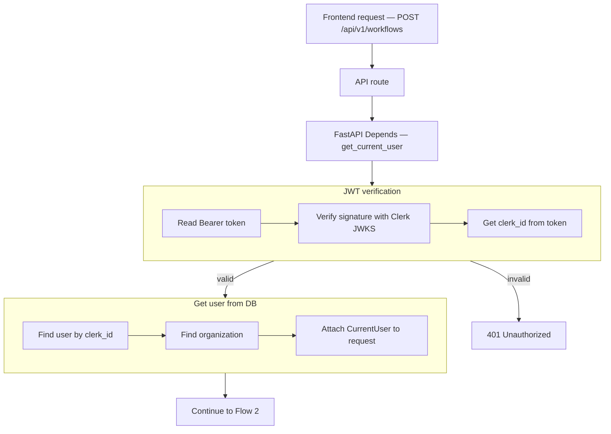
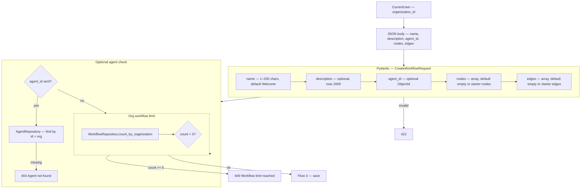
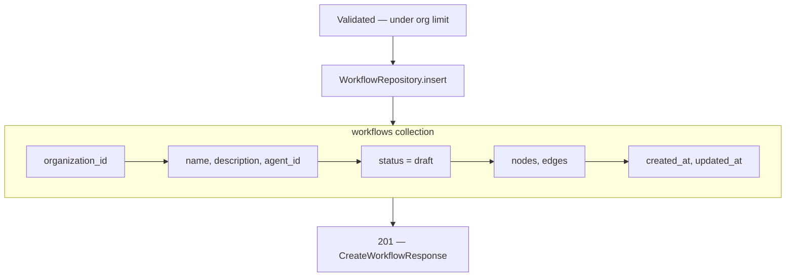

# Create Workflow — `POST /api/v1/workflows`

**Agentic migration (REST):** Phase A **Done** — `routing_hint` → `agent.capability_catalog.workflows`. PATCH: [04-update-workflow-diagrams.md](./04-update-workflow-diagrams.md). Phase B **Done** — runtime only (LLM picks workflow; no auto-start). Phase C **no REST change**. See [../agentic/updets/api-migration-agentic-phase-c.md](../agentic/updets/api-migration-agentic-phase-c.md).

Organization creates a **Workflow** — named canvas with `nodes` and `edges` stored as JSON.

`organization_id` comes from JWT auth (`CurrentUser`), not the request body.

Model reference: [00-workflow-model.md](./00-workflow-model.md)

---

# Flow 1 — Auth

Same as agents, connectors, and tools.

## Flow



## Navigate to auth files

| Flow step | What happens | Open file |
|-----------|--------------|-----------|
| API route | `POST /api/v1/workflows` handler | [workflows.py](../../app/api/v1/workflows.py) *(planned)* |
| Router | Mount under `/api/v1` | [router.py](../../app/api/v1/router.py) |
| Depends | Inject `CurrentUser` | [auth.py](../../app/di/auth.py) |
| JWT + user + org | Same as KB / connectors | [clerk_authenticator.py](../../app/infrastructure/auth/clerk_authenticator.py) |

## JSON at each step

**After organization lookup**

```json
{
  "clerk_id": "user_3FZX0ugQeNkL7VO8cMOY8mhRAS5",
  "token_valid": true,
  "user_id": "6a3b7c61d8139334274fbbfd",
  "email": "jayasingheshehan1995@gmail.com",
  "organization_id": "6a3b7c61d8139334274fbbfc",
  "organization_name": "abc bank"
}
```

---

# Flow 2 — Validate request body



### Pydantic validation rules

| Field | Rule |
|-------|------|
| `name` | optional on body — default `"Welcome"` if omitted |
| `description` | optional, max 2000 chars |
| `agent_id` | optional — 24-char hex ObjectId when provided |
| `nodes` | optional — default starter graph (start + message) if omitted |
| `edges` | optional — default edge linking starter nodes if omitted |

### What the client does NOT send

| Field | Source |
|-------|--------|
| `organization_id` | `CurrentUser.organization_id` |
| `status` | Server sets `draft` |
| `created_at` / `updated_at` | Server timestamps |

---

# Flow 3 — Save



---

# Request body examples

**Minimal — sidebar + Create button (default graph)**

```http
POST /api/v1/workflows
Authorization: Bearer <clerk_jwt>
Content-Type: application/json

{}
```

Server applies defaults: `name: "Welcome"`, starter `nodes` + `edges`.

**With optional fields**

```json
{
  "name": "Welcome",
  "description": "Onboarding greeting flow",
  "agent_id": "67agent001",
  "nodes": [
    {
      "id": "start-1",
      "type": "start",
      "position": { "x": 120, "y": 220 },
      "data": {}
    },
    {
      "id": "message-1",
      "type": "message",
      "position": { "x": 320, "y": 220 },
      "data": { "text": "Welcome" }
    }
  ],
  "edges": [
    { "id": "edge-1", "source": "start-1", "target": "message-1" }
  ]
}
```

---

# Response `201`

```json
{
  "id": "6a3f9012d8139334274fbc00",
  "name": "Welcome",
  "description": null,
  "agent_id": null,
  "status": "draft",
  "nodes": [
    {
      "id": "start-1",
      "type": "start",
      "position": { "x": 120, "y": 220 },
      "data": {}
    },
    {
      "id": "message-1",
      "type": "message",
      "position": { "x": 320, "y": 220 },
      "data": { "text": "Welcome" }
    }
  ],
  "edges": [
    { "id": "edge-1", "source": "start-1", "target": "message-1" }
  ],
  "organization_id": "6a3b7c61d8139334274fbbfc",
  "created_at": "2026-06-26T10:00:00Z",
  "updated_at": "2026-06-26T10:00:00Z"
}
```

---

# Error responses

| Status | When |
|--------|------|
| `401` | Invalid JWT |
| `404` | `agent_id` sent but agent not found in org |
| `409` | Organization already has **5** workflows |
| `422` | Invalid body or ObjectId |

---

# Frontend flow after create

1. Sidebar **+ Create** → `POST /workflows` with `{}` or `{ "name": "Welcome" }`
2. On `201` → `navigate(/workflows/{id})`
3. Editor loads — user edits title and canvas
4. **Save** → `PATCH /workflows/{id}` — see [04-update-workflow-diagrams.md](./04-update-workflow-diagrams.md)

---

# Navigate to implementation files

| Layer | Open file |
|-------|-----------|
| API route | [workflows.py](../../app/api/v1/workflows.py) |
| Schemas | [workflow.py](../../app/schemas/workflow.py) |
| Service | [workflow_service.py](../../app/services/workflow_service.py) |
| Repository | [workflow_repository.py](../../app/infrastructure/db/repositories/mongo/workflow_repository.py) |
| Constants | [workflow_constants.py](../../app/domain/constants/workflow_constants.py) |
