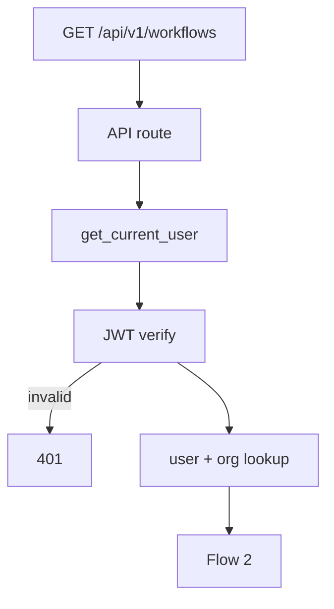

# List Workflows — `GET /api/v1/workflows`

Returns all workflows for the authenticated user's **organization**. Used by the **Workflows** sidebar list (max 5 items in MVP).

Model reference: [00-workflow-model.md](./00-workflow-model.md)

---

# Flow 1 — Auth

Same as [01-create-workflow-diagrams.md](./01-create-workflow-diagrams.md) Flow 1.



---

# Flow 2 — Query + response

```mermaid
flowchart TB
    AUTH[CurrentUser — organization_id]

    AUTH --> QUERY

    subgraph QUERY["Optional filters"]
        Q1[status — draft | published]
        Q2[agent_id — filter by linked agent]
    end

    QUERY --> SVC[WorkflowService.list_by_organization]
    SVC --> REPO[WorkflowRepository.find_all_by_organization]
    REPO --> MAP[Map to WorkflowListItem]
    MAP --> RES[200 ListWorkflowsResponse]
```

## Query parameters (optional)

| Param | Rule |
|-------|------|
| `status` | optional: `draft`, `published` |
| `agent_id` | optional: 24-char ObjectId |

## Example request

```http
GET /api/v1/workflows
Authorization: Bearer <clerk_jwt>
```

## MongoDB query

Collection: `workflows`

```json
{
  "organization_id": "6a3b7c61d8139334274fbbfc"
}
```

Sort: `updated_at` descending (most recently edited first).

## Response `200`

```json
{
  "items": [
    {
      "id": "6a3f9012d8139334274fbc00",
      "name": "Welcome",
      "description": null,
      "agent_id": null,
      "status": "draft",
      "node_count": 2,
      "organization_id": "6a3b7c61d8139334274fbbfc",
      "created_at": "2026-06-26T10:00:00Z",
      "updated_at": "2026-06-26T11:30:00Z"
    }
  ],
  "total": 1
}
```

List items omit full `nodes` / `edges` for performance — load via `GET /workflows/{id}`.

| Field | Notes |
|-------|-------|
| `node_count` | Derived: `len(nodes)` — for sidebar display |
| `total` | Count of items returned (max 5 per org in MVP) |

---

# Sidebar UI mapping

| UI element | Behavior |
|------------|----------|
| Workflow name link | `GET /workflows` item → navigate `/workflows/{id}` |
| **+ Create** | Hidden or disabled when `total >= 5` |
| Active highlight | Match current `workflow_id` route param |

---

# Navigate to planned files

| What | Open file |
|------|-----------|
| API route | [workflows.py](../../app/api/v1/workflows.py) *(planned)* |
| Service | [workflow_service.py](../../app/services/workflow_service.py) *(planned)* |
| Repository | [workflow_repository.py](../../app/infrastructure/db/repositories/mongo/workflow_repository.py) *(planned)* |
| List schema | [workflow.py](../../app/schemas/workflow.py) *(planned)* |
| Frontend sidebar | [Sidebar.tsx](../../../frontend/src/components/layout/Sidebar.tsx) |
