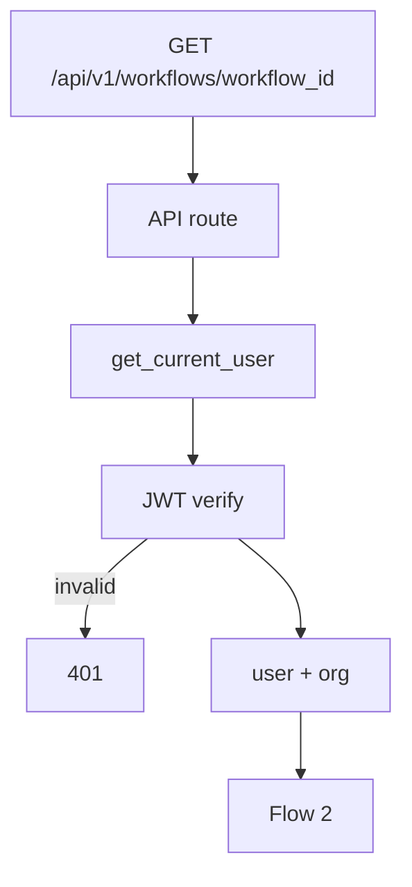
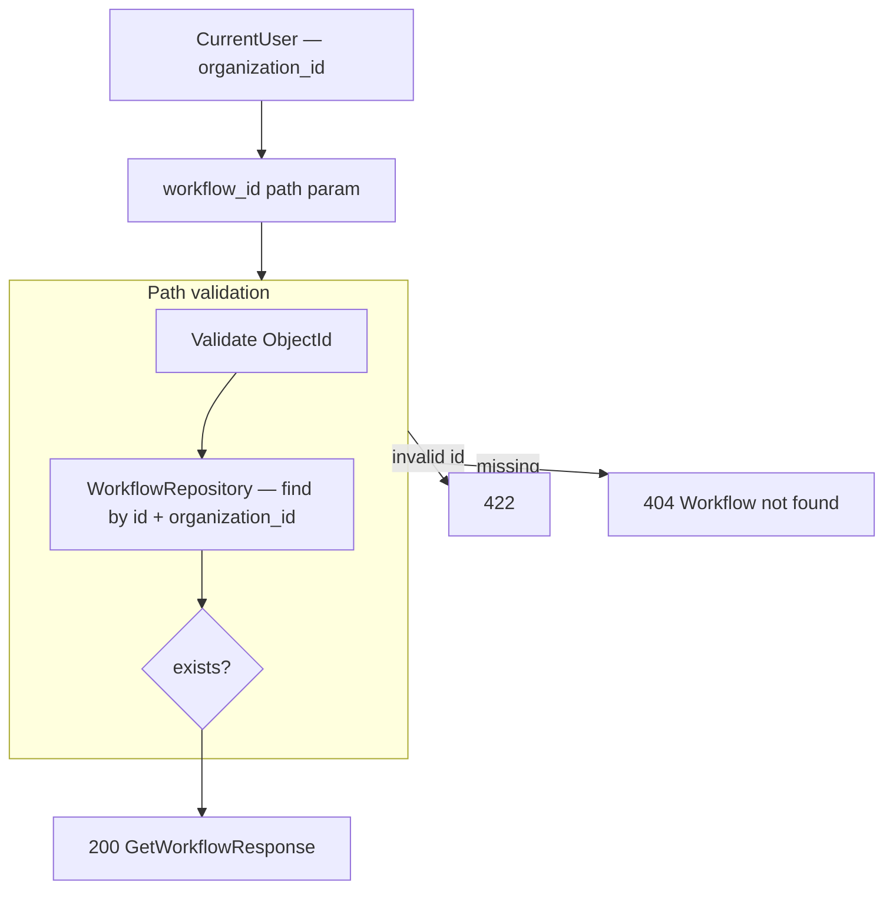

# Get Workflow — `GET /api/v1/workflows/{workflow_id}`

Returns one workflow including full `nodes` and `edges` for the editor canvas.

Model reference: [00-workflow-model.md](./00-workflow-model.md)

---

# Flow 1 — Auth

Same as [01-create-workflow-diagrams.md](./01-create-workflow-diagrams.md) Flow 1.



---

# Flow 2 — Validate path + load



## Example request

```http
GET /api/v1/workflows/6a3f9012d8139334274fbc00
Authorization: Bearer <clerk_jwt>
```

## Response `200`

```json
{
  "id": "6a3f9012d8139334274fbc00",
  "name": "Welcome",
  "description": null,
  "agent_id": null,
  "status": "draft",
  "nodes": [
    {
      "id": "start-1",
      "type": "start",
      "position": { "x": 120, "y": 220 },
      "data": {}
    },
    {
      "id": "message-1",
      "type": "message",
      "position": { "x": 320, "y": 220 },
      "data": { "text": "Welcome" }
    }
  ],
  "edges": [
    { "id": "edge-1", "source": "start-1", "target": "message-1" }
  ],
  "organization_id": "6a3b7c61d8139334274fbbfc",
  "created_at": "2026-06-26T10:00:00Z",
  "updated_at": "2026-06-26T11:30:00Z"
}
```

## Error responses

| Status | When |
|--------|------|
| `401` | Invalid JWT |
| `404` | Workflow not found or wrong org |
| `422` | Invalid `workflow_id` format |

---

# Editor UI mapping

| UI | Data source |
|----|-------------|
| Title (top-left, editable) | `name` |
| Canvas nodes | `nodes` |
| Canvas connections | `edges` |
| Last modified footer | `updated_at` |

Load on mount: `GET /workflows/{id}` when route is `/workflows/:workflowId`.

---

# Navigate to planned files

| What | Open file |
|------|-----------|
| API route | [workflows.py](../../app/api/v1/workflows.py) *(planned)* |
| Service | [workflow_service.py](../../app/services/workflow_service.py) *(planned)* |
| Repository | [workflow_repository.py](../../app/infrastructure/db/repositories/mongo/workflow_repository.py) *(planned)* |
| Response schema | [workflow.py](../../app/schemas/workflow.py) *(planned)* |
| Frontend editor | [WorkflowEditorPage.tsx](../../../frontend/src/pages/workflows/WorkflowEditorPage.tsx) *(planned)* |
