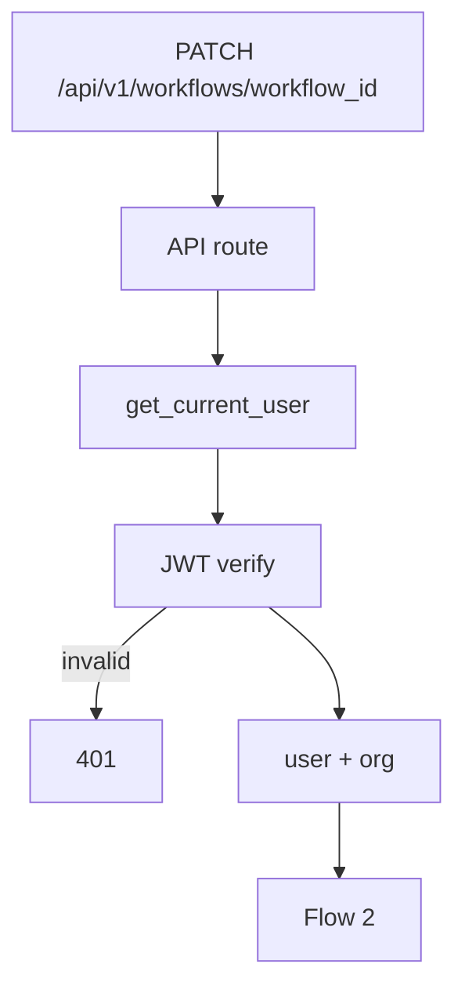
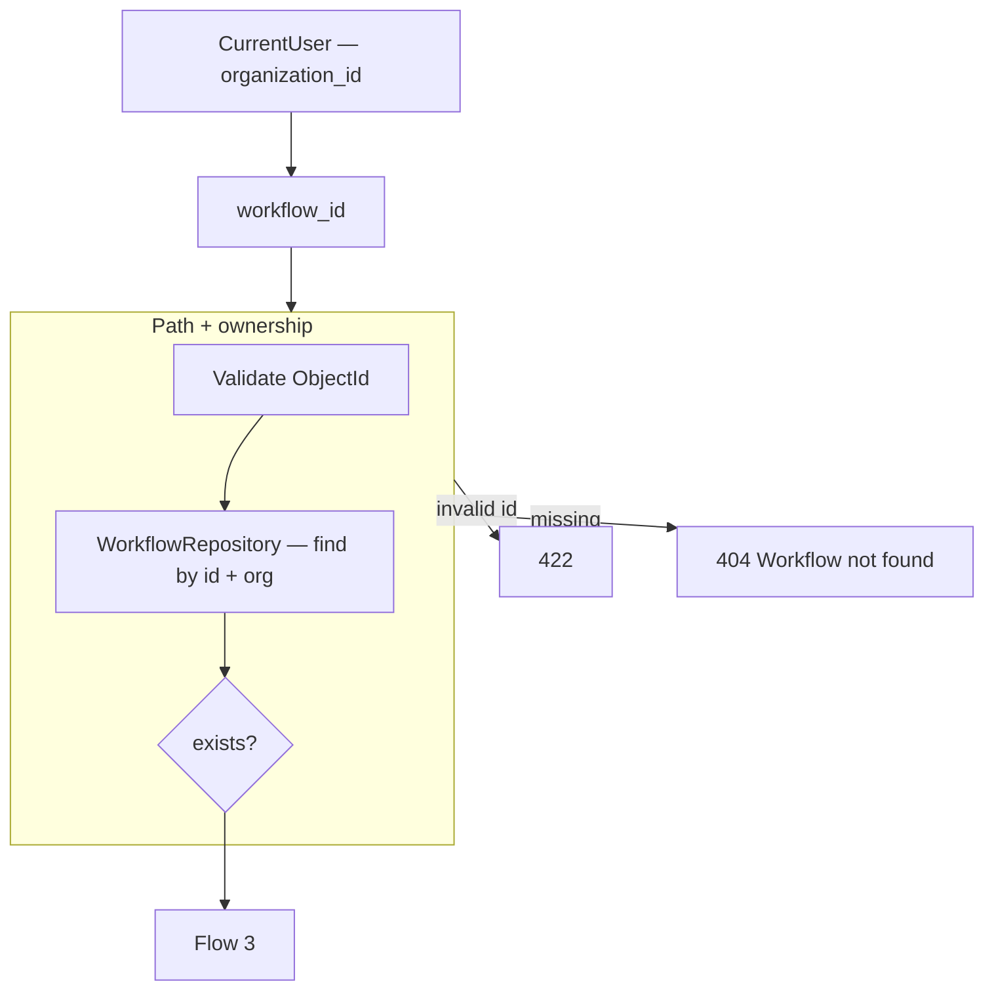
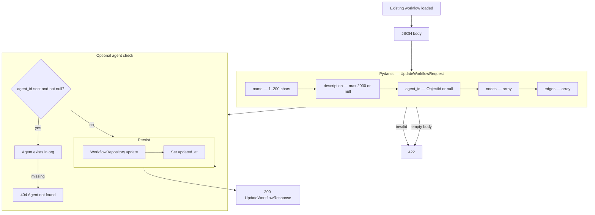

# Update Workflow — `PATCH /api/v1/workflows/{workflow_id}`

Partially update a workflow. Used by the editor **Save** button — persists title, canvas `nodes` / `edges`, and optional `description`.

Model reference: [00-workflow-model.md](./00-workflow-model.md)

**Not in MVP:** `status` → `published` (Publish button disabled).

---

# Flow 1 — Auth

Same as [03-get-workflow-diagrams.md](./03-get-workflow-diagrams.md) Flow 1.



---

# Flow 2 — Validate path + load existing



---

# Flow 3 — Validate request body (partial)

All fields optional — only sent fields are updated. At least one field required.



### Updatable fields (MVP)

| Field | Rule |
|-------|------|
| `name` | optional — user edits title in editor |
| `description` | optional |
| `agent_id` | optional — set or clear (`null`) |
| `nodes` | optional — full canvas node array |
| `edges` | optional — full canvas edge array |

### Immutable via PATCH (MVP)

| Field | Reason |
|-------|--------|
| `organization_id` | From auth only |
| `status` | Publish flow — phase 2 |
| `id` | Path param |

---

# Request body examples

**Save title + canvas (toolbar Save)**

```http
PATCH /api/v1/workflows/6a3f9012d8139334274fbc00
Authorization: Bearer <clerk_jwt>
Content-Type: application/json

{
  "name": "Customer onboarding",
  "nodes": [
    {
      "id": "start-1",
      "type": "start",
      "position": { "x": 120, "y": 220 },
      "data": {}
    },
    {
      "id": "input-1",
      "type": "input",
      "position": { "x": 300, "y": 220 },
      "data": { "label": "Customer name" }
    },
    {
      "id": "message-1",
      "type": "message",
      "position": { "x": 500, "y": 220 },
      "data": { "text": "Hello {{name}}" }
    }
  ],
  "edges": [
    { "id": "edge-1", "source": "start-1", "target": "input-1" },
    { "id": "edge-2", "source": "input-1", "target": "message-1" }
  ]
}
```

**Rename only**

```json
{ "name": "Billing flow" }
```

---

# Response `200`

Same shape as [03-get-workflow-diagrams.md](./03-get-workflow-diagrams.md) — full workflow document with new `updated_at`.

---

# Error responses

| Status | When |
|--------|------|
| `401` | Invalid JWT |
| `404` | Workflow or agent not found |
| `422` | Invalid body, empty PATCH, or bad ObjectId |

---

# Auto-save (phase 2)

MVP uses manual **Save** only. `auto_save` toggle in UI is visual-only until debounced `PATCH` is implemented.

---

# Navigate to planned files

| What | Open file |
|------|-----------|
| API route | [workflows.py](../../app/api/v1/workflows.py) *(planned)* |
| Service | [workflow_service.py](../../app/services/workflow_service.py) *(planned)* |
| Repository | [workflow_repository.py](../../app/infrastructure/db/repositories/mongo/workflow_repository.py) *(planned)* |
| Update schema | [workflow.py](../../app/schemas/workflow.py) *(planned)* |
| Frontend Save handler | [WorkflowEditorPage.tsx](../../../frontend/src/pages/workflows/WorkflowEditorPage.tsx) *(planned)* |
